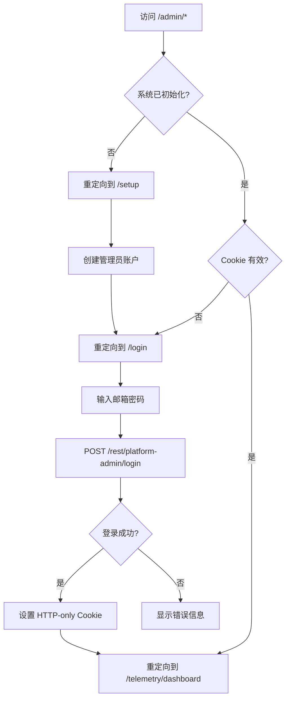

# Admin Panel 完整架构分析报告

**分析时间**: 2025-11-11  
**版本**: v1.0.0  
**分析范围**: packages/frontend/admin-panel

---

## 📋 目录

1. [架构概览](#架构概览)
2. [目录结构](#目录结构)
3. [路由系统](#路由系统)
4. [API 端点清单](#api-端点清单)
5. [状态管理 (Stores)](#状态管理-stores)
6. [功能模块清单](#功能模块清单)
7. [共享依赖](#共享依赖)
8. [认证系统](#认证系统)
9. [架构问题与建议](#架构问题与建议)

---

## 🏗️ 架构概览

### 技术栈
- **框架**: Vue 3 (Composition API)
- **路由**: Vue Router 4
- **状态管理**: Pinia
- **UI 组件**: @n8n/design-system (共享)
- **国际化**: @n8n/i18n (共享)
- **构建工具**: Vite
- **图表**: Chart.js + vue-chartjs

### 核心特性
1. **独立部署**: 运行在 `/admin/` 子路径，端口 5679
2. **模块化设计**: 采用模块化架构，每个功能独立封装
3. **共享设计系统**: 与主应用共享 @n8n/design-system
4. **Cookie 认证**: 基于 HTTP-only Cookie 的认证机制
5. **多阶段初始化**: 支持系统初始化和管理员账户设置

---

## 📁 目录结构

```
packages/frontend/admin-panel/
├── src/
│   ├── App.vue                      # 根组件
│   ├── main.ts                      # 入口文件
│   ├── config/
│   │   └── modules.ts               # 模块配置 (已实现/未实现标记)
│   ├── layouts/
│   │   ├── MainLayout.vue           # 主布局 (Sidebar + Header + Content)
│   │   └── components/
│   │       ├── Sidebar.vue          # 侧边栏 (导航菜单)
│   │       └── Header.vue           # 顶部栏 (用户信息、退出等)
│   ├── router/
│   │   └── index.ts                 # 路由配置 + 认证守卫
│   ├── stores/
│   │   ├── system.store.ts          # 系统状态 (初始化、管理员登录)
│   │   └── auth.store.ts            # 认证状态 (n8n 用户认证)
│   ├── modules/
│   │   ├── telemetry/               # ✅ Telemetry 数据分析模块
│   │   │   ├── stores/telemetry.store.ts
│   │   │   ├── views/
│   │   │   │   ├── DashboardView.vue      # 仪表板
│   │   │   │   ├── EventsView.vue         # 事件列表
│   │   │   │   ├── EventDetailView.vue    # 事件详情
│   │   │   │   ├── AnalyticsView.vue      # 数据分析
│   │   │   │   └── UsersView.vue          # 用户统计
│   │   │   └── components/
│   │   │       ├── LineChart.vue
│   │   │       ├── StatsCard.vue
│   │   │       └── TopEventsList.vue
│   │   ├── ai-providers/            # ✅ AI 服务提供商模块
│   │   │   ├── stores/ai-providers.store.ts
│   │   │   ├── views/AIProvidersView.vue
│   │   │   └── components/
│   │   │       ├── ProviderDialog.vue
│   │   │       └── ModelConfigEditor.vue
│   │   └── platform-nodes/          # ✅ 平台节点管理模块
│   │       ├── stores/platform-nodes.store.ts
│   │       ├── views/PlatformNodesView.vue
│   │       └── components/PlatformNodeDialog.vue
│   └── views/
│       ├── AdminSetupView.vue       # 管理员账户设置页
│       ├── AdminLoginView.vue       # 管理员登录页
│       ├── ForbiddenView.vue        # 403 页面
│       └── NotFoundView.vue         # 404 页面
├── vite.config.ts                   # Vite 配置 (CDN 支持)
├── package.json
└── index.html

统计:
- 总 Vue 文件: 21 个
- View 文件代码量: 1,832 行
- 模块数: 3 已实现 + 5 规划中
```

---

## 🛤️ 路由系统

### 路由配置 (router/index.ts)

| 路径 | 名称 | 组件 | 功能 | 认证要求 |
|------|------|------|------|----------|
| `/setup` | AdminSetup | AdminSetupView | 平台初始化，创建管理员账户 | ❌ 公开 |
| `/login` | AdminLogin | AdminLoginView | 管理员登录 | ❌ 公开 |
| `/` | - | Redirect to `/telemetry/dashboard` | 根路径重定向 | ✅ 需认证 |
| `/telemetry` | - | Redirect to `/telemetry/dashboard` | Telemetry 重定向 | ✅ 需认证 |
| `/telemetry/dashboard` | TelemetryDashboard | DashboardView | Telemetry 仪表板 | ✅ 需认证 |
| `/telemetry/events` | TelemetryEvents | EventsView | 事件列表 | ✅ 需认证 |
| `/telemetry/events/:id` | TelemetryEventDetail | EventDetailView | 事件详情 | ✅ 需认证 |
| `/telemetry/analytics` | TelemetryAnalytics | AnalyticsView | 数据分析 | ✅ 需认证 |
| `/telemetry/users` | TelemetryUsers | UsersView | 用户统计 | ✅ 需认证 |
| `/ai-providers` | AIProviders | AIProvidersView | AI 服务提供商管理 | ✅ 需认证 |
| `/platform-nodes` | PlatformNodes | PlatformNodesView | 平台节点管理 | ✅ 需认证 |
| `/forbidden` | Forbidden | ForbiddenView | 访问被拒绝 | ❌ 公开 |
| `/:pathMatch(.*)*` | NotFound | NotFoundView | 404 页面 | ❌ 公开 |

### 路由守卫逻辑

```typescript
router.beforeEach(async (to, _from, next) => {
  // 1. 更新页面标题
  document.title = to.meta.title || 'n8n Admin Panel';

  // 2. 公开路由直接放行
  if (to.meta.public) return next();

  // 3. 检查系统初始化状态
  if (!systemStore.initializationStatus) {
    await systemStore.checkSystemStatus();
  }

  // 4. 未初始化系统 → 重定向到 /setup
  if (systemStore.needsSetup) {
    if (to.name !== 'AdminSetup') {
      return next({ name: 'AdminSetup' });
    }
    return next();
  }

  // 5. 已初始化系统 → 检查认证状态 (通过测试 API 调用)
  try {
    const testResponse = await fetch('/rest/telemetry/stats/overview?days=1', {
      credentials: 'include',
    });

    if (testResponse.status === 401) {
      // 未认证 → 重定向到 /login
      if (to.name !== 'AdminLogin') {
        return next({ name: 'AdminLogin' });
      }
      return next();
    }

    // 已认证 → 放行
    next();
  } catch (authError) {
    // 网络错误 → Fail-open (开发模式放行)
    console.warn('[Router] Auth check error:', authError);
    next();
  }
});
```

**关键设计决策**:
- **双重认证检查**: 先检查系统初始化状态，再检查管理员认证状态
- **API 探测认证**: 通过轻量级 API 调用 (401 检测) 判断认证状态，而非专用认证端点
- **Fail-open 策略**: 认证检查失败时放行 (开发友好，生产环境需调整)

---

## 🌐 API 端点清单

### 1. 平台管理 API (`/rest/platform-admin`)

| 方法 | 端点 | 功能 | 认证要求 | 后端控制器 |
|------|------|------|----------|------------|
| GET | `/status` | 检查系统初始化状态 | ❌ 无需认证 | PlatformAdminController |
| POST | `/setup` | 创建管理员账户 (初始化) | ❌ 无需认证 | PlatformAdminController |
| POST | `/login` | 管理员登录 | ❌ 无需认证 | PlatformAdminController |
| GET | `/list` | 列出所有管理员 | ✅ 需认证 | PlatformAdminController |
| PATCH | `/:id/deactivate` | 停用管理员 | ✅ 需认证 | PlatformAdminController |

**调用位置**: `src/stores/system.store.ts`

### 2. Telemetry API (`/rest/telemetry`)

| 方法 | 端点 | 功能 | 认证要求 | 后端控制器 |
|------|------|------|----------|------------|
| GET | `/events` | 获取事件列表 (分页 + 过滤) | ✅ 需认证 | TelemetryController |
| GET | `/stats/overview?days=N` | 获取统计概览 | ✅ 需认证 | TelemetryController |
| GET | `/stats/top-events?limit=N&days=N` | 获取 Top N 事件 | ✅ 需认证 | TelemetryController |
| GET | `/stats/active-users?days=N` | 获取活跃用户统计 | ✅ 需认证 | TelemetryController |
| GET | `/export?format=csv\|json` | 导出事件数据 | ✅ 需认证 | TelemetryController |

**调用位置**: `src/modules/telemetry/stores/telemetry.store.ts`

### 3. AI 提供商 API (`/rest/admin/platform-ai-providers`)

| 方法 | 端点 | 功能 | 认证要求 | 后端控制器 |
|------|------|------|----------|------------|
| GET | `/` | 获取所有 AI 提供商 (支持过滤) | ✅ 需认证 | AdminPlatformAIProvidersController |
| GET | `/:providerKey` | 获取单个提供商详情 | ✅ 需认证 | AdminPlatformAIProvidersController |
| POST | `/` | 创建 AI 提供商 | ✅ 需认证 | AdminPlatformAIProvidersController |
| PATCH | `/:providerKey` | 更新 AI 提供商 | ✅ 需认证 | AdminPlatformAIProvidersController |
| DELETE | `/:providerKey` | 删除 AI 提供商 | ✅ 需认证 | AdminPlatformAIProvidersController |
| PATCH | `/:providerKey/toggle` | 启用/禁用提供商 | ✅ 需认证 | AdminPlatformAIProvidersController |

**调用位置**: `src/modules/ai-providers/stores/ai-providers.store.ts`

### 4. 平台节点 API (`/rest/platform-nodes`)

| 方法 | 端点 | 功能 | 认证要求 | 后端控制器 |
|------|------|------|----------|------------|
| GET | `/admin/all` | 获取所有平台节点 (管理员视图) | ✅ 需认证 | PlatformNodesController |
| GET | `/:nodeKey` | 获取单个节点详情 | ✅ 需认证 | PlatformNodesController |
| POST | `/admin/create` | 创建平台节点 | ✅ 需认证 | PlatformNodesController |
| PATCH | `/:nodeKey` | 更新平台节点 | ✅ 需认证 | PlatformNodesController |
| DELETE | `/admin/:nodeKey` | 删除平台节点 | ✅ 需认证 | PlatformNodesController |
| POST | `/:nodeKey/approve` | 审核通过节点 | ✅ 需认证 | PlatformNodesController |
| POST | `/:nodeKey/reject` | 审核拒绝节点 | ✅ 需认证 | PlatformNodesController |
| PATCH | `/:nodeKey/toggle` | 启用/禁用节点 | ✅ 需认证 | PlatformNodesController |
| GET | `/admin/submissions` | 获取待审核节点 | ✅ 需认证 | PlatformNodesController |
| GET | `/categories/grouped` | 按分类分组获取节点 | ✅ 需认证 | PlatformNodesController |

**调用位置**: `src/modules/platform-nodes/stores/platform-nodes.store.ts`

### 5. 自定义节点 API (`/rest/custom-nodes`)

| 方法 | 端点 | 功能 | 认证要求 | 后端控制器 |
|------|------|------|----------|------------|
| GET | `/?workspaceId=X` | 获取工作空间自定义节点 | ✅ 需认证 | CustomNodesController |
| GET | `/:nodeKey?workspaceId=X` | 获取单个自定义节点 | ✅ 需认证 | CustomNodesController |
| POST | `/` | 创建自定义节点 | ✅ 需认证 | CustomNodesController |
| PUT | `/:nodeId?workspaceId=X` | 更新自定义节点 | ✅ 需认证 | CustomNodesController |
| DELETE | `/:nodeId?workspaceId=X` | 删除自定义节点 | ✅ 需认证 | CustomNodesController |
| POST | `/:nodeId/submit?workspaceId=X` | 提交节点审核 | ✅ 需认证 | CustomNodesController |
| POST | `/:nodeId/toggle?workspaceId=X` | 启用/禁用节点 | ✅ 需认证 | CustomNodesController |
| PUT | `/:nodeId/shared-config?workspaceId=X` | 更新共享配置 | ✅ 需认证 | CustomNodesController |
| GET | `/:nodeId/shared-config?workspaceId=X` | 获取共享配置 | ✅ 需认证 | CustomNodesController |

**调用位置**: `src/modules/platform-nodes/stores/platform-nodes.store.ts`

---

## 🗄️ 状态管理 (Stores)

### 1. System Store (`stores/system.store.ts`)

**职责**: 系统初始化和平台管理员认证

**State**:
```typescript
{
  initializationStatus: SystemInitStatus | null,  // 系统初始化状态
  isCheckingStatus: boolean,                       // 是否正在检查状态
  lastCheckedAt: Date | null,                      // 最后检查时间
}
```

**Getters**:
- `isPlatformInitialized`: 平台是否已初始化
- `hasAdminAccount`: 是否已有管理员账户
- `needsSetup`: 是否需要初始化设置
- `isReady`: 系统是否就绪

**Actions**:
- `checkSystemStatus()`: 检查系统初始化状态
- `setupAdmin(data)`: 创建管理员账户
- `loginAdmin(data)`: 管理员登录
- `resetState()`: 重置状态

**API 依赖**:
- `GET /rest/platform-admin/status`
- `POST /rest/platform-admin/setup`
- `POST /rest/platform-admin/login`

### 2. Auth Store (`stores/auth.store.ts`)

**职责**: n8n 用户认证 (未使用，保留用于未来扩展)

**State**:
```typescript
{
  user: User | null,      // 当前用户
  initialized: boolean,   // 是否已初始化
}
```

**Getters**:
- `isLoggedIn`: 是否已登录
- `isAdmin`: 是否为管理员
- `userName`: 用户名

**Actions**:
- `checkAuth()`: 检查认证状态
- `logout()`: 退出登录
- `reset()`: 重置状态

**API 依赖**:
- `GET /rest/me`
- `POST /rest/logout`

### 3. Telemetry Store (`modules/telemetry/stores/telemetry.store.ts`)

**职责**: Telemetry 事件数据管理

**State**:
```typescript
{
  events: TelemetryEventDto[],           // 事件列表
  overview: TelemetryStatsOverview | null,  // 统计概览
  topEvents: TopEvent[],                  // Top 事件
  activeUsersData: ActiveUserStats | null,  // 活跃用户数据
  loading: boolean,                        // 加载状态
  filters: EventFilters,                   // 过滤条件
  pagination: PaginationState,             // 分页状态
}
```

**Getters**:
- `hasFilters`: 是否有过滤条件
- `totalPages`: 总页数

**Actions**:
- `fetchEvents(reset?)`: 获取事件列表
- `fetchOverview(days)`: 获取统计概览
- `fetchTopEvents(limit, days)`: 获取 Top 事件
- `fetchActiveUsers(days)`: 获取活跃用户
- `exportEvents(format)`: 导出事件数据
- `setFilters(filters)`: 设置过滤条件
- `clearFilters()`: 清除过滤条件
- `setPage(page)`: 设置页码
- `setLimit(limit)`: 设置每页条数
- `reset()`: 重置状态

### 4. AI Providers Store (`modules/ai-providers/stores/ai-providers.store.ts`)

**职责**: AI 服务提供商管理

**State**:
```typescript
{
  providers: AdminAIProvider[],          // 提供商列表
  selectedProvider: AdminAIProvider | null,  // 选中的提供商
  loading: boolean,                       // 加载状态
  error: string | null,                   // 错误信息
}
```

**Getters**:
- `activeProviders`: 活跃的提供商
- `inactiveProviders`: 未激活的提供商
- `isLoading`: 是否加载中
- `hasError`: 是否有错误

**Actions**:
- `fetchProviders(filters?)`: 获取提供商列表
- `fetchProvider(providerKey)`: 获取单个提供商
- `createProvider(data)`: 创建提供商
- `updateProvider(providerKey, data)`: 更新提供商
- `deleteProvider(providerKey)`: 删除提供商
- `toggleProvider(providerKey, enabled)`: 启用/禁用提供商
- `clearError()`: 清除错误
- `reset()`: 重置状态

### 5. Platform Nodes Store (`modules/platform-nodes/stores/platform-nodes.store.ts`)

**职责**: 平台节点和自定义节点管理

**State**:
```typescript
{
  platformNodes: AdminPlatformNode[],      // 平台节点列表
  selectedPlatformNode: AdminPlatformNode | null,  // 选中的平台节点
  customNodes: AdminCustomNode[],          // 自定义节点列表
  selectedCustomNode: AdminCustomNode | null,  // 选中的自定义节点
  loading: boolean,                         // 加载状态
  error: string | null,                     // 错误信息
}
```

**Getters**:
- `pendingPlatformNodes`: 待审核平台节点
- `approvedPlatformNodes`: 已审核平台节点
- `rejectedPlatformNodes`: 已拒绝平台节点
- `activePlatformNodes`: 活跃平台节点
- `pendingCustomNodes`: 待审核自定义节点
- `isLoading`: 是否加载中
- `hasError`: 是否有错误

**Actions - 平台节点**:
- `fetchPlatformNodes(filters?)`: 获取平台节点
- `fetchPlatformNode(nodeKey)`: 获取单个节点
- `createPlatformNode(data)`: 创建节点
- `updatePlatformNode(nodeKey, data)`: 更新节点
- `deletePlatformNode(nodeKey)`: 删除节点
- `approvePlatformNode(nodeKey, notes?)`: 审核通过
- `rejectPlatformNode(nodeKey, notes?)`: 审核拒绝
- `togglePlatformNode(nodeKey, enabled)`: 启用/禁用
- `fetchPendingSubmissions()`: 获取待审核
- `getNodesByCategory()`: 按分类获取

**Actions - 自定义节点**:
- `fetchCustomNodes(workspaceId)`: 获取自定义节点
- `fetchCustomNode(nodeKey, workspaceId)`: 获取单个节点
- `createCustomNode(data)`: 创建节点
- `updateCustomNode(nodeId, workspaceId, data)`: 更新节点
- `deleteCustomNode(nodeId, workspaceId)`: 删除节点
- `submitCustomNodeForReview(nodeId, workspaceId)`: 提交审核
- `toggleCustomNode(nodeId, workspaceId, isActive)`: 启用/禁用
- `updateCustomNodeSharedConfig(nodeId, workspaceId, config)`: 更新共享配置
- `getCustomNodeSharedConfig(nodeId, workspaceId)`: 获取共享配置

---

## 📦 功能模块清单

### 已实现模块 (3个)

#### 1. Telemetry 数据分析 ✅

**路径**: `src/modules/telemetry`

**功能**:
- **仪表板**: 统计概览、Top 事件、趋势图表
- **事件列表**: 分页、过滤、搜索
- **事件详情**: 单个事件的详细信息
- **数据分析**: 高级统计和可视化
- **用户统计**: 活跃用户分析
- **数据导出**: CSV/JSON 格式导出

**组件**:
- `DashboardView.vue`: 仪表板主页
- `EventsView.vue`: 事件列表页
- `EventDetailView.vue`: 事件详情页
- `AnalyticsView.vue`: 数据分析页
- `UsersView.vue`: 用户统计页
- `LineChart.vue`: 折线图组件
- `StatsCard.vue`: 统计卡片组件
- `TopEventsList.vue`: Top 事件列表组件

**Store**: `telemetry.store.ts`

**API 依赖**:
- `GET /rest/telemetry/events`
- `GET /rest/telemetry/stats/overview`
- `GET /rest/telemetry/stats/top-events`
- `GET /rest/telemetry/stats/active-users`
- `GET /rest/telemetry/export`

#### 2. AI 服务提供商 ✅

**路径**: `src/modules/ai-providers`

**功能**:
- AI 提供商 CRUD
- 模型配置编辑
- 配额管理
- 启用/禁用控制
- 活跃状态筛选

**组件**:
- `AIProvidersView.vue`: AI 提供商管理页
- `ProviderDialog.vue`: 提供商编辑对话框
- `ModelConfigEditor.vue`: 模型配置编辑器

**Store**: `ai-providers.store.ts`

**API 依赖**:
- `GET /rest/admin/platform-ai-providers`
- `POST /rest/admin/platform-ai-providers`
- `PATCH /rest/admin/platform-ai-providers/:providerKey`
- `DELETE /rest/admin/platform-ai-providers/:providerKey`
- `PATCH /rest/admin/platform-ai-providers/:providerKey/toggle`

#### 3. 平台节点管理 ✅

**路径**: `src/modules/platform-nodes`

**功能**:
- 平台节点 CRUD
- 自定义节点 CRUD
- 节点审核 (approve/reject)
- 计费模式配置
- 配置模式管理 (none/user/team)
- 分类管理
- 启用/禁用控制

**组件**:
- `PlatformNodesView.vue`: 节点管理页
- `PlatformNodeDialog.vue`: 节点编辑对话框

**Store**: `platform-nodes.store.ts`

**API 依赖**:
- 平台节点: `/rest/platform-nodes/*`
- 自定义节点: `/rest/custom-nodes/*`

### 规划中模块 (5个)

| 模块 | 路径 | 功能 | 优先级 |
|------|------|------|--------|
| 工作空间管理 ❌ | `/workspaces` | 管理个人和团队工作空间 | P1 |
| 用户管理 ❌ | `/users` | 用户生命周期管理 | P1 |
| 系统设置 ❌ | `/system` | 系统配置和参数管理 | P2 |
| 审计日志 ❌ | `/audit` | 系统操作审计日志 | P2 |
| 计费管理 ❌ | `/billing` | 计费、充值和订阅管理 | P1 |

**配置位置**: `src/config/modules.ts`

---

## 🔗 共享依赖

### 与主应用 (editor-ui) 共享

1. **@n8n/design-system**
   - UI 组件库 (N8nIcon, N8nButton, etc.)
   - 样式系统 (CSS 变量)
   - 主题支持

2. **@n8n/i18n**
   - 国际化系统
   - 翻译文件 (en.json, zh.json)
   - 语言切换功能

3. **@n8n/api-types**
   - 共享类型定义
   - DTO 类型 (TelemetryEventDto, etc.)
   - 接口定义

### 独立依赖

1. **chart.js + vue-chartjs**
   - 图表可视化
   - 仅在 Telemetry 模块使用

2. **date-fns**
   - 日期时间处理

### Vite 配置要点

```typescript
// vite.config.ts
{
  base: cdnUrl || '/admin/',  // 支持 CDN 部署
  server: {
    port: 5679,
    proxy: {
      '/rest': {
        target: 'http://localhost:5678',  // 代理到主应用后端
        changeOrigin: true,
      },
    },
  },
  resolve: {
    alias: {
      '@': './src',
      '@n8n/design-system': 'packages/frontend/@n8n/design-system/src',
    },
  },
}
```

**关键特性**:
- **API 代理**: 开发模式下代理 `/rest` 到主应用
- **CDN 支持**: 生产环境支持部署到 CDN
- **别名解析**: 共享包使用源码别名 (加快开发速度)

---

## 🔐 认证系统

### 认证流程



### 认证机制详解

#### 1. 平台管理员认证

**实现**: `src/stores/system.store.ts`

**流程**:
1. **系统初始化检查** (`GET /rest/platform-admin/status`)
   ```typescript
   {
     initialized: boolean,  // 系统是否已初始化
     hasAdmin: boolean,     // 是否已有管理员账户
   }
   ```

2. **管理员账户创建** (`POST /rest/platform-admin/setup`)
   - 仅在系统未初始化时可用
   - 创建后自动重定向到登录页

3. **管理员登录** (`POST /rest/platform-admin/login`)
   - 后端返回 HTTP-only Cookie
   - 前端不存储任何 Token
   - Cookie 名称: `n8n-admin-auth` (推测)

#### 2. Cookie 验证

**实现**: `src/router/index.ts` (Router Guard)

**验证方式**: 通过测试 API 调用判断 Cookie 有效性
```typescript
const testResponse = await fetch('/rest/telemetry/stats/overview?days=1', {
  credentials: 'include',  // 携带 Cookie
});

if (testResponse.status === 401) {
  // Cookie 无效或已过期 → 重定向到登录
}
```

**优点**:
- 无需专用认证检查端点
- 利用现有 API 端点
- 减少后端接口数量

**缺点**:
- 每次路由切换都会发起 API 请求
- 可能影响性能 (建议缓存验证结果)

#### 3. n8n 用户认证 (未使用)

**实现**: `src/stores/auth.store.ts`

**目的**: 保留用于未来扩展 (例如，管理员同时是 n8n 用户时的用户信息展示)

**API**: `GET /rest/me` (主应用端点)

### 认证安全性

| 安全措施 | 状态 | 说明 |
|----------|------|------|
| HTTP-only Cookie | ✅ | 防止 XSS 攻击窃取 Cookie |
| SameSite Cookie | ⚠️ | 需确认后端设置 (防止 CSRF) |
| HTTPS Only | ⚠️ | 生产环境必须启用 |
| Cookie 过期时间 | ⚠️ | 需确认后端配置 |
| 速率限制 | ✅ | `/setup` 和 `/login` 已启用 |
| CSRF Token | ❌ | 未实现 (依赖 SameSite) |

---

## ⚠️ 架构问题与建议

### 问题 1: 认证检查性能

**现状**: 每次路由切换都通过 API 调用检查认证状态

**影响**:
- 增加后端负载
- 降低路由切换速度
- 浪费网络请求

**建议**:
```typescript
// 添加认证状态缓存
const authCache = {
  isAuthenticated: false,
  checkedAt: null,
  ttl: 60000, // 1 分钟缓存
};

// Router Guard 中使用缓存
if (authCache.isAuthenticated && Date.now() - authCache.checkedAt < authCache.ttl) {
  return next(); // 使用缓存，跳过 API 调用
}
```

### 问题 2: Fail-open 认证策略

**现状**: 认证检查失败时直接放行
```typescript
catch (authError) {
  console.warn('[Router] Auth check error:', authError);
  next(); // ⚠️ 直接放行
}
```

**风险**: 生产环境下网络错误可能导致未授权访问

**建议**:
```typescript
catch (authError) {
  if (process.env.NODE_ENV === 'production') {
    next({ name: 'AdminLogin' }); // 生产环境 fail-close
  } else {
    next(); // 开发环境 fail-open
  }
}
```

### 问题 3: 缺少 CSRF 保护

**现状**: 依赖 Cookie 认证，但未实现 CSRF Token

**风险**: 可能遭受跨站请求伪造攻击

**建议**:
1. 后端设置 `SameSite=Strict` Cookie 属性
2. 或添加 CSRF Token 验证机制

### 问题 4: 缺少统一的 API 客户端

**现状**: 各 Store 直接使用 `fetch()` 调用 API

**问题**:
- 代码重复 (错误处理、认证头等)
- 难以统一配置 (超时、重试等)
- 难以添加全局拦截器

**建议**:
```typescript
// 创建统一 API 客户端
// src/api/client.ts
class ApiClient {
  async request(url, options) {
    const response = await fetch(url, {
      ...options,
      credentials: 'include',
      headers: {
        'Content-Type': 'application/json',
        ...options.headers,
      },
    });

    if (!response.ok) {
      if (response.status === 401) {
        // 统一处理未认证
        router.push({ name: 'AdminLogin' });
      }
      throw new Error(`API Error: ${response.statusText}`);
    }

    return response.json();
  }
}

export const api = new ApiClient();
```

### 问题 5: 模块配置硬编码

**现状**: 已实现/未实现模块在 `modules.ts` 中硬编码

**问题**: 难以动态控制模块可见性 (例如，根据用户权限)

**建议**:
```typescript
// 从后端获取模块配置
async function fetchModulePermissions() {
  const response = await fetch('/rest/platform-admin/modules', {
    credentials: 'include',
  });
  return response.json(); // { modules: ['telemetry', 'ai-providers', ...] }
}

// 动态过滤模块
const enabledModules = computed(() => {
  return modules.filter(m => permissions.value.includes(m.id));
});
```

### 问题 6: 缺少错误边界

**现状**: 组件错误可能导致整个应用崩溃

**建议**: 添加全局错误边界
```vue
<!-- App.vue -->
<ErrorBoundary>
  <RouterView />
</ErrorBoundary>
```

### 问题 7: 缺少加载状态和骨架屏

**现状**: 路由切换时可能出现白屏

**建议**: 添加全局加载状态
```vue
<Suspense>
  <template #default>
    <RouterView />
  </template>
  <template #fallback>
    <LoadingSpinner />
  </template>
</Suspense>
```

### 问题 8: i18n 缺少类型安全

**现状**: `$t('key')` 字符串硬编码，无类型检查

**建议**: 使用类型安全的 i18n 键
```typescript
// src/i18n/keys.ts
export const I18N_KEYS = {
  adminPanel: {
    login: {
      title: 'adminPanel.login.title',
      // ...
    },
  },
} as const;

// 使用
$t(I18N_KEYS.adminPanel.login.title);
```

---

## 📊 架构质量评分

| 维度 | 评分 | 说明 |
|------|------|------|
| **模块化设计** | ⭐⭐⭐⭐⭐ | 模块划分清晰，职责单一 |
| **代码组织** | ⭐⭐⭐⭐⭐ | 目录结构合理，易于维护 |
| **状态管理** | ⭐⭐⭐⭐☆ | Pinia Store 使用规范，但缺少持久化 |
| **类型安全** | ⭐⭐⭐⭐☆ | TypeScript 使用良好，部分类型可增强 |
| **认证安全** | ⭐⭐⭐☆☆ | 基本认证流程完善，但缺少 CSRF 保护 |
| **性能优化** | ⭐⭐⭐☆☆ | 路由懒加载已实现，但认证检查需优化 |
| **错误处理** | ⭐⭐⭐☆☆ | 基本错误处理，缺少全局错误边界 |
| **国际化** | ⭐⭐⭐⭐☆ | i18n 集成良好，缺少类型安全 |
| **测试覆盖** | ⭐☆☆☆☆ | 未发现单元测试 |

**总体评分**: ⭐⭐⭐⭐☆ (4/5)

---

## 📝 总结

### 优势

1. **清晰的模块化架构**: 每个功能模块独立封装，易于维护和扩展
2. **共享设计系统**: 与主应用共享 UI 组件和样式，保持一致性
3. **完善的路由守卫**: 多阶段认证检查，确保系统安全
4. **良好的状态管理**: Pinia Store 使用规范，状态管理清晰
5. **CDN 部署支持**: Vite 配置支持 CDN 部署，适合 SaaS 架构
6. **模块化配置**: 已实现/未实现模块清晰标记，便于迭代开发

### 待改进

1. **认证检查性能优化**: 添加缓存机制，减少 API 调用
2. **安全性增强**: 添加 CSRF 保护，fail-close 策略
3. **统一 API 客户端**: 减少代码重复，统一错误处理
4. **错误边界**: 添加全局错误处理机制
5. **测试覆盖**: 添加单元测试和 E2E 测试
6. **类型安全增强**: i18n 键类型化，API 响应类型化

### 下一步行动

#### P0 (立即执行)
- [ ] 优化认证检查性能 (添加缓存)
- [ ] 修复 fail-open 安全问题
- [ ] 添加 CSRF 保护

#### P1 (近期执行)
- [ ] 创建统一 API 客户端
- [ ] 添加全局错误边界
- [ ] 实现工作空间管理模块
- [ ] 实现用户管理模块
- [ ] 实现计费管理模块

#### P2 (未来规划)
- [ ] 添加单元测试
- [ ] 添加 E2E 测试
- [ ] i18n 键类型化
- [ ] 实现系统设置模块
- [ ] 实现审计日志模块

---

**文档版本**: v1.0  
**最后更新**: 2025-11-11  
**维护者**: SASA Platform Team
