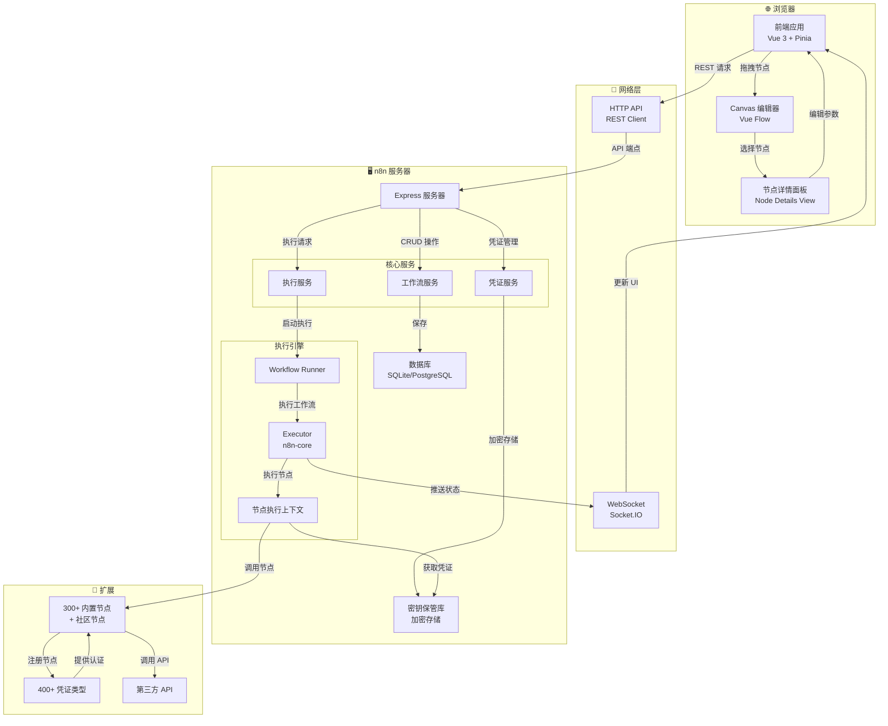
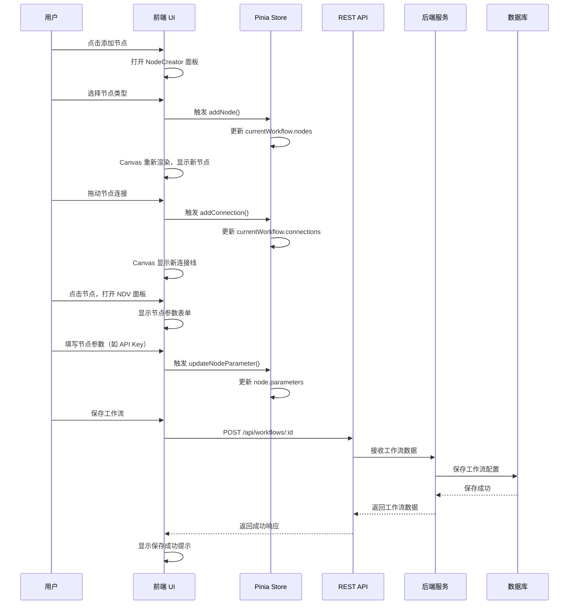
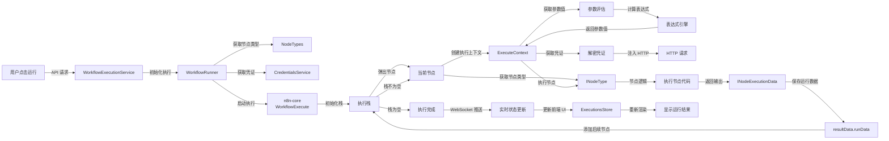
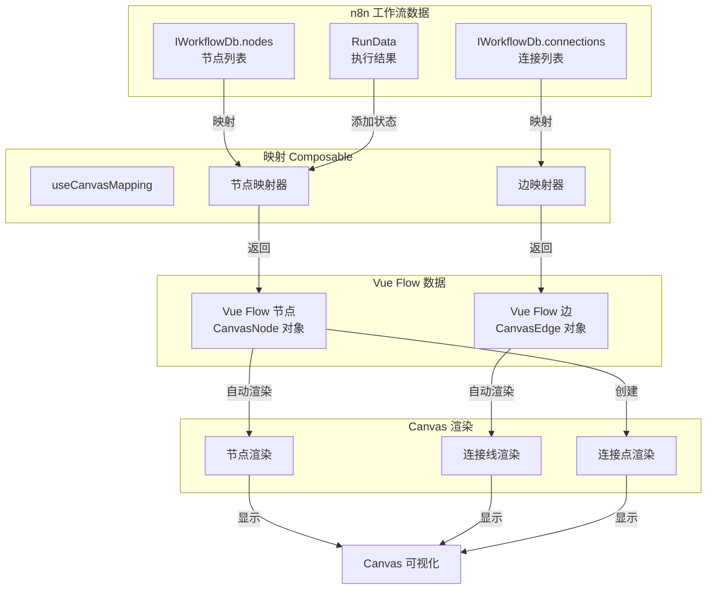
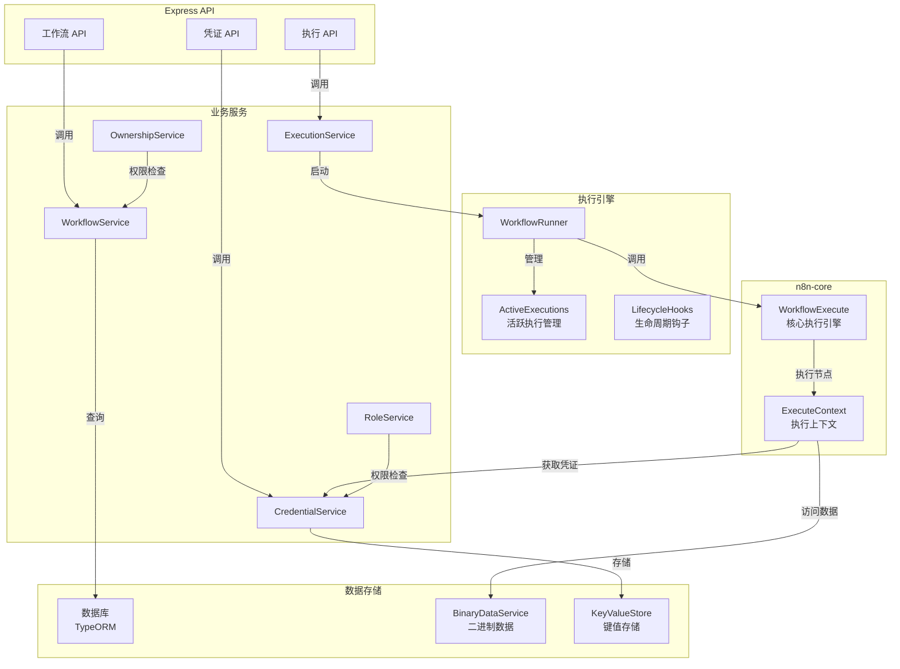
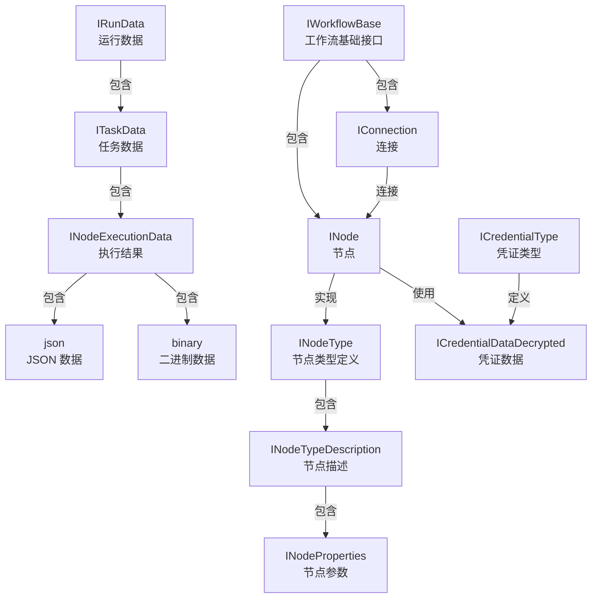
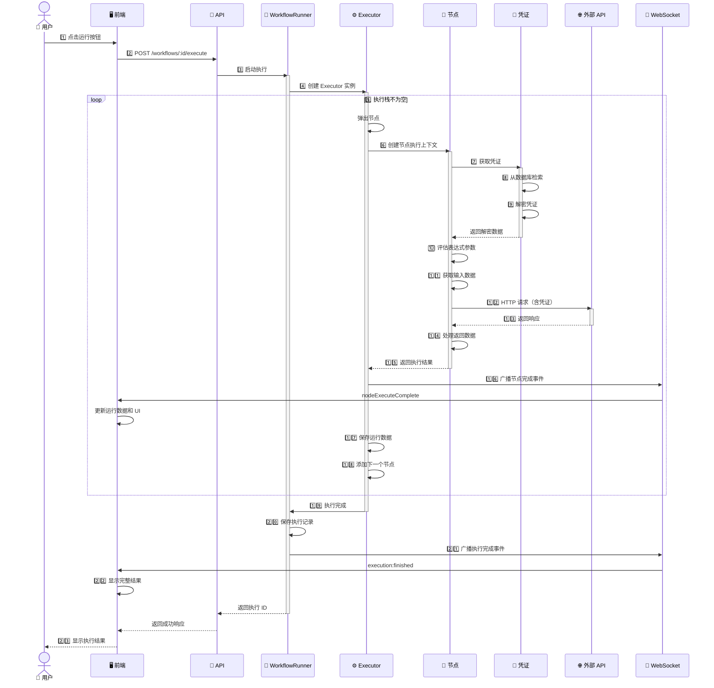

# n8n 架构图解

这份文档使用 Mermaid 图表可视化 n8n 的核心架构和数据流。

---

## 1. 高层系统架构



---

## 2. 前端组件架构

```mermaid
graph TD
    subgraph 应用层["应用层"]
        App["App.vue"]
    end
    
    subgraph 视图层["视图层"]
        WorkflowsView["工作流列表<br/>WorkflowsView.vue"]
        NodeView["编辑器主视图<br/>NodeView.vue"]
        SettingsView["设置视图<br/>SettingsView.vue"]
    end
    
    subgraph 编辑器["编辑器组件"]
        MainHeader["MainHeader<br/>顶部导航栏"]
        MainSidebar["MainSidebar<br/>左侧边栏"]
        WorkflowCanvas["WorkflowCanvas<br/>Canvas 包装器"]
        Canvas["Canvas.vue<br/>Vue Flow 实例"]
        NDVPanel["NDVPanel<br/>节点详情"]
        NodeCreator["NodeCreator<br/>节点面板"]
    end
    
    subgraph Canvas组件["Canvas 内部组件"]
        CanvasNode["CanvasNode<br/>节点组件"]
        CanvasEdge["CanvasEdge<br/>连接线"]
        CanvasHandle["CanvasHandle<br/>连接点"]
        CanvasBackground["CanvasBackground<br/>网格背景"]
        ControlButtons["ControlButtons<br/>运行/停止按钮"]
    end
    
    subgraph 状态管理["Pinia Stores"]
        WorkflowsStore["Workflows Store<br/>工作流数据"]
        NodeTypesStore["NodeTypes Store<br/>节点类型"]
        CredentialsStore["Credentials Store<br/>凭证数据"]
        ExecutionsStore["Executions Store<br/>执行记录"]
        UIStore["UI Store<br/>UI 状态"]
    end
    
    subgraph 组合函数["Composables"]
        useRunWorkflow["useRunWorkflow<br/>执行工作流"]
        useCanvasOperations["useCanvasOperations<br/>Canvas 操作"]
        useNodeHelpers["useNodeHelpers<br/>节点助手"]
        useWorkflowHelpers["useWorkflowHelpers<br/>工作流助手"]
    end
    
    App -->|路由| WorkflowsView
    App -->|路由| NodeView
    App -->|路由| SettingsView
    
    NodeView --> MainHeader
    NodeView --> MainSidebar
    NodeView --> WorkflowCanvas
    NodeView --> NDVPanel
    NodeView --> NodeCreator
    
    WorkflowCanvas --> Canvas
    Canvas --> CanvasNode
    Canvas --> CanvasEdge
    Canvas --> CanvasHandle
    Canvas --> CanvasBackground
    Canvas --> ControlButtons
    
    Canvas -.注入| WorkflowsStore
    NDVPanel -.注入| WorkflowsStore
    NDVPanel -.注入| NodeTypesStore
    NDVPanel -.注入| CredentialsStore
    NodeCreator -.注入| NodeTypesStore
    ControlButtons -.注入| ExecutionsStore
    
    CanvasNode -.读取| WorkflowsStore
    CanvasNode -.读取| ExecutionsStore
    
    useRunWorkflow -.调用| WorkflowsStore
    useRunWorkflow -.更新| ExecutionsStore
    useCanvasOperations -.操作| WorkflowsStore
    
    NodeView -->|使用| useRunWorkflow
    NodeView -->|使用| useCanvasOperations
    Canvas -->|使用| useNodeHelpers
```

---

## 3. 工作流编辑流程



---

## 4. 工作流执行流程



---

## 5. Canvas 数据映射



---

## 6. 节点参数流程

```mermaid
graph TB
    NodeType["INodeTypeDescription<br/>节点定义"]
    Properties["INodeProperties[]<br/>参数列表"]
    
    NodeType -->|包含| Properties
    
    subgraph 参数类型["参数类型"]
        String["string<br/>文本"]
        Number["number<br/>数字"]
        Boolean["boolean<br/>布尔值"]
        Options["options<br/>下拉选项"]
        Collection["collection<br/>集合"]
    end
    
    Properties -->|定义| String
    Properties -->|定义| Number
    Properties -->|定义| Boolean
    Properties -->|定义| Options
    Properties -->|定义| Collection
    
    subgraph 参数特性["参数特性"]
        DisplayOptions["displayOptions<br/>条件显示"]
        TypeOptions["typeOptions<br/>类型选项"]
        LoadOptions["loadOptions<br/>动态加载"]
    end
    
    String -.配置| DisplayOptions
    Options -.配置| TypeOptions
    Options -.配置| LoadOptions
    
    DisplayOptions -->|检查条件| "应该显示?"
    "应该显示?" -->|true| "渲染参数组件"
    "应该显示?" -->|false| "隐藏参数"
    
    LoadOptions -->|HTTP 请求| "获取选项列表"
    "获取选项列表" -->|响应数据| "填充选项"
    
    "渲染参数组件" -->|用户输入| "参数值"
    "填充选项" -->|用户选择| "参数值"
    
    "参数值" -->|保存到| "node.parameters"
    "node.parameters" -->|执行时| "getNodeParameter()"
    "getNodeParameter()" -->|用于| "节点执行逻辑"
```

---

## 7. 凭证系统流程

```mermaid
graph TB
    subgraph 定义["凭证类型定义"]
        CT["ICredentialType"]
        Props["properties<br/>字段定义"]
        Auth["authenticate()<br/>认证方法"]
        Test["test<br/>测试方法"]
    end
    
    CT -->|包含| Props
    CT -->|实现| Auth
    CT -->|实现| Test
    
    subgraph 前端["前端操作"]
        SelectCred["选择现有凭证"]
        CreateCred["创建新凭证"]
        TestCred["测试凭证"]
    end
    
    SelectCred -->|选择| "凭证 ID"
    CreateCred -->|生成表单| Props
    CreateCred -->|用户输入| "凭证数据"
    
    "凭证数据" -->|API 请求| "后端创建"
    TestCred -->|API 请求| "后端测试"
    
    subgraph 后端["后端处理"]
        CredService["CredentialsService"]
        Encrypt["加密凭证数据"]
        Store["保存到数据库"]
        Decrypt["解密凭证"]
    end
    
    "后端创建" -->|CredentialsService| Encrypt
    Encrypt -->|AES-256| Store
    Store -->|保存| "数据库"
    
    "后端测试" -->|测试 API| Test
    Test -->|成功/失败| "返回结果"
    
    subgraph 执行["执行时"]
        NodeExec["节点执行"]
        GetCred["getCredentials()"]
        Decrypt
        UseCred["使用凭证"]
    end
    
    NodeExec -->|获取凭证| GetCred
    GetCred -->|从数据库| "凭证数据"
    "凭证数据" -->|解密| Decrypt
    Decrypt -->|返回| "凭证对象"
    "凭证对象" -->|注入| Auth
    Auth -->|修改请求| UseCred
    UseCred -->|HTTP 请求| "第三方 API"
```

---

## 8. 表达式计算流程

```mermaid
graph LR
    Input["参数值<br/>{{ $node.X.data }}"]
    Parse["解析表达式<br/>提取 {{ }}"]
    Extract["提取代码<br/>$node.X.data"]
    
    Input -->|正则匹配| Parse
    Parse -->|成功| Extract
    Parse -->|失败| "返回原值"
    
    subgraph 构建上下文["构建表达式上下文"]
        NodeData["$node<br/>所有节点输出"]
        ParamData["$parameter<br/>当前节点参数"]
        InputData["$input<br/>输入项数据"]
        Env["$env<br/>环境变量"]
        Special["特殊变量<br/>$now, $today"]
    end
    
    Extract -->|创建| 构建上下文
    
    subgraph 沙箱执行["安全沙箱执行"]
        Inject["注入变量到作用域"]
        Compile["编译 Function"]
        Execute["执行代码"]
    end
    
    构建上下文 -->|注入| Inject
    Inject -->|创建函数| Compile
    Compile -->|with 上下文| Execute
    
    Execute -->|成功| Result["表达式结果"]
    Execute -->|错误| Error["表达式错误"]
    
    Result -->|返回给| "参数使用"
    Error -->|抛出异常| "错误处理"
```

---

## 9. 后端服务架构



---

## 10. 节点执行上下文

```mermaid
graph TB
    subgraph Context["IExecuteFunctions<br/>节点执行上下文"]
        NodeInfo["getNode()<br/>获取节点信息"]
        GetParam["getNodeParameter()<br/>获取参数值"]
        GetInput["getInputData()<br/>获取输入数据"]
        CurrentItem["item<br/>当前处理项"]
    end
    
    subgraph Expression["表达式和变量"]
        Evaluate["evaluateExpression()<br/>表达式计算"]
        Variables["内置变量<br/>$node, $parameter"]
    end
    
    subgraph HTTP["HTTP 请求"]
        Request["helpers.request()<br/>发送 HTTP"]
        Headers["自动添加认证<br/>Authorization"]
    end
    
    subgraph Credentials["凭证访问"]
        GetCreds["getCredentials()<br/>获取凭证"]
        DecryptCreds["自动解密<br/>凭证数据"]
    end
    
    subgraph Data["数据处理"]
        FileSystem["helpers.fs<br/>文件系统"]
        Binary["处理二进制<br/>文件/图片"]
        Database["数据库操作"]
    end
    
    subgraph Execution["执行控制"]
        Continue["继续执行"]
        Pause["暂停等待"]
        Error["错误处理"]
    end
    
    Context -->|提供| NodeInfo
    Context -->|提供| GetParam
    Context -->|提供| GetInput
    Context -->|提供| CurrentItem
    
    GetParam -->|使用| Expression
    Expression -->|计算| Evaluate
    Evaluate -->|访问| Variables
    
    HTTP -->|需要| Credentials
    Credentials -->|调用| GetCreds
    GetCreds -->|解密| DecryptCreds
    DecryptCreds -->|注入请求| Request
    
    GetInput -->|处理| Data
    Data -->|操作| FileSystem
    FileSystem -->|处理| Binary
    
    Context -->|控制| Execution
    Execution -->|继续/暂停/错误| "节点流程"
```

---

## 11. 数据类型关系



---

## 12. 事件流 (WebSocket)

```mermaid
graph LR
    Server["n8n 服务器<br/>执行引擎"]
    
    Event1["execution:start<br/>执行开始"]
    Event2["execution:nodeExecuteStart<br/>节点执行开始"]
    Event3["execution:nodeExecuteComplete<br/>节点执行完成"]
    Event4["execution:nodeExecuteError<br/>节点执行错误"]
    Event5["execution:finished<br/>执行完成"]
    
    Server -->|发送| Event1
    Event1 -->|包含| "executionId, startedAt"
    
    Server -->|发送| Event2
    Event2 -->|包含| "executionId, nodeId"
    
    Server -->|发送| Event3
    Event3 -->|包含| "executionId, nodeId, runData"
    
    Server -->|发送| Event4
    Event4 -->|包含| "executionId, nodeId, error"
    
    Server -->|发送| Event5
    Event5 -->|包含| "executionId, result, stoppedAt"
    
    subgraph 前端处理["前端接收处理"]
        Client["浏览器<br/>WebSocket 客户端"]
        UpdateUI["更新 UI"]
        Store["更新 Store"]
    end
    
    Event1 -->|接收| Client
    Event2 -->|接收| Client
    Event3 -->|接收| Client
    Event4 -->|接收| Client
    Event5 -->|接收| Client
    
    Client -->|处理| Store
    Store -->|驱动| UpdateUI
    UpdateUI -->|显示| "Canvas 节点状态<br/>执行日志<br/>运行结果"
```

---

## 13. 项目构建流程

```mermaid
graph LR
    Source["源代码<br/>TypeScript"]
    Lint["Lint<br/>代码检查"]
    TypeCheck["Type Check<br/>类型检查"]
    Build["Build<br/>编译"]
    
    subgraph 前端["前端构建"]
        FELint["✓ Lint"]
        FEType["✓ TypeCheck"]
        FEBuild["✓ Vite 构建<br/>生成 dist/"]
    end
    
    subgraph 后端["后端构建"]
        BELint["✓ Lint"]
        BEType["✓ TypeCheck"]
        BEBuild["✓ TSC 编译<br/>生成 dist/"]
    end
    
    Source -->|packages/frontend| 前端构建
    Source -->|packages/cli| 后端构建
    
    FEBuild -->|输出| "编译后的 JS<br/>HTML<br/>CSS"
    BEBuild -->|输出| "编译后的 JS"
    
    "编译后的 JS<br/>HTML<br/>CSS" -->|部署| "生产环境"
    "编译后的 JS" -->|运行| "Node.js 进程"
```

---

## 14. 完整执行时序图



---

## 总结

这些图表展示了：

1. **系统架构** - 前端、后端、执行引擎、扩展的整体布局
2. **组件关系** - 前端各组件之间的层级和通信
3. **编辑流程** - 用户编辑工作流的交互流程
4. **执行流程** - 工作流从触发到完成的执行路径
5. **数据映射** - Canvas 数据如何映射到 Vue Flow
6. **参数系统** - 节点参数的定义和使用
7. **凭证系统** - 凭证的定义、存储和使用
8. **表达式** - 动态表达式的解析和计算
9. **后端服务** - 各个后端服务的职责和关系
10. **执行上下文** - 节点执行时可用的 API
11. **数据类型** - 各个数据结构的关系
12. **事件系统** - WebSocket 事件的推送和处理
13. **构建流程** - 代码从源到生产的编译过程
14. **完整时序** - 端到端的执行时序

这些可视化图表能帮助你快速理解 n8n 的架构和工作流程。

