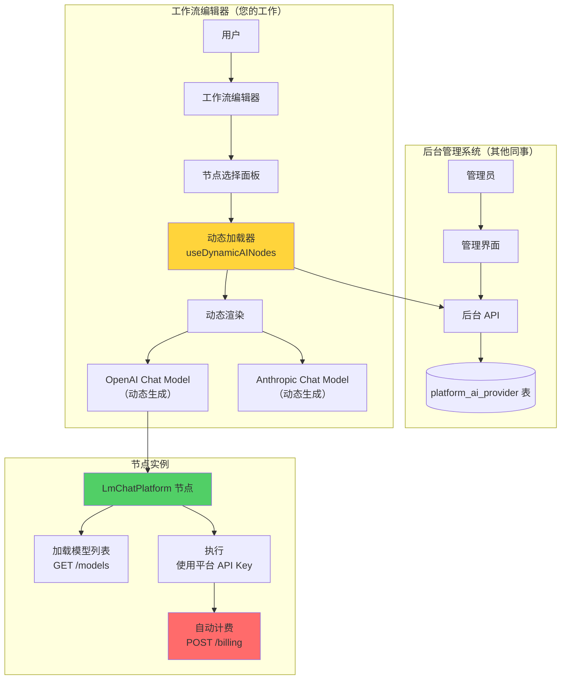

# 动态 AI 节点实施文档

> **实施日期：** 2025-11-09
> **目标：** 将硬编码的 Chat Model 节点改为100%由后台管理系统动态控制
> **当前进度：** 核心组件完成（约70%），待集成和测试

---

## 📋 已完成工作

### ✅ 1. 后端 API（由其他同事完成）

**已有接口：**
```typescript
GET /platform-ai-providers                      // 获取所有提供商
GET /platform-ai-providers/:key/models          // 获取模型列表
GET /platform-ai-providers/:key                 // 获取提供商详情
POST /platform-ai-providers/:key/chat/completions/billing // 计费接口
```

**数据表：**
- `platform_ai_provider` - 存储 AI 服务提供商配置和平台 API Key

### ✅ 2. 通用 Chat Model 节点

**文件：** `packages/@n8n/nodes-langchain/nodes/llms/LmChatPlatform/LmChatPlatform.node.ts`

**核心特性：**
- ✅ 支持参数化提供商（`providerKey`, `providerName`, `providerIcon`）
- ✅ 从后台 API 动态加载模型列表（`searchModels` 方法）
- ✅ 使用平台 API Key（无需用户配置凭证）
- ✅ 自动计费（通过 LangChain callbacks 调用后台接口）
- ✅ 支持 OpenAI 和 Anthropic（可扩展到其他提供商）

**已注册：** 在 `package.json` 中注册为 `dist/nodes/llms/LmChatPlatform/LmChatPlatform.node.js`

### ✅ 3. 前端动态节点加载 Composable

**文件：** `packages/frontend/editor-ui/src/features/shared/nodeCreator/composables/useDynamicAINodes.ts`

**功能：**
- ✅ 从后台 API 加载 AI 提供商列表
- ✅ 为每个提供商生成独立的节点条目
- ✅ 提供商图标映射
- ✅ 动态节点识别和提供商 key 提取

---

## 🚧 待完成工作

### 步骤 1：集成动态节点到 NodeTypes Store

**文件：** `packages/frontend/editor-ui/src/app/stores/nodeTypes.store.ts`

**需要添加：**

```typescript
import { useDynamicAINodes } from '@/features/shared/nodeCreator/composables/useDynamicAINodes';

// 在 store 定义中添加
const { loadDynamicAIChatModels } = useDynamicAINodes();

// 在 getNodeTypes 函数中添加动态节点加载
const getNodeTypes = async () => {
	const nodeTypes = await nodeTypesApi.getNodeTypes(rootStore.baseUrl);

	if (nodeTypes.length) {
		setNodeTypes(nodeTypes);
	}

	// ✅ 加载动态 AI Chat Model 节点
	const dynamicAINodes = await loadDynamicAIChatModels();
	if (dynamicAINodes.length) {
		// 将动态节点转换为 INodeTypeDescription 格式
		const dynamicNodeTypes = dynamicAINodes.map(node => ({
			...node,
			// 映射到实际的 lmChatPlatform 节点类型
			name: '@n8n/n8n-nodes-langchain.lmChatPlatform',
			// 保留动态名称用于显示
			__dynamicDisplayName: node.displayName,
			__providerKey: node.defaults.parameters.providerKey,
		}));
		setNodeTypes(dynamicNodeTypes);
	}
};
```

### 步骤 2：修改节点创建逻辑

**文件：** `packages/frontend/editor-ui/src/app/stores/workflows.store.ts`

**需要修改 `addNode` 方法：**

```typescript
// 检查是否是动态 AI 节点
if (nodeTypeName.includes('.lmChatPlatform-')) {
	// 提取提供商 key
	const providerKey = nodeTypeName.split('-').pop();

	// 使用实际的 lmChatPlatform 节点类型
	const actualNodeType = '@n8n/n8n-nodes-langchain.lmChatPlatform';

	// 创建节点时预设参数
	newNodeData.parameters = {
		...newNodeData.parameters,
		providerKey,
		providerName: // 从 aiProvidersStore 获取
		providerIcon: // 从 aiProvidersStore 获取
	};

	// 使用实际节点类型
	nodeTypeName = actualNodeType;
}
```

### 步骤 3：更新节点选择面板显示

**文件：** `packages/frontend/editor-ui/src/features/shared/nodeCreator/composables/useActionsGeneration.ts`

**需要修改：**

```typescript
import { useDynamicAINodes } from './useDynamicAINodes';

export function useActionsGeneration() {
	const { dynamicNodes, loadDynamicAIChatModels } = useDynamicAINodes();

	// 在生成节点列表时包含动态节点
	async function generateMergedNodesAndActions(...) {
		// 加载动态 AI 节点
		await loadDynamicAIChatModels();

		// 将动态节点添加到 AI Language Models 类别
		const aiCategoryNodes = [
			...existingAINodes,
			...dynamicNodes.value,
		];

		return { nodes: aiCategoryNodes, actions };
	}
}
```

### 步骤 4：构建和测试

**命令：**

```bash
# 1. 构建后端节点
cd packages/@n8n/nodes-langchain
pnpm build

# 2. 构建前端
cd packages/frontend/editor-ui
pnpm build

# 3. 启动 n8n
cd ../../..
pnpm dev
```

**测试清单：**

- [ ] 打开工作流编辑器
- [ ] 点击添加节点按钮
- [ ] 导航到 AI → Language Models
- [ ] 验证显示动态加载的节点（如 "OpenAI Chat Model", "Anthropic Chat Model"）
- [ ] 点击一个节点
- [ ] 验证模型下拉列表从后台 API 动态加载
- [ ] 验证模型列表显示价格（¥x/1K tokens）
- [ ] 创建工作流并执行
- [ ] 验证使用平台 API Key 调用模型
- [ ] 验证自动计费功能（检查后台数据库或日志）

### 步骤 5：删除硬编码节点

**⚠️ 重要：只在动态节点测试通过后执行**

**需要删除的节点（15个）：**

```bash
# 删除节点目录
rm -rf packages/@n8n/nodes-langchain/nodes/llms/LMChatAnthropic
rm -rf packages/@n8n/nodes-langchain/nodes/llms/LmChatAwsBedrock
rm -rf packages/@n8n/nodes-langchain/nodes/llms/LmChatAzureOpenAi
rm -rf packages/@n8n/nodes-langchain/nodes/llms/LmChatCohere
rm -rf packages/@n8n/nodes-langchain/nodes/llms/LmChatDeepSeek
rm -rf packages/@n8n/nodes-langchain/nodes/llms/LmChatGoogleGemini
rm -rf packages/@n8n/nodes-langchain/nodes/llms/LmChatGoogleVertex
rm -rf packages/@n8n/nodes-langchain/nodes/llms/LmChatGroq
rm -rf packages/@n8n/nodes-langchain/nodes/llms/LMChatLemonade
rm -rf packages/@n8n/nodes-langchain/nodes/llms/LmChatMistralCloud
rm -rf packages/@n8n/nodes-langchain/nodes/llms/LMChatOllama
rm -rf packages/@n8n/nodes-langchain/nodes/llms/LMChatOpenAi
rm -rf packages/@n8n/nodes-langchain/nodes/llms/LmChatOpenRouter
rm -rf packages/@n8n/nodes-langchain/nodes/llms/LmChatVercelAiGateway
rm -rf packages/@n8n/nodes-langchain/nodes/llms/LmChatXAiGrok
```

**从 package.json 移除注册：**

编辑 `packages/@n8n/nodes-langchain/package.json`，删除所有 `dist/nodes/llms/LMChat*` 相关的行（保留 `LmChatPlatform`）。

---

## 🔧 可能需要的调整

### 1. 图标处理

如果提供商图标不在预设映射中，需要：

**选项 A：** 使用默认图标（`fa:robot`）

**选项 B：** 从后台 API 返回图标 URL
```typescript
// 后台 API 返回
{
  providerKey: "openai",
  providerName: "OpenAI",
  iconUrl: "/icons/openai.svg", // ← 新增字段
  ...
}
```

### 2. 添加更多提供商支持

在 `LmChatPlatform.node.ts` 的 `supplyData` 方法中添加：

```typescript
case 'google-gemini':
	const { ChatGoogleGenerativeAI } = await import('@langchain/google-genai');
	chatModel = new ChatGoogleGenerativeAI({
		modelName: modelResource,
		apiKey: providerConfig.apiKey,
		// ... 其他配置
	});
	break;

case 'aws-bedrock':
	const { BedrockChat } = await import('@langchain/community/chat_models/bedrock');
	chatModel = new BedrockChat({
		model: modelResource,
		// ... AWS 配置
	});
	break;
```

### 3. 错误处理增强

**场景 1：** 后台 API 不可用

```typescript
try {
	await loadDynamicAIChatModels();
} catch (error) {
	console.warn('Failed to load dynamic AI nodes, falling back to empty list', error);
	// 显示通知给用户
	useToast().showError({
		title: '加载 AI 模型失败',
		message: '请检查后台服务是否正常运行',
	});
}
```

**场景 2：** 余额不足

在 `LmChatPlatform.node.ts` 中：

```typescript
handleLLMStart: async () => {
	// 在调用前检查余额
	const balance = await this.helpers.httpRequest({
		method: 'GET',
		url: `${this.getRestApiUrl()}/workspaces/current/balance`,
	});

	if (balance.amount < estimatedCost) {
		throw new Error('工作空间余额不足，请充值后再试');
	}
}
```

---

## 📊 架构图



---

## 🎯 下一步行动

1. **您的工作：** 完成"待完成工作"中的步骤 1-4
2. **测试：** 与后台同事联调，确保 API 正常工作
3. **清理：** 测试通过后执行步骤 5 删除硬编码节点
4. **文档：** 更新用户文档和开发文档

---

## 📞 需要协调的事项

**与后台同事确认：**
- ✅ API 端点是否已实现
- ✅ 返回的数据格式是否符合预期
- ✅ 平台 API Key 解密逻辑是否正常
- ✅ 计费接口是否能正确扣费

**测试数据准备：**
- 至少配置 2 个 AI 提供商（如 OpenAI 和 Anthropic）
- 每个提供商至少配置 2-3 个模型
- 确保有测试工作空间和余额

---

## 🐛 已知问题和解决方案

### 问题 1：节点显示名称不更新

**原因：** 动态表达式 `={{$parameter.providerName}}` 可能不生效

**解决方案：** 在节点创建时直接设置显示名称

```typescript
newNodeData.name = `${providerName} Chat Model`;
```

### 问题 2：模型列表加载失败

**原因：** `providerKey` 参数未正确传递

**解决方案：** 确保在节点创建时预设隐藏参数

```typescript
newNodeData.parameters = {
	providerKey: 'openai',
	providerName: 'OpenAI',
	providerIcon: 'file:openAiLight.svg',
};
```

---

**最后更新：** 2025-11-09
**维护者：** 开发团队
