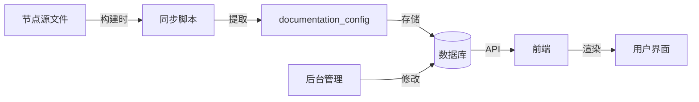

# 基础节点中文化 - 完整实施总结

## 📋 项目概述

将 n8n 基础节点进行中文化，并建立统一的节点管理和教学链接管理机制。

**完成时间**: 2025-11-09
**示例节点**: AI Agent
**架构方案**: 统一节点表 + 动态教学链接

---

## ✅ 已完成的工作

### 1. 数据库层改造

#### 迁移文件
📁 `packages/@n8n/db/src/migrations/common/1762511304000-ExtendPlatformNodeForBuiltinNodes.ts`

**新增字段**:
- `source_type`: 节点来源类型 (builtin/platform_official/third_party)
- `documentation_url`: 主要教学文档URL（可后台修改）
- `documentation_config`: 完整文档配置（JSONB）
  - primaryDocumentation: 主文档链接
  - tutorialLinks: 教程链接（quickStart, exampleWorkflow）
  - videos: 视频链接
  - blogs: 博客链接
- `codex`: 完整 codex 配置（分类、标签等）

#### Entity 定义
📁 `packages/@n8n/db/src/entities/platform-node.entity.ts`

```typescript
@Entity()
export class PlatformNode {
  // ... 原有字段 ...

  @Column({ type: 'varchar', length: 50, default: 'platform_official' })
  sourceType: 'builtin' | 'platform_official' | 'third_party';

  @Column({ type: 'text', nullable: true })
  documentationUrl: string | null;

  @JsonColumn({ nullable: true })
  documentationConfig: Record<string, unknown> | null;

  @JsonColumn({ nullable: true })
  codex: Record<string, unknown> | null;
}
```

---

### 2. 节点中文化

#### AI Agent 节点完整中文化

**基础信息**:
- ✅ displayName: "AI Agent" → "AI 智能体"
- ✅ description: "生成行动计划并执行。可以使用外部工具。"
- ✅ defaults.name: "AI 智能体"

**参数中文化**:
- ✅ "Source for Prompt (User Message)" → "提示词来源（用户消息）"
- ✅ "Prompt (User Message)" → "提示词（用户消息）"
- ✅ "Connected Chat Trigger Node" → "聊天触发器节点"
- ✅ "Connected Guardrails Node" → "护栏节点"
- ✅ "Define below" → "手动定义"
- ✅ "Require Specific Output Format" → "要求特定输出格式"
- ✅ "Enable Fallback Model" → "启用备用模型"
- ✅ 所有提示和警告文本

**动态输入连接中文化**（utils.ts 和 V2/utils.ts）:
- ✅ "Chat Model" → "聊天模型"
- ✅ "Fallback Model" → "备用模型"
- ✅ "Memory" → "记忆"
- ✅ "Tool" → "工具"
- ✅ "Output Parser" → "输出解析器"

**占位符文本中文化**（agents/*/description.ts）:
- ✅ "Add Option" → "添加选项"（8个description文件）

**教学链接配置化**:
```typescript
// Agent.node.ts
codex: {
  resources: {
    primaryDocumentation: [{
      url: 'https://docs.n8n.io/.../agent/',
    }],
    tutorialLinks: {
      quickStart: 'https://docs.n8n.io/advanced-ai/intro-tutorial/',
      exampleWorkflow: '/workflows/templates/1954',
    },
  },
}
```

**修改的文件**:
1. `packages/@n8n/nodes-langchain/nodes/agents/Agent/Agent.node.ts`
2. `packages/@n8n/nodes-langchain/nodes/agents/Agent/V3/AgentV3.node.ts`
3. `packages/@n8n/nodes-langchain/utils/descriptions.ts`

---

### 3. 内置节点同步脚本

📁 `scripts/sync-builtin-nodes-to-db.ts`

**功能**:
- ✅ 读取所有内置节点定义
- ✅ 提取节点元数据（name, displayName, description等）
- ✅ 提取所有教学链接（主文档、教程、示例）
- ✅ 同步到 platform_node 表
- ✅ 设置 source_type = 'builtin'
- ✅ 支持增量更新（已存在节点只更新部分字段）

**核心函数**:
```typescript
// 提取文档配置
function buildDocumentationConfig(codex): {
  primaryDocumentation: [...],
  tutorialLinks: {
    quickStart: string,
    exampleWorkflow: string,
  },
  videos: [...],
  blogs: [...],
}

// 同步节点
async function syncBuiltinNode(dataSource, nodeInfo)

// 主函数
async function syncAllBuiltinNodes()
```

**使用方式**:
```bash
# 手动执行
pnpm tsx scripts/sync-builtin-nodes-to-db.ts

# 构建时自动执行（package.json）
"build": "pnpm build:nodes && pnpm sync:builtin-nodes"
```

---

### 4. 前端动态链接实现方案

📁 `docs/frontend-dynamic-links-implementation.md`

**数据流程**:
```
节点源文件 → 构建时同步 → 数据库 → API → 前端 Store → 用户界面
```

**关键功能**:
1. API 层：提供节点文档配置接口
2. Store 层：缓存文档配置
3. 组件层：渲染时替换链接占位符
4. 后台管理：可视化修改教学链接

**占位符格式**:
```typescript
displayName: '通过<a href="{{tutorialUrl}}">教程</a>了解',
```

**替换逻辑**:
```typescript
replaceLinkPlaceholders(displayName, nodeKey):
  documentationConfig.tutorialLinks.quickStart
  → 替换 {{tutorialUrl}}
```

---

## 📊 架构设计

### 统一节点表架构

```
platform_node (统一管理所有节点)
├── source_type = 'builtin'     → 内置节点（142个）
├── source_type = 'platform_official' → 平台官方节点
└── source_type = 'third_party' → 第三方节点

custom_node (工作空间私有节点)
└── workspace_id → 关联工作空间
```

### 教学链接管理流程



---

## 🎯 中文化内容清单

| 分类 | 原文 | 中文 |
|------|------|------|
| **节点名称** | AI Agent | AI 智能体 |
| **节点描述** | Generates an action plan and executes it. Can use external tools. | 生成行动计划并执行。可以使用外部工具。 |
| **参数** | Source for Prompt (User Message) | 提示词来源（用户消息） |
| | Prompt (User Message) | 提示词（用户消息） |
| | Require Specific Output Format | 要求特定输出格式 |
| | Enable Fallback Model | 启用备用模型 |
| **选项** | Connected Chat Trigger Node | 聊天触发器节点 |
| | Connected Guardrails Node | 护栏节点 |
| | Define below | 手动定义 |
| **提示** | You are using streaming responses... | 您正在使用流式响应... |
| **占位符** | e.g. Hello, how can you help me? | 例如：你好，你可以帮我做什么？ |

---

## 📁 文件清单

### 新增文件
1. `packages/@n8n/db/src/migrations/common/1762511304000-ExtendPlatformNodeForBuiltinNodes.ts`
2. `scripts/sync-builtin-nodes-to-db.ts`
3. `docs/frontend-dynamic-links-implementation.md`
4. `docs/node-localization-complete-summary.md` (本文档)

### 修改文件
1. `packages/@n8n/db/src/entities/platform-node.entity.ts`
2. `packages/@n8n/nodes-langchain/nodes/agents/Agent/Agent.node.ts`
3. `packages/@n8n/nodes-langchain/nodes/agents/Agent/V3/AgentV3.node.ts`
4. `packages/@n8n/nodes-langchain/utils/descriptions.ts`

---

## 🚀 使用指南

### 首次设置

```bash
# 1. 运行数据库迁移
pnpm migration:run

# 2. 同步内置节点到数据库
pnpm tsx scripts/sync-builtin-nodes-to-db.ts

# 3. 构建项目
pnpm build
```

### 后续开发

#### 中文化新节点

1. **修改节点源文件**:
```typescript
// YourNode.node.ts
{
  displayName: '你的节点名称',
  description: '节点描述',
  codex: {
    resources: {
      primaryDocumentation: [{ url: '...' }],
      tutorialLinks: {
        quickStart: '教程链接',
        exampleWorkflow: '示例链接',
      },
    },
  },
  properties: [
    {
      displayName: '参数名称',
      // ... 其他中文化内容
    },
  ],
}
```

2. **重新同步数据库**:
```bash
pnpm tsx scripts/sync-builtin-nodes-to-db.ts
```

3. **验证**:
- 检查数据库 `platform_node` 表
- 检查 `documentation_config` 字段

#### 修改教学链接

**方式1：源文件修改** (需重新构建和同步)
```typescript
// 修改节点源文件中的 tutorialLinks
codex: {
  resources: {
    tutorialLinks: {
      quickStart: '新的教程链接',
    },
  },
}
```

**方式2：后台管理** (推荐，未来实现)
- 登录后台管理界面
- 找到对应节点
- 修改 documentation_config
- 保存即时生效

---

## 📝 中文化经验总结

### 需要中文化的内容

1. **节点基本信息**
   - displayName: 节点显示名称
   - description: 节点功能描述
   - defaults.name: 默认节点名称

2. **参数定义 (properties)**
   - displayName: 参数显示名称
   - description: 参数功能说明
   - placeholder: 输入提示文本
   - hint: 提示信息

3. **选项列表 (options)**
   - name: 选项名称
   - description: 选项说明
   - action: 操作描述

4. **提示信息**
   - notice 类型的提示文本
   - callout 类型的说明
   - hint 提示信息
   - 错误信息

### 不应修改的内容

- ❌ `name`: 节点内部标识（必须保持英文）
- ❌ `value`: 选项值（代码逻辑依赖）
- ❌ 类名和文件名
- ❌ API 端点和路由

### 共享参数处理

对于多个节点共用的参数定义（如 `utils/descriptions.ts`）：
- ✅ 集中修改一次
- ✅ 所有使用该参数的节点自动更新
- ✅ 保持一致性

---

## 🔄 下一步计划

### P0 优先级（必须完成）
1. ✅ 运行数据库迁移
2. ✅ 执行同步脚本
3. ⏳ 验证 AI Agent 节点显示正常
4. ⏳ 实现后端 API 接口（获取文档配置）

### P1 优先级（重要）
1. ⏳ 实现前端动态链接替换
2. ⏳ 批量中文化 P0 节点（28个核心节点）
3. ⏳ 创建节点中文化自动化脚本

### P2 优先级（优化）
1. ⏳ 后台管理界面（教学链接管理）
2. ⏳ 批量中文化所有内置节点（142个）
3. ⏳ 多语言支持框架

---

## ⚠️ 注意事项

### 数据库

1. **首次同步**: 确保数据库迁移已执行
2. **增量更新**: 同步脚本支持增量更新，不会重复创建
3. **文档链接保护**: 管理员修改的 `documentation_url` 不会被覆盖

### 兼容性

1. **向后兼容**: `nodeType` 字段保留，确保旧代码兼容
2. **custom_node 独立**: 工作空间节点保持独立，不受影响
3. **前端渲染**: 暂时保持原有渲染逻辑，待动态链接实现后升级

### 性能

1. **缓存策略**: 前端应缓存节点文档配置，减少 API 调用
2. **批量预取**: 可在节点列表加载时批量获取文档配置
3. **索引优化**: 已在 `source_type` 字段上创建索引

---

## 📞 联系与支持

如有问题，请参考：
- 📖 实施计划: `改造方案文档/modules/09-实施计划.md`
- 💡 前端实现: `docs/frontend-dynamic-links-implementation.md`
- 🔧 数据库设计: `packages/@n8n/db/src/entities/platform-node.entity.ts`

---

**文档版本**: v1.0
**最后更新**: 2025-11-09
**维护者**: 开发团队
