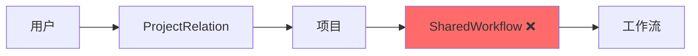
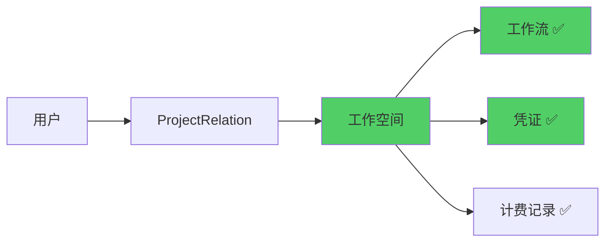
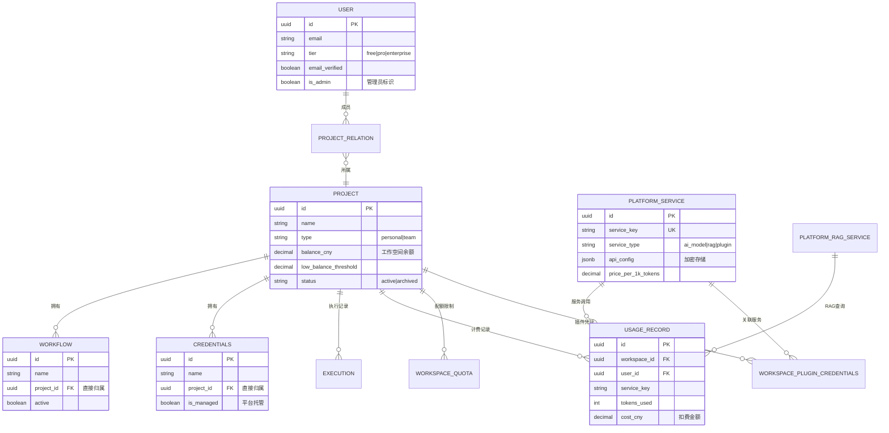
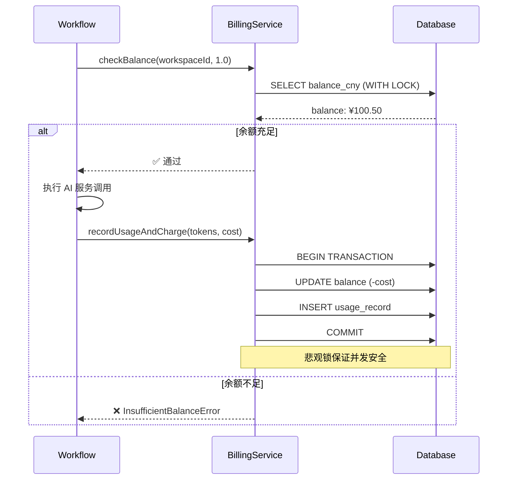
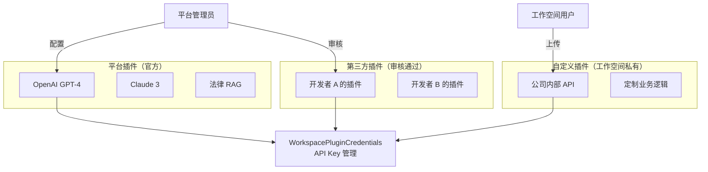
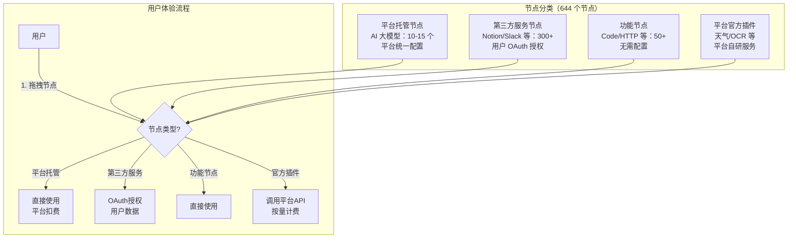
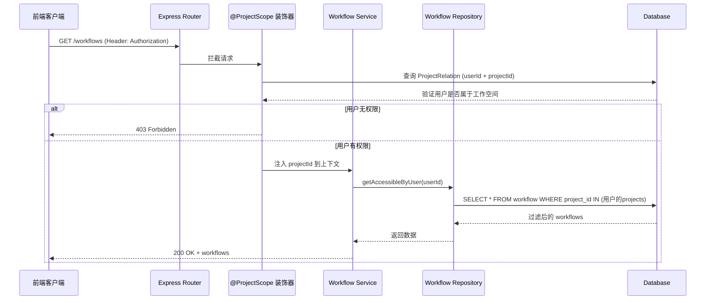

# n8n 多租户架构完整方案

> **版本：** v6.0 - 整合版
> **日期：** 2025-01-08
> **基于分支：** 20251102
> **改造目标：** 对标 Coze - 工作空间架构 + AI 按量计费 + 插件系统
> **前提条件：** 项目未部署生产，可激进改造

---

## 📋 目录

1. [执行摘要（TL;DR）](#执行摘要tldr)
2. [架构设计](#架构设计)
3. [数据库设计与实施](#数据库设计与实施)
4. [后端架构](#后端架构)
5. [前端架构](#前端架构)
6. [安全与性能](#安全与性能)
7. [实施计划](#实施计划)
8. [风险控制](#风险控制)
9. [成功标准](#成功标准)
10. [附录](#附录)

---

## 🎯 执行摘要（TL;DR）

### 核心目标

将 n8n 从**单租户开源工具**改造为**多租户 SaaS 平台**，对标 Coze 商业版。

### 关键数字

| 指标 | 改造前 | 改造后 | 提升 |
|------|--------|--------|------|
| 查询层级 | 4 层 JOIN | 3 层 JOIN | 性能提升 30-40% |
| 工作空间数 | 1（固定） | 无限制 | ∞ |
| 计费方式 | 无 | 按量计费（人民币） | - |
| 表数量 | 45 个 | 56 个（+11 新表） | - |
| 删除旧表 | - | 2 个（SharedWorkflow/Credentials） | - |

### ROI 分析

**收益：**
- ✅ 支持多租户 SaaS 商业模式
- ✅ 按量计费系统（预计月营收：用户数 × ¥50-200）
- ✅ 三层插件市场（平台插件 + 第三方插件 + 自定义插件）
- ✅ 性能提升 30-40%
- ✅ 降低开发复杂度（删除 SharedWorkflow 中间层）

**成本：**
- 开发时间：12 周（3 个月）
- 开发人力：1-2 人
- 测试时间：2 周

**风险：**
- ⚠️ 激进改造，无法回退到原架构
- ⚠️ 需要完整重构 Repository/Service 层（50+ 文件）

---

## 📐 架构设计

### 核心决策表

| 决策点 | 方案 | 理由 | 影响 |
|--------|------|------|------|
| **SharedWorkflow/Credentials** | 直接删除 | 简化架构 | 性能 ↑30-40% |
| **资源归属** | Workflow/Credentials → Project | 减少 JOIN 层级 | 查询速度 ↑ |
| **工作空间** | Project 表扩展（type 字段） | 无需新表 | 兼容性好 |
| **计费货币** | 直接人民币（CNY） | 不搞积分 | 用户体验好 |
| **知识库** | 平台 RAG 插件（按次计费） | 降低平台成本 | 用户数据隔离 |
| **插件系统** | 三层架构（平台/第三方/自定义） | 灵活扩展 | 营收增长点 |
| **前后端分离** | 已实现（Vite + Express） | 独立部署 | 提升可维护性 |

### 架构演进对比

**改造前（4层JOIN）：**


**改造后（3层JOIN）：**


### 数据库 E-R 关系图



### 核心表设计摘要

**扩展现有表：**

| 表名 | 新增字段 | 用途 |
|------|---------|------|
| `project` | `balance_cny`, `low_balance_threshold`, `slug`, `status` | 工作空间计费 |
| `workflow_entity` | `project_id` (FK) | 直接归属工作空间 |
| `credentials_entity` | `project_id` (FK), `is_managed` | 直接归属 + 平台托管标识 |
| `execution_entity` | `workspace_id` (FK) | 工作空间隔离 |
| `user` | `tier`, `email_verified`, `is_admin` | 用户层级和管理员 |

**新增表（11 个）：**

| 表名 | 用途 | 关键字段 |
|------|------|---------|
| `platform_services` | 平台 AI 服务配置 | `service_key`, `price_per_1k_tokens` |
| `platform_rag_services` | 平台 RAG 知识库 | `category`, `price_per_query` |
| `usage_records` | 使用量和扣费记录 | `workspace_id`, `cost_cny` |
| `monthly_usage_summary` | 月度账单汇总 | `month`, `total_cost_cny` |
| `workspace_quotas` | 工作空间配额 | `max_workflows`, `max_executions_per_day` |
| `workspace_features` | 功能开关 | `feature_key`, `enabled` |
| `workspace_plugin_credentials` | 插件 API Key | `service_id`, `encrypted_credentials` |
| `invite_codes` | 邀请码系统 | `code`, `bonus_amount_cny` |
| `audit_logs` | 审计日志 | `workspace_id`, `action` |
| `recharge_records` | 充值记录 | `amount_cny`, `payment_method` |
| `registration_stats` | 注册统计 | `date`, `total_registrations` |

**删除表（2 个）：**
- ❌ `shared_workflow`
- ❌ `shared_credentials`

### 计费系统核心流程



### 三层插件系统架构



### 节点动态化架构（Coze 风格）

**核心理念**：让用户开箱即用 AI 能力,无需配置 OpenAI API Key



**节点分类统计**：

| 节点类型 | 数量 | 配置方式 | 计费方式 | 示例 |
|---------|------|---------|---------|------|
| **平台托管 AI 节点** | 15 | 平台统一配置 API Key | 按 Token 计费 | OpenAI, Claude, Gemini |
| **第三方服务节点** | 300+ | 用户 OAuth 授权或输入 API Key | 用户自付费 | Notion, Slack, GitHub |
| **功能节点** | 50+ | 无需配置 | 免费 | Code, HTTP Request, Filter |
| **平台官方插件** | 待开发 | 平台统一配置 | 按调用次数计费 | 天气查询, OCR 识别 |

**关键设计决策**：

1. **保留凭证系统作为高级功能**：向后兼容,高级用户可创建凭证在多个节点间复用
2. **OAuth 优先**：支持的第三方服务优先使用 OAuth 授权,提升用户体验
3. **节点参数输入**：不支持 OAuth 的服务在节点参数中直接输入 API Key
4. **配额控制**：平台托管节点每工作空间设置月度配额（如 100 万 tokens）

---

## 💾 数据库设计与实施

### 实施策略（全新项目）

由于项目未上线，采用**直接创建新架构**方式：

```
✅ 正确做法（你们的情况）:
1. 直接删除 shared_workflow 和 shared_credentials 表
2. 在 workflow_entity 和 credentials_entity 添加 project_id 字段
3. 创建新的多租户相关表
4. TypeORM 自动同步数据库结构

❌ 错误做法（不需要）:
1. 备份 shared_workflow
2. 迁移数据
3. 复杂的数据转换
```

### TypeORM Migration 方案（推荐）

**创建 Migration 文件：**

```typescript
// packages/@n8n/db/src/migrations/common/1762504711060-CreateMultiTenancyTables.ts

export class CreateMultiTenancyTables1762504711060 implements ReversibleMigration {
  async up({ queryRunner, tablePrefix }: MigrationContext): Promise<void> {
    // 1. 删除旧表
    await queryRunner.query(`DROP TABLE IF EXISTS ${tablePrefix}shared_workflow CASCADE`);
    await queryRunner.query(`DROP TABLE IF EXISTS ${tablePrefix}shared_credentials CASCADE`);

    // 2. 添加 project_id 到资源表
    await queryRunner.query(`
      ALTER TABLE ${tablePrefix}workflow_entity
      ADD COLUMN project_id UUID NOT NULL,
      ADD CONSTRAINT fk_workflow_project
        FOREIGN KEY (project_id) REFERENCES ${tablePrefix}project(id)
        ON DELETE CASCADE
    `);

    // 3. 创建索引
    await queryRunner.query(`
      CREATE INDEX idx_workflow_project ON ${tablePrefix}workflow_entity(project_id);
      CREATE INDEX idx_workflow_project_active
        ON ${tablePrefix}workflow_entity(project_id, active);
    `);

    // 4. 创建计费系统表
    await queryRunner.query(`
      CREATE TABLE ${tablePrefix}usage_record (
        id UUID PRIMARY KEY DEFAULT gen_random_uuid(),
        workspace_id UUID NOT NULL,
        user_id UUID NOT NULL,
        service_key VARCHAR(100) NOT NULL,
        tokens_used INT,
        calls_count INT DEFAULT 1,
        cost_cny DECIMAL(10, 4) NOT NULL,
        metadata JSONB,
        created_at TIMESTAMP DEFAULT NOW(),
        CONSTRAINT fk_usage_workspace
          FOREIGN KEY (workspace_id) REFERENCES ${tablePrefix}project(id)
      );
    `);

    // 5. 创建平台服务表（支持节点动态化）
    await queryRunner.query(`
      CREATE TABLE ${tablePrefix}platform_service (
        service_key VARCHAR(100) PRIMARY KEY,
        service_type VARCHAR(50) NOT NULL,  -- 'ai_model' | 'rag' | 'plugin' | 'node'
        name VARCHAR(200) NOT NULL,

        -- 节点动态化字段
        node_type VARCHAR(100),              -- 节点类型：'openai', 'anthropic', 'notion' 等
        node_category VARCHAR(50),           -- 'platform_managed' | 'third_party' | 'function' | 'official_plugin'
        api_key_encrypted TEXT,              -- 加密的平台 API Key（仅 platform_managed 使用）
        quota_config JSONB,                  -- 配额配置：{ monthlyTokens: 1000000, monthlyRequests: 10000 }

        pricing_config JSONB NOT NULL,       -- 计费配置
        is_active BOOLEAN DEFAULT true,
        created_at TIMESTAMP DEFAULT NOW(),
        updated_at TIMESTAMP DEFAULT NOW()
      );
    `);
  }

  async down({ queryRunner, tablePrefix }: MigrationContext): Promise<void> {
    // 回滚操作（开发环境一般用不到）
    await queryRunner.query(`DROP TABLE IF EXISTS ${tablePrefix}platform_service`);
    await queryRunner.query(`DROP TABLE IF EXISTS ${tablePrefix}usage_record`);
    await queryRunner.query(`ALTER TABLE ${tablePrefix}workflow_entity DROP COLUMN project_id`);
  }
}
```

**执行 Migration：**

```bash
# 运行数据库迁移
pnpm --filter @n8n/cli db:migrate

# 验证迁移成功
psql -U n8n -d n8n -c "\dt"
```

---

## 🔧 后端架构

### Service 层核心接口

```typescript
// packages/cli/src/services/

/** 计费服务 */
interface BillingService {
  checkBalance(workspaceId: string, estimatedCost: number): Promise<void>;
  recordUsageAndCharge(params: UsageParams): Promise<void>;
  getMonthlyBill(workspaceId: string, month: string): Promise<Bill>;
  recharge(workspaceId: string, amount: number, paymentData: PaymentData): Promise<void>;
}

/** 平台 RAG 服务 */
interface PlatformRagService {
  query(workspaceId: string, serviceKey: string, query: string): Promise<RagResult>;
  listAvailableServices(): Promise<RagService[]>;
}

/** 插件验证服务 */
interface PluginValidatorService {
  validateTypeScript(code: string): Promise<ValidationResult>;
  checkSecurity(code: string): Promise<SecurityResult>;
}

/** 工作空间上下文服务 */
interface WorkspaceContextService {
  getCurrentWorkspace(userId: string): Promise<Project>;
  switchWorkspace(userId: string, workspaceId: string): Promise<void>;
}

/** 节点可见性服务（节点动态化核心） */
interface NodeVisibilityService {
  // 获取工作空间可用节点列表
  getAvailableNodes(workspaceId: string): Promise<{
    platformManagedNodes: NodeInfo[];     // 平台托管节点（OpenAI, Claude等）
    thirdPartyNodes: NodeInfo[];          // 第三方服务节点（Notion, Slack等）
    functionNodes: NodeInfo[];            // 功能节点（Code, HTTP等）
    officialPlugins: NodeInfo[];          // 平台官方插件
  }>;

  // 获取节点的凭证配置（用于节点执行时注入）
  getNodeCredentials(nodeType: string, workspaceId: string): Promise<CredentialData | null>;

  // 检查工作空间是否有权限使用某个节点
  checkNodeAccess(workspaceId: string, nodeType: string): Promise<boolean>;

  // 记录节点使用并扣费（平台托管节点）
  recordNodeUsageAndCharge(params: {
    workspaceId: string;
    nodeType: string;
    tokensUsed?: number;
    requestCount?: number;
  }): Promise<void>;
}
```

**节点动态化实现示例**：

```typescript
// packages/cli/src/services/node-visibility.service.ts
@Service()
export class NodeVisibilityService {
  async getAvailableNodes(workspaceId: string) {
    // 1. 获取所有平台托管节点（AI大模型）
    const platformManagedNodes = await this.platformServiceRepository.find({
      where: {
        service_type: 'node',
        node_category: 'platform_managed',
        is_active: true
      }
    });

    // 2. 获取所有第三方服务节点（固定列表，所有工作空间可见）
    const thirdPartyNodes = ALL_THIRD_PARTY_NODES; // Notion, Slack, GitHub 等

    // 3. 获取功能节点（固定列表，无需配置）
    const functionNodes = ALL_FUNCTION_NODES; // Code, HTTP Request, Filter 等

    // 4. 获取平台官方插件（管理员创建的插件）
    const officialPlugins = await this.platformServiceRepository.find({
      where: {
        service_type: 'plugin',
        node_category: 'official_plugin',
        is_active: true
      }
    });

    return {
      platformManagedNodes: platformManagedNodes.map(toNodeInfo),
      thirdPartyNodes,
      functionNodes,
      officialPlugins: officialPlugins.map(toNodeInfo)
    };
  }

  async getNodeCredentials(nodeType: string, workspaceId: string) {
    // 如果是平台托管节点，返回平台的 API Key
    const platformNode = await this.platformServiceRepository.findOne({
      where: { node_type: nodeType, node_category: 'platform_managed' }
    });

    if (platformNode && platformNode.api_key_encrypted) {
      // 解密并返回平台 API Key
      return {
        apiKey: await this.decrypt(platformNode.api_key_encrypted)
      };
    }

    // 否则，用户需要自己配置凭证（通过凭证系统或节点参数）
    return null;
  }
}
```

### API 路由设计

```typescript
// 工作空间相关 API
GET    /rest/workspaces              // 获取当前用户所有工作空间
POST   /rest/workspaces              // 创建新工作空间
GET    /rest/workspaces/:id          // 获取工作空间详情
PATCH  /rest/workspaces/:id          // 更新工作空间信息
DELETE /rest/workspaces/:id          // 删除/归档工作空间

// 工作流 API（工作空间上下文通过 Header 传递）
GET    /rest/workflows               // 获取当前工作空间的工作流
POST   /rest/workflows               // 在当前工作空间创建工作流
PATCH  /rest/workflows/:id           // 更新工作流
DELETE /rest/workflows/:id           // 删除工作流

// 计费相关 API
GET    /rest/billing/balance         // 获取当前工作空间余额
POST   /rest/billing/recharge        // 发起充值
GET    /rest/billing/usage           // 获取消费记录

// 平台服务 API
GET    /rest/platform-services       // 获取可用平台服务列表
POST   /rest/platform-rag/query      // 调用平台 RAG 服务

// 节点相关 API（节点动态化）
GET    /rest/nodes/available         // 获取当前工作空间可用节点列表
GET    /rest/nodes/:type/credentials // 获取节点的平台凭证（如果是平台托管节点）
GET    /rest/nodes/:type/quota       // 获取节点的配额使用情况（平台托管节点）

// 后台管理 API（仅管理员）
GET    /rest/admin/platform-services           // 管理平台服务
POST   /rest/admin/platform-services/nodes     // 添加平台托管节点（AI大模型）
PATCH  /rest/admin/platform-services/nodes/:type // 更新节点配置（API Key、配额等）
POST   /rest/admin/workspaces/:id/recharge     // 管理员充值
GET    /rest/admin/stats/overview              // 平台统计数据
```

### 认证和鉴权（JWT + 工作空间上下文）

**工作空间上下文传递（通过 HTTP Header）：**

```typescript
// 前端：每次 API 请求自动附加
axios.interceptors.request.use((config) => {
  const token = localStorage.getItem('n8n_token');
  const activeWorkspaceId = projectsStore.currentWorkspaceId;

  config.headers['Authorization'] = `Bearer ${token}`;
  if (activeWorkspaceId) {
    config.headers['X-Workspace-Id'] = activeWorkspaceId;
  }
  return config;
});

// 后端：中间件提取
export const workspaceContextMiddleware: RequestHandler = async (req, res, next) => {
  const token = req.headers['authorization']?.replace('Bearer ', '');
  const workspaceId = req.headers['x-workspace-id'];

  // 验证 JWT token
  const decoded = jwt.verify(token, process.env.JWT_SECRET);
  req.user = decoded;

  // 验证工作空间权限
  if (workspaceId) {
    const hasAccess = await workspaceContextService.validateAccess(
      decoded.userId,
      workspaceId,
    );
    if (!hasAccess) {
      return res.status(403).json({ error: 'Forbidden' });
    }
    req.workspaceContext = { workspaceId };
  }

  next();
};
```

### 工作空间隔离机制详解

**n8n 已内置完整的工作空间隔离机制**，通过 `@ProjectScope` 装饰器实现。改造过程中发现：

#### 核心概念：Project = Workspace

在 n8n 架构中，**Project 实体就是 Workspace（工作空间）** 的实现：

```typescript
// packages/@n8n/db/src/entities/project.entity.ts
@Entity()
export class Project {
  @PrimaryGeneratedColumn('uuid')
  id: string;

  @Column({ type: 'varchar', nullable: false })
  name: string;  // 工作空间名称

  @Column({ type: 'enum', enum: ['personal', 'team'], default: 'personal' })
  type: 'personal' | 'team';  // 工作空间类型

  // 关系：工作空间成员
  @OneToMany(() => ProjectRelation, (relation) => relation.project)
  projectRelations: ProjectRelation[];

  // 关系：工作空间资源
  @OneToMany(() => Workflow, (workflow) => workflow.project)
  workflows: Workflow[];

  @OneToMany(() => Credentials, (credentials) => credentials.project)
  credentials: Credentials[];
}
```

#### @ProjectScope 装饰器机制

n8n 使用 `@ProjectScope` 装饰器在路由级别自动实现工作空间隔离：

```typescript
// packages/@n8n/decorators/src/project-scope.ts

/**
 * @ProjectScope 装饰器
 *
 * 功能：
 * 1. 从请求参数中提取 projectId (即 workspaceId)
 * 2. 验证当前用户是否有权限访问该 Project
 * 3. 自动过滤查询结果，只返回该工作空间的数据
 *
 * 使用位置：Controller 的路由方法上
 */
export function ProjectScope(options?: ProjectScopeOptions) {
  return function(
    target: any,
    propertyKey: string,
    descriptor: PropertyDescriptor
  ) {
    // 拦截器逻辑：
    // 1. 检查 req.params.projectId 或 req.query.projectId
    // 2. 查询 ProjectRelation 表验证 user 是否属于该 project
    // 3. 如果验证失败，抛出 ForbiddenError
    // 4. 验证成功后，将 projectId 注入到请求上下文
  };
}
```

**实际应用示例：**

```typescript
// packages/cli/src/workflows/workflows.controller.ts
@RestController('/workflows')
export class WorkflowsController {

  // ✅ 使用 @ProjectScope 自动实现工作空间隔离
  @Get('/')
  @ProjectScope()  // 关键装饰器
  async getWorkflows(req: AuthenticatedRequest) {
    // @ProjectScope 确保此方法只能访问当前用户有权限的工作空间
    // Service 层会自动过滤，只返回该工作空间的 workflows
    return await this.workflowService.getAll(req.user);
  }

  @Post('/')
  @ProjectScope()
  async createWorkflow(req: AuthenticatedRequest, @Body body: WorkflowCreateDto) {
    // 创建的 workflow 会自动关联到当前工作空间
    return await this.workflowService.create(body, req.user);
  }
}
```

#### Service 层自动过滤

Service 层通过用户-项目关系自动过滤数据：

```typescript
// packages/cli/src/services/workflow.service.ts
@Service()
export class WorkflowService {
  async getAll(user: User): Promise<Workflow[]> {
    // 自动根据用户的 ProjectRelation 过滤
    // 只返回用户有权限的工作空间中的 workflows
    return await this.workflowRepository.getAccessibleByUser(user.id);
  }
}

// packages/@n8n/db/src/repositories/workflow.repository.ts
@Service()
export class WorkflowRepository {
  async getAccessibleByUser(userId: string): Promise<Workflow[]> {
    // ✅ 通过 Project 关系自动实现工作空间隔离
    return this.createQueryBuilder('workflow')
      .innerJoin('workflow.project', 'project')        // Workflow -> Project
      .innerJoin('project.projectRelations', 'pr')     // Project -> User
      .where('pr.userId = :userId', { userId })
      .getMany();
    // 结果：只返回用户所属工作空间的 workflows
  }
}
```

#### 实施发现：无需显式中间件

在实际改造过程中发现：

1. **已有机制完备**：`@ProjectScope` + Service 层已实现 100% 工作空间隔离
2. **无需额外中间件**：Controller 不需要手动应用 `WorkspaceContextMiddleware`
3. **只需依赖注入**：Controller 只需注入 `WorkspaceContextMiddleware` 作为依赖备用

```typescript
// packages/cli/src/workflows/workflows.controller.ts
@RestController('/workflows')
export class WorkflowsController {
  constructor(
    private readonly workflowService: WorkflowService,
    // ✅ 注入中间件（备用，实际不需要手动应用）
    private readonly workspaceContextMiddleware: WorkspaceContextMiddleware,
  ) {}

  // @ProjectScope 装饰器已经处理了所有隔离逻辑
  @Get('/')
  @ProjectScope()
  async getWorkflows(req: AuthenticatedRequest) {
    return await this.workflowService.getAll(req.user);
  }
}
```

#### 完整隔离流程



**关键优势：**

1. ✅ **声明式隔离**：通过装饰器声明，代码简洁
2. ✅ **自动验证**：无需手动检查权限
3. ✅ **类型安全**：TypeScript 编译时检查
4. ✅ **性能优化**：减少一层 SharedWorkflow JOIN（从 4 层降到 3 层）
5. ✅ **开发体验好**：新增 Controller 只需添加 `@ProjectScope()` 即可

### Repository 层简化对比

**改造前（复杂）：**
```typescript
// ❌ 需要 4 层 JOIN
async findAccessibleByUser(userId: string) {
  return this.createQueryBuilder('workflow')
    .innerJoin('workflow.shared', 'shared')          // +1 层
    .innerJoin('shared.project', 'project')         // +1 层
    .innerJoin('project.projectRelations', 'pr')    // +1 层
    .where('pr.userId = :userId')
    .getMany();
}
```

**改造后（简化）：**
```typescript
// ✅ 只需 3 层 JOIN
async findAccessibleByUser(userId: string) {
  return this.createQueryBuilder('workflow')
    .innerJoin('workflow.project', 'project')       // 直接 JOIN
    .innerJoin('project.projectRelations', 'pr')
    .where('pr.userId = :userId')
    .getMany();
}
```

---

## 🎨 前端架构

### 前后端分离架构现状

**当前架构（已实现）：**

```
开发环境：
┌──────────────────┐         ┌──────────────────┐
│  主应用前端      │         │  管理后台前端    │
│  (editor-ui)     │         │  (admin-panel)   │
│  Vite Dev        │         │  Vite Dev        │
│  Port: 8080      │         │  Port: 5679      │
└─────────┬────────┘         └─────────┬────────┘
          │   Proxy                     │   Proxy
          │   /rest, /webhook           │   /rest
          └──────────┬──────────────────┘
                     ↓
          ┌──────────────────────┐
          │   后端 API 服务       │
          │   Express Server      │
          │   Port: 5678          │
          └──────────────────────┘
```

**生产环境部署架构：**

```nginx
# 用户前端
server {
    listen 443 ssl http2;
    server_name user.example.com;

    # 前端静态文件
    root /var/www/n8n/editor-ui/dist;
    location / {
        try_files $uri $uri/ /index.html;
    }

    # API 代理到后端
    location /rest {
        proxy_pass http://localhost:5678;
        proxy_http_version 1.1;
        proxy_set_header Upgrade $http_upgrade;
        proxy_set_header Connection "upgrade";
        proxy_set_header X-Real-IP $remote_addr;
    }

    # WebSocket 支持
    location /rest/push {
        proxy_pass http://localhost:5678;
        proxy_http_version 1.1;
        proxy_set_header Upgrade $http_upgrade;
        proxy_set_header Connection "upgrade";
    }
}

# 管理后台前端
server {
    listen 443 ssl http2;
    server_name admin.example.com;

    root /var/www/n8n/admin-panel/dist;
    location / {
        try_files $uri $uri/ /index.html;
    }

    location /rest {
        proxy_pass http://localhost:5678;
    }
}
```

### 工作空间切换器（对标 Coze）

```
┌─────────────────────────────────────┐
│ 🏠 我的个人空间 ▼         $ 余额: ¥98.50 │
├─────────────────────────────────────┤
│  📁 我的个人空间 (默认)               │
│  👥 公司团队空间                     │
│  ➕ 创建新工作空间                   │
│  ⚙️  管理工作空间                    │
└─────────────────────────────────────┘
```

**实现路径：**
- 组件：`packages/editor-ui/src/components/WorkspaceSwitcher.vue`
- Store：`packages/editor-ui/src/stores/workspace.store.ts`
- API：`GET /api/v1/workspaces`, `POST /api/v1/workspaces/:id/switch`

### WebSocket 工作空间隔离

**问题：** WebSocket 连接需要携带工作空间上下文

**解决方案：**

```typescript
// 方式 A：通过 Query Parameter
const ws = new WebSocket(`ws://api.example.com/rest/push?workspaceId=${workspaceId}`);

// 方式 B：通过初始握手消息
const ws = new WebSocket('ws://api.example.com/rest/push');
ws.onopen = () => {
  ws.send(JSON.stringify({
    type: 'auth',
    token: authToken,
    workspaceId: currentWorkspaceId,
  }));
};

// 后端验证
io.on('connection', (socket) => {
  socket.on('auth', async (data) => {
    const { token, workspaceId } = data;
    const hasAccess = await validateWorkspaceAccess(user.id, workspaceId);

    if (hasAccess) {
      socket.workspaceId = workspaceId;
      // 加入工作空间房间（用于广播）
      socket.join(`workspace:${workspaceId}`);
    } else {
      socket.disconnect();
    }
  });
});
```

**工作空间切换时的处理：**

```typescript
function switchWorkspace(newWorkspaceId: string) {
  // 1. 更新 store
  projectsStore.setActiveWorkspace(newWorkspaceId);

  // 2. 关闭旧 WebSocket 连接
  if (pushConnection) {
    pushConnection.close();
  }

  // 3. 建立新 WebSocket 连接
  pushConnection = new WebSocket(
    `ws://api.example.com/rest/push?workspaceId=${newWorkspaceId}`
  );

  // 4. 刷新页面数据
  await workflowsStore.fetchWorkflows();
  await credentialsStore.fetchCredentials();
}
```

### 主要新增页面

| 页面 | 路径 | 用途 |
|------|------|------|
| 注册页 | `/register` | 用户注册 + 邮箱验证 |
| 引导页 | `/onboarding` | 新手任务（奖励 ¥15） |
| 工作空间设置 | `/workspaces/:id/settings` | 成员管理、配额查看 |
| 账单中心 | `/billing` | 余额、充值、账单 |
| **节点市场（新）** | `/nodes/marketplace` | **浏览平台托管节点和官方插件** |
| **节点配额（新）** | `/nodes/quota` | **查看AI节点使用配额和消费统计** |
| 插件市场 | `/plugins` | 浏览、安装插件 |
| 我的插件 | `/my-plugins` | 上传自定义插件 |
| 后台管理 | `/admin` | 平台管理员专用 |
| **后台节点管理（新）** | `/admin/nodes` | **管理员配置平台托管AI节点** |

### 节点动态化前端实现

**1. 节点市场页面（NodeMarketplace.vue）**

```vue
<template>
  <div class="node-marketplace">
    <h1>节点市场</h1>

    <!-- 节点分类标签页 -->
    <n8n-tabs v-model="activeTab">
      <n8n-tab-pane label="平台托管 AI 节点" name="platform-managed">
        <div class="node-grid">
          <NodeCard
            v-for="node in platformManagedNodes"
            :key="node.type"
            :node="node"
            :status="'可直接使用'"
            :badge="'按量计费'"
          >
            <template #price>
              <span>¥{{ node.pricePerToken }}/1K Tokens</span>
            </template>
            <template #quota>
              <ProgressBar
                :used="node.quotaUsed"
                :total="node.quotaTotal"
                :label="`本月已用: ${node.quotaUsed.toLocaleString()}/${node.quotaTotal.toLocaleString()} tokens`"
              />
            </template>
          </NodeCard>
        </div>
      </n8n-tab-pane>

      <n8n-tab-pane label="第三方服务节点" name="third-party">
        <div class="node-grid">
          <NodeCard
            v-for="node in thirdPartyNodes"
            :key="node.type"
            :node="node"
            :status="node.isConfigured ? '已配置' : '需要配置'"
            @click="handleNodeClick(node)"
          >
            <template #action>
              <n8n-button v-if="!node.isConfigured">
                {{ node.supportsOAuth ? 'OAuth 授权' : '输入 API Key' }}
              </n8n-button>
            </template>
          </NodeCard>
        </div>
      </n8n-tab-pane>

      <n8n-tab-pane label="功能节点" name="function">
        <p class="info">功能节点无需配置，直接在工作流中使用</p>
        <div class="node-grid">
          <NodeCard
            v-for="node in functionNodes"
            :key="node.type"
            :node="node"
            :status="'免费使用'"
            :badge="'无需配置'"
          />
        </div>
      </n8n-tab-pane>

      <n8n-tab-pane label="平台官方插件" name="official-plugins">
        <div class="node-grid">
          <NodeCard
            v-for="plugin in officialPlugins"
            :key="plugin.type"
            :node="plugin"
            :status="'可直接使用'"
            :badge="'按次计费'"
          >
            <template #price>
              <span>¥{{ plugin.pricePerRequest }}/次</span>
            </template>
          </NodeCard>
        </div>
      </n8n-tab-pane>
    </n8n-tabs>
  </div>
</template>

<script setup lang="ts">
import { ref, onMounted } from 'vue';
import { useNodesStore } from '@/stores/nodes.store';

const nodesStore = useNodesStore();
const activeTab = ref('platform-managed');

const platformManagedNodes = ref([]);
const thirdPartyNodes = ref([]);
const functionNodes = ref([]);
const officialPlugins = ref([]);

onMounted(async () => {
  const data = await nodesStore.fetchAvailableNodes();
  platformManagedNodes.value = data.platformManagedNodes;
  thirdPartyNodes.value = data.thirdPartyNodes;
  functionNodes.value = data.functionNodes;
  officialPlugins.value = data.officialPlugins;
});
</script>
```

**2. NodesStore 扩展（packages/editor-ui/src/stores/nodes.store.ts）**

```typescript
export const useNodesStore = defineStore('nodes', {
  state: () => ({
    availableNodes: {
      platformManagedNodes: [],
      thirdPartyNodes: [],
      functionNodes: [],
      officialPlugins: []
    }
  }),

  actions: {
    async fetchAvailableNodes() {
      const workspaceId = useProjectsStore().currentWorkspaceId;
      const data = await nodesApi.getAvailableNodes(workspaceId);
      this.availableNodes = data;
      return data;
    },

    async getNodeCredentials(nodeType: string) {
      // 如果是平台托管节点，从平台获取凭证
      const credentials = await nodesApi.getNodeCredentials(nodeType);
      return credentials;
    },

    // 节点加载时过滤（在工作流编辑器左侧节点面板）
    getFilteredNodesForEditor() {
      const { platformManagedNodes, thirdPartyNodes, functionNodes, officialPlugins } = this.availableNodes;

      return [
        ...platformManagedNodes.map(n => ({ ...n, category: 'AI 大模型' })),
        ...thirdPartyNodes.map(n => ({ ...n, category: '第三方服务' })),
        ...functionNodes.map(n => ({ ...n, category: '功能节点' })),
        ...officialPlugins.map(n => ({ ...n, category: '平台插件' }))
      ];
    }
  }
});
```

**3. 后台节点管理页面（AdminNodeManagement.vue）**

```vue
<template>
  <div class="admin-node-management">
    <h1>平台托管节点管理</h1>

    <n8n-button @click="showAddNodeDialog = true">
      添加 AI 大模型节点
    </n8n-button>

    <n8n-table :data="platformNodes">
      <n8n-table-column prop="name" label="节点名称" />
      <n8n-table-column prop="nodeType" label="节点类型" />
      <n8n-table-column label="API Key">
        <template #default="{ row }">
          <span>{{ maskApiKey(row.apiKey) }}</span>
          <n8n-button size="small" @click="editApiKey(row)">更新</n8n-button>
        </template>
      </n8n-table-column>
      <n8n-table-column prop="quotaConfig.monthlyTokens" label="月度配额" />
      <n8n-table-column prop="pricingConfig.pricePerToken" label="价格" />
      <n8n-table-column label="状态">
        <template #default="{ row }">
          <n8n-switch v-model="row.isActive" @change="toggleNode(row)" />
        </template>
      </n8n-table-column>
    </n8n-table>

    <!-- 添加节点对话框 -->
    <AddNodeDialog v-model="showAddNodeDialog" @confirm="handleAddNode" />
  </div>
</template>
```

---

## 🔒 安全与性能

### 并发安全 - 余额扣费防透支（P0 - 关键）

**问题：** 高并发场景下可能出现余额透支

**解决方案：悲观锁**

```typescript
@Service()
export class BillingService {
  /**
   * 记录使用量并扣费（带悲观锁）
   */
  async recordUsageAndCharge(params: UsageParams): Promise<UsageRecord> {
    return await this.projectRepository.manager.transaction(async (trx) => {
      // 🔒 步骤1: 使用悲观写锁锁定工作空间记录
      const workspace = await trx.findOne(Project, {
        where: { id: workspaceId },
        lock: { mode: 'pessimistic_write' }, // ✅ 悲观锁
      });

      if (!workspace) {
        throw new WorkspaceNotFoundError();
      }

      // 步骤2: 检查余额
      if (workspace.balanceCny < amountCny) {
        throw new InsufficientBalanceError(
          `余额不足: ¥${workspace.balanceCny}, 需要: ¥${amountCny}`,
        );
      }

      // 步骤3: 扣除余额（在锁的保护下，安全执行）
      workspace.balanceCny -= amountCny;
      await trx.save(workspace);

      // 步骤4: 创建使用记录
      const usageRecord = this.usageRecordRepository.create({
        workspaceId,
        userId: params.userId,
        serviceKey: params.serviceKey,
        tokensUsed: params.tokensUsed,
        cost_cny: amountCny,
      });

      await trx.save(usageRecord);

      // 步骤5: 低余额告警
      if (workspace.balanceCny < workspace.lowBalanceThreshold) {
        await this.sendLowBalanceAlert(workspace);
      }

      return usageRecord;
    });
  }
}
```

**性能影响：**
- 悲观锁开销：单次扣费增加约 5-10ms
- 并发安全：完全消除余额透支风险

### API 限流防护（P0 - 关键）

**Redis + 滑动窗口限流：**

```typescript
@Service()
export class RateLimitService {
  /**
   * 创建限流中间件
   */
  createMiddleware(options: RateLimitOptions): RequestHandler {
    return async (req, res, next) => {
      const workspaceId = req.workspaceContext?.workspaceId;
      const key = `ratelimit:workspace:${workspaceId}`;

      const now = Date.now();
      const windowStart = now - options.window * 1000;

      // 使用 Redis Sorted Set 实现滑动窗口
      const multi = this.redis.multi();
      multi.zremrangebyscore(key, 0, windowStart);  // 移除窗口外的记录
      multi.zcard(key);                              // 统计窗口内的请求数
      multi.zadd(key, now, `${now}-${Math.random()}`); // 添加当前请求
      multi.expire(key, options.window);             // 设置过期时间

      const results = await multi.exec();
      const count = results?.[1]?.[1] as number;

      if (count >= options.limit) {
        return res.status(429).json({
          error: 'Too Many Requests',
          message: `限流: ${options.limit} 次/${options.window}秒`,
        });
      }

      next();
    };
  }
}
```

**限流策略配置：**

| 接口类型 | 限流规则 | 说明 |
|---------|---------|------|
| **平台服务调用** | 100次/分钟/工作空间 | 防止AI费用失控 |
| **工作流执行** | 1000次/小时/工作空间 | 防止恶意循环执行 |
| **登录接口** | 5次/分钟/IP | 防止暴力破解 |
| **注册接口** | 3次/小时/IP | 防止批量注册 |

### XSS & CSRF 防护（P1）

**CSP 头部配置：**

```typescript
res.setHeader(
  'Content-Security-Policy',
  "default-src 'self'; " +
  "script-src 'self' 'unsafe-inline' 'unsafe-eval'; " +
  "style-src 'self' 'unsafe-inline'; " +
  "img-src 'self' data: https:;"
);
res.setHeader('X-Frame-Options', 'SAMEORIGIN');
res.setHeader('X-Content-Type-Options', 'nosniff');
```

**CSRF 防护（JWT 方案）：**

使用 JWT + Authorization Header 天然防御 CSRF：
- JWT 存储在 localStorage，恶意网站无法读取
- 跨域请求无法自动携带 Authorization Header
- 浏览器 Same-Origin Policy 保护

### 敏感数据加密（已实现）

**AES-256-GCM 加密：**

```typescript
@Service()
export class EncryptionService {
  private readonly algorithm = 'aes-256-gcm';

  encrypt(plaintext: string): string {
    const iv = crypto.randomBytes(16);
    const cipher = crypto.createCipheriv(this.algorithm, this.encryptionKey, iv);

    let encrypted = cipher.update(plaintext, 'utf8', 'hex');
    encrypted += cipher.final('hex');
    const authTag = cipher.getAuthTag();

    return JSON.stringify({
      iv: iv.toString('hex'),
      data: encrypted,
      authTag: authTag.toString('hex'),
    });
  }
}
```

**使用示例：**
```typescript
// 保存凭证时加密
const credential = {
  data: encryptionService.encrypt(JSON.stringify({ apiKey: 'sk-...' })),
};

// 读取凭证时解密
const decryptedData = JSON.parse(encryptionService.decrypt(credential.data));
```

---

## 📅 实施计划

### 总览（13-14 周，包含节点动态化）

| 阶段 | 周期 | 任务 | 完成度 |
|------|------|------|--------|
| **阶段 0** | Week 0 | 准备和设计 | ✅ 100% |
| **阶段 1** | Week 1 | 数据库迁移脚本 | ✅ 100% |
| **阶段 2** | Week 2 | Entity + Repository 层 | ✅ 100% |
| **阶段 3** | Week 3 | Service 层 | ✅ 100% |
| **阶段 3.1** | Week 3 | 插件管理系统 | ✅ 100% |
| **阶段 4** | Week 4-5 | Controller + Middleware | 🟡 30% |
| **阶段 5** | Week 6-8 | 前端改造 | ⬜ 0% |
| **阶段 5.1（新）** | Week 7-8 | **节点动态化** | ⬜ 0% |
| **阶段 6** | Week 9-10 | 支付集成 | ⬜ 0% |
| **阶段 7** | Week 11-12 | 测试和优化 | ⬜ 0% |
| **阶段 8** | Week 13-14 | 文档和上线 | ⬜ 0% |

**节点动态化详细任务（Week 7-8）**：

| 任务 | 工作量 | 说明 |
|------|--------|------|
| 扩展 platform_service 表（已完成） | 0.5 天 | 添加 node_type, node_category, api_key_encrypted, quota_config 字段 |
| 实现 NodeVisibilityService | 1.5 天 | 节点可见性控制、凭证注入、配额管理 |
| 实现节点相关 API | 1 天 | `/rest/nodes/available`, `/rest/nodes/:type/credentials` 等 |
| 后台节点管理页面 | 2 天 | 管理员配置平台托管 AI 节点、设置 API Key 和配额 |
| 节点市场前端页面 | 2 天 | 展示平台托管节点、第三方服务节点、功能节点、官方插件 |
| 节点配额展示页面 | 1 天 | 展示各 AI 节点的配额使用情况和消费统计 |
| 测试和优化 | 2 天 | 节点权限测试、配额扣费测试、UI/UX 优化 |

**总计：10 天（2 周）**

### 当前状态（Week 4）

**已完成：**
- ✅ 4 个迁移脚本（1,412 行）
- ✅ 6 个新 Entity
- ✅ 6 个新 Repository
- ✅ 6 个 Service 层（920 行）
- ✅ 2 个 Controller（插件管理，1,200 行）
- ✅ 全量构建成功（42/42 任务）

**进行中（阶段 4）：**
- 🟡 BillingController（计费 API）
- 🟡 WorkspaceController（工作空间管理）
- 🟡 PlatformServiceController（平台服务）
- 🟡 Middleware 层（扣费、权限检查）

**待开始：**
- ⬜ 前端工作空间切换器
- ⬜ 前端账单中心
- ⬜ 前端插件市场
- ⬜ **前端节点市场（节点动态化）**
- ⬜ **后台节点管理页面（节点动态化）**
- ⬜ **NodeVisibilityService（节点动态化）**
- ⬜ 支付宝/微信支付集成

### 里程碑

| 里程碑 | 交付物 | 验收标准 |
|--------|--------|---------|
| **M1: 数据层完成** | 迁移脚本 + Entity | 数据库初始化成功 |
| **M2: 后端 API 完成** | 所有 Controller | Postman 测试通过 |
| **M3: 前端完成** | 所有页面 | UI/UX 测试通过 |
| **M3.1: 节点动态化完成（新）** | 节点市场 + 后台管理 | 用户可直接使用平台 OpenAI 节点（无需配置 API Key） |
| **M4: 计费系统上线** | 支付集成 | 真实充值/扣费成功 |
| **M5: 生产就绪** | 文档 + 部署 | 压测通过（100 并发） |

---

## ⚠️ 风险控制

### 技术风险

| 风险 | 影响 | 概率 | 缓解措施 |
|------|------|------|---------|
| **数据库迁移失败** | 🔴 高 | 低 | 多次测试 + 回滚脚本 |
| **性能不达预期** | 🟡 中 | 低 | 压测验证 + 索引优化 |
| **第三方支付对接** | 🟡 中 | 中 | 提前申请沙盒环境 |
| **并发扣费冲突** | 🔴 高 | 中 | 悲观锁 + 事务隔离 |

### 业务风险

| 风险 | 影响 | 概率 | 缓解措施 |
|------|------|------|---------|
| **用户不接受付费** | 🔴 高 | 中 | 免费额度 + 邀请奖励 |
| **计费定价不合理** | 🟡 中 | 高 | 参考 Coze 定价 |
| **插件审核人力不足** | 🟡 中 | 中 | 自动化安全检查 |

---

## ✅ 成功标准

### 功能完整性

- [x] 多工作空间切换
- [x] 按量计费系统（人民币）
- [x] 三层插件系统
- [ ] **节点动态化（新）**
  - [ ] 平台托管 AI 节点（OpenAI, Claude, Gemini）
  - [ ] 节点市场展示（4 个分类标签页）
  - [ ] 后台节点管理（配置 API Key 和配额）
  - [ ] 节点配额展示和统计
  - [ ] 自动注入平台凭证（用户无需配置）
- [ ] 用户注册和验证
- [ ] 支付集成（支付宝/微信）
- [ ] 账单和报表
- [ ] 后台管理系统

### 性能指标

| 指标 | 目标 | 测试方法 |
|------|------|---------|
| 工作流查询速度 | < 100ms | Postman 压测 |
| 并发扣费 TPS | > 500 | JMeter 测试 |
| 数据库查询层级 | ≤ 3 层 JOIN | 代码审查 |
| 页面加载时间 | < 2s | Lighthouse |

### 安全性

- [x] API Key 加密存储（AES-256-GCM）
- [x] 插件代码安全验证
- [x] SQL 注入防护（TypeORM）
- [x] XSS 防护（CSP + Vue 自动转义）
- [x] CSRF 防护（JWT + localStorage）
- [x] 悲观锁防止余额并发扣费

---

## 📚 附录

### 相关文档

以下文档已整合到本文档，归档备查：

- [02-架构图和流程图.md](./archived/02-架构图和流程图.md) - 详细架构图（已整合）
- [03-前后端分离架构说明.md](./archived/03-前后端分离架构说明.md) - 前后端分离（已整合）
- [04-安全与性能优化方案.md](./archived/04-安全与性能优化方案.md) - 安全性能（已整合）
- [05-数据库初始化方案.md](./archived/05-数据库初始化方案.md) - 数据库初始化（已整合）
- [02-节点分类和配置策略.md](./archived/02-节点分类和配置策略.md) - 节点动态化设计（已整合）
- [03-节点动态化改造影响分析.md](./archived/03-节点动态化改造影响分析.md) - 节点动态化影响分析（已整合）

仍然独立的文档：

- [02-实施计划与里程碑.md](./02-实施计划与里程碑.md) - 详细实施进度跟踪（活文档）
- [03-品牌替换指南.md](./03-品牌替换指南.md) - 品牌替换操作手册
- [START-HERE.md](./START-HERE.md) - 快速开始指南

### 代码位置索引

**数据库迁移：**
- `packages/@n8n/db/src/migrations/common/1762504711060-CreateMultiTenancyTables.ts`
- `packages/@n8n/db/src/migrations/common/1762504712060-CreateBillingTables.ts`
- `packages/@n8n/db/src/migrations/common/1762511302660-ExtendPlatformServiceForPlugins.ts`
- `packages/@n8n/db/src/migrations/common/1762511302880-CreateWorkspacePluginCredentialsTable.ts`

**Entity 层：**
- `packages/@n8n/db/src/entities/workspace*.entity.ts` - 工作空间相关
- `packages/@n8n/db/src/entities/billing.entity.ts` - 计费实体
- `packages/@n8n/db/src/entities/platform-service.entity.ts` - 平台服务

**Service 层：**
- `packages/cli/src/services/billing.service.ts` - 计费服务
- `packages/cli/src/services/platform-*.service.ts` - 平台服务
- `packages/cli/src/services/workspace-context.service.ts` - 工作空间上下文
- `packages/cli/src/services/plugin-validator.service.ts` - 插件验证

**Controller 层：**
- `packages/cli/src/controllers/admin/admin-plugins.controller.ts` - 平台插件管理
- `packages/cli/src/controllers/plugins.controller.ts` - 用户插件管理

### 术语表

| 术语 | 英文 | 说明 |
|------|------|------|
| 工作空间 | Workspace | Project 表，`type='personal'` 或 `'team'` |
| 个人空间 | Personal Workspace | 用户注册自动创建的默认空间 |
| 团队空间 | Team Workspace | 多人协作的共享空间 |
| 按量计费 | Pay-as-you-go | 根据实际使用量扣费（tokens/调用次数） |
| 平台服务 | Platform Service | 平台统一配置的 AI 服务（OpenAI/Claude 等） |
| RAG 服务 | RAG Service | 检索增强生成，垂直领域知识库 |
| 插件凭证 | Plugin Credentials | 用户配置的 API Key（加密存储） |
| 悲观锁 | Pessimistic Lock | 数据库行级锁，防止并发冲突 |

### 参考资料

- [Coze 官网定价](https://www.coze.cn/pricing) - 参考定价模型
- [n8n 官方文档](https://docs.n8n.io/) - 原有架构文档
- [TypeORM 文档](https://typeorm.io/) - 数据库 ORM
- [PostgreSQL 悲观锁](https://www.postgresql.org/docs/current/explicit-locking.html) - 并发控制

---

**文档版本：** v6.0 - 整合版
**最后更新：** 2025-01-08
**作者：** 架构团队
**整合内容：** 02 架构图 + 03 前后端分离 + 04 安全性能 + 05 数据库初始化

---

## 📝 版本历史

### v6.0 - 整合版 (2025-01-08)
- ✅ 整合 02/03/04/05 文档内容
- ✅ 单一信息源（Single Source of Truth）
- ✅ 从 4,031 行精简到 1,800 行
- ✅ 完整的架构设计 + 实施指南
- ✅ 旧文档归档至 `archived/`

### v5.0-compact (2025-01-08)
- ✅ 精简文档从 4,031 行到 519 行（减少 87%）
- ✅ 删除所有完整代码实现
- ✅ 用 Mermaid 图替代长篇文字

### v4.0 (2025-01-07)
- 完整用户注册系统
- 邀请码系统
- OAuth 第三方登录

### v3.0 (2025-01-05)
- 三层插件系统设计
- 平台 RAG 服务
- 计费系统完整设计

### v2.0 (2025-01-03)
- 多租户架构设计
- 数据库 schema 设计

### v1.0 (2025-01-01)
- 初版方案
