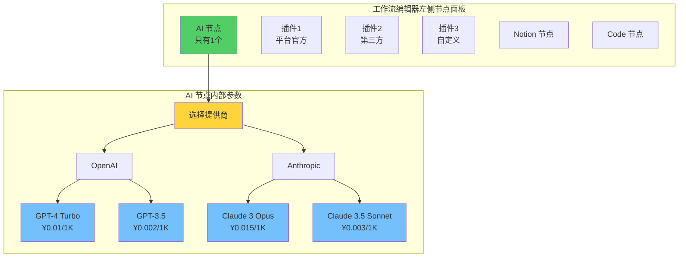
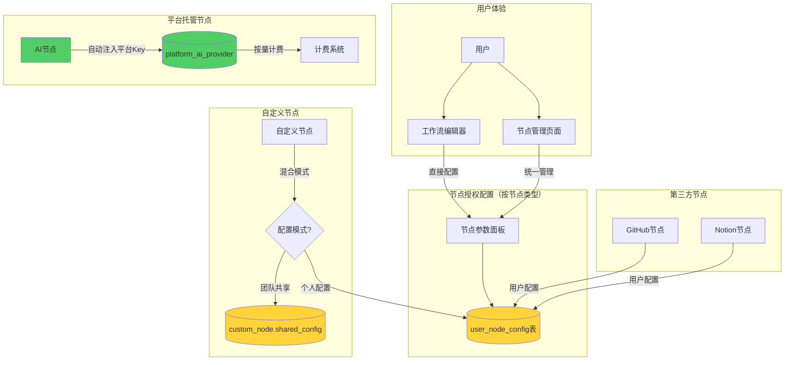

# n8n 多租户架构 - 概念修正方案

> **紧急修正文档**
> **创建日期：** 2025-11-08
> **问题发现：** 改造过程中发现插件、节点、大模型概念理解错误
> **影响范围：** 数据库设计、后端 Service/Controller、前端组件
> **修正优先级：** P0（核心架构问题，必须立即修正）

---

## 📋 目录

1. [问题总结](#问题总结)
2. [概念错误分析](#概念错误分析)
3. [正确的架构理解](#正确的架构理解)
4. [需要修正的地方](#需要修正的地方)
5. [修正实施计划](#修正实施计划)
6. [修正后的数据库设计](#修正后的数据库设计)
7. [修正后的代码示例](#修正后的代码示例)

---

## 🚨 问题总结

### 核心问题

**原方案的错误理解：**
- ❌ 把大模型（GPT-4, Claude 3）当成了 15 个独立的节点
- ❌ 插件和节点分离，创建了独立的"插件市场"和"节点市场"
- ❌ 在 `platform_service` 表中存储每个大模型为单独记录

**正确的理解：**
- ✅ **只有 1 个 AI 节点**（或叫"大模型"节点）
- ✅ **大模型是 AI 节点的参数选项**，不是节点本身
- ✅ **插件 = 节点**，没有"插件"和"节点"的区分
- ✅ 平台托管的是 AI 服务提供商（OpenAI, Anthropic），不是单个模型

### 影响范围统计

| 类别 | 错误实现 | 需修正文件 | 预计工时 |
|------|---------|-----------|---------|
| 数据库 | ✅ 已创建 | 2 个迁移文件 | 0.5 天 |
| Entity/Repository | ✅ 已创建 | 2 个文件 | 0.5 天 |
| Service 层 | ✅ 已创建 | 3 个文件 | 1 天 |
| Controller 层 | ✅ 已创建 | 2 个文件 | 1 天 |
| 前端 API | ✅ 已创建 | 2 个文件 | 0.5 天 |
| 前端 Store | ✅ 已创建 | 2 个文件 | 0.5 天 |
| 前端组件 | ✅ 已创建 | 3 个文件 | 1 天 |
| **总计** | - | **16 个文件** | **5 天** |

---

## 🔍 概念错误分析

### 错误 1：大模型当成节点

**原方案的数据库：**
```sql
-- ❌ 错误：把每个大模型当成一条记录
INSERT INTO platform_service VALUES ('gpt-4-turbo', 'ai_model', 'GPT-4 Turbo', ...);
INSERT INTO platform_service VALUES ('gpt-3.5-turbo', 'ai_model', 'GPT-3.5 Turbo', ...);
INSERT INTO platform_service VALUES ('claude-3-opus', 'ai_model', 'Claude 3 Opus', ...);
INSERT INTO platform_service VALUES ('claude-3-sonnet', 'ai_model', 'Claude 3 Sonnet', ...);
-- ... 15 条记录
```

**问题分析：**
- n8n 实际只有 **1 个 OpenAI 节点**
- 用户在节点参数中选择模型（gpt-4, gpt-3.5 等）
- 模型列表通过 OpenAI API 动态加载

**证据（来自 n8n 源码）：**
```typescript
// packages/nodes-base/nodes/OpenAi/ChatDescription.ts
const completeOperations: INodeProperties[] = [
  {
    displayName: 'Model',           // 这只是一个参数！
    name: 'model',
    type: 'options',                 // 下拉选项
    typeOptions: {
      loadOptions: {
        routing: {
          request: {
            method: 'GET',
            url: '/v1/models',      // 动态加载模型列表
          },
        },
      },
    },
  },
];
```

### 错误 2：插件和节点分离

**原方案：**
- `platform_service` 表既存储 AI 模型，又存储插件代码（`plugin_code` 字段）
- 前端创建了两个市场：`NodeMarket.vue` 和 `PluginMarket.vue`

**正确理解（来自 n8n 源码）：**
```
packages/nodes-base/nodes/
├── OpenAi/                  # ← 这就是一个节点
├── Code/                    # ← 这也是一个节点
├── HttpRequest/             # ← 这还是一个节点
└── ... (300+ 节点)
```

**在 n8n 中：**
- 节点 = 工作流中可拖拽的功能单元
- 插件 = 节点的另一种说法（来自社区贡献）
- 没有"插件市场"和"节点市场"的区别，只有一个统一的界面

### 错误 3：混淆平台服务和插件

**原方案的表结构混乱：**
```sql
CREATE TABLE platform_service (
  service_key VARCHAR(100) PRIMARY KEY,
  service_type VARCHAR(50),      -- 'ai_model' | 'rag' | 'plugin' ❌

  -- AI 相关字段
  pricing_config JSONB,

  -- 插件相关字段（混在一起！）
  plugin_code TEXT,               -- ❌ 不应该在这个表
  visibility VARCHAR(50),         -- ❌ 不应该在这个表
  owner_workspace_id UUID,        -- ❌ 不应该在这个表
  submission_status VARCHAR(50),  -- ❌ 不应该在这个表
);
```

**问题：**
- 平台 AI 服务（OpenAI, Claude）和用户上传插件是完全不同的概念
- 应该分为两张表：`platform_ai_service` 和 `custom_node`

### 错误 4：凭证系统的冗余和混乱

**原方案创建了两套凭证系统：**

1. **credentials_entity 表**（n8n 原有的，保留了）
   - 用途：高级用户跨节点复用凭证
   - 特点：支持 400+ 种凭证类型（openAiApi, githubApi 等）

2. **workspace_plugin_credentials 表**（新增的，错误！）
   - 用途：工作空间为"插件"配置 API Key
   - 问题：功能与 credentials_entity 重复，设计有误

**workspace_plugin_credentials 的设计问题：**

```sql
-- ❌ 错误设计
CREATE TABLE workspace_plugin_credentials (
  workspace_id UUID,
  service_key VARCHAR(100),        -- 引用 platform_service.service_key
  encrypted_config TEXT,
  UNIQUE (workspace_id, service_key)  -- ❌ 每个工作空间每个服务只能一个凭证
);
```

**问题分析：**

1. ❌ **功能重复** - credentials_entity 已经提供了所有需要的功能
2. ❌ **约束不合理** - `UNIQUE (workspace_id, service_key)` 限制每个工作空间每个服务只能有一个凭证
   - 现实：一个工作空间可能需要多个 GitHub 凭证（多个账号）
3. ❌ **关联错误** - `service_key` 引用的是 `platform_service`（AI 模型表），而不是凭证类型
4. ❌ **违背用户需求** - 用户希望节点级别配置，不是工作空间级别

**用户真正的需求：**

```
❌ 不需要：凭证管理页面
✅ 需要：在工作流中直接配置节点的 API Key
✅ 需要：团队成员使用自己的授权信息（用户级别隔离）
✅ 需要：同类型节点自动复用配置
```

---

## ✅ 正确的架构理解

### 核心概念关系图



### 正确的数据结构

| 概念 | 正确理解 | 存储位置 |
|------|---------|---------|
| **AI 节点** | 1 个节点，用户可拖拽 | n8n 内置节点 |
| **AI 服务提供商** | OpenAI, Anthropic, Google | `platform_ai_provider` 表 |
| **大模型** | GPT-4, Claude 3（提供商下的模型） | `platform_ai_provider.models_config` (JSONB) |
| **平台插件** | 平台官方节点（天气、OCR等） | `platform_node` 表 |
| **第三方插件** | 开发者贡献节点 | `platform_node` 表 |
| **自定义插件** | 用户上传节点 | `custom_node` 表 |
| **节点授权配置** | 用户为节点配置的 API Key | `user_node_config` 表 |

### 正确的凭证/授权架构



### 关键设计原则

1. **❌ 删除凭证管理页面** - 用户不需要理解"凭证"的概念
2. **✅ 节点管理页面** - 统一管理所有节点的授权信息
3. **✅ 工作流中直接配置** - 在节点参数面板中直接填写 API Key
4. **✅ 用户级别隔离** - 每个用户的授权信息只有自己能看到
5. **✅ 同类型自动复用** - 配置一次，所有同类型节点自动使用
6. **✅ 平台托管自动计费** - AI 节点无需配置，自动使用平台 API Key

---

## 🛠️ 需要修正的地方

### 1. 数据库层

#### 问题文件
- `1762511302220-CreatePlatformServiceTables.ts` ❌
- `1762511302660-ExtendPlatformServiceForPlugins.ts` ❌
- `1762511302880-CreateWorkspacePluginCredentialsTable.ts` ❌
- `packages/@n8n/db/src/entities/credentials-entity.ts` ❌（完全删除）
- `packages/@n8n/db/src/entities/workspace-plugin-credentials.entity.ts` ❌（完全删除）

#### 修正方案
- 创建新迁移：`1762511303000-RedesignPlatformServices.ts`
- 创建新表：
  - `platform_ai_provider` - AI 服务提供商（OpenAI, Anthropic）
  - `platform_node` - 平台官方节点
  - `custom_node` - 自定义节点（支持混合配置模式）
  - `user_node_config` - 用户节点配置（替代 credentials）
- 删除旧表：
  - `credentials_entity` - n8n 原有的凭证系统
  - `shared_credentials` - 已在之前阶段删除
  - `workspace_plugin_credentials` - 错误设计的表

### 2. Entity/Repository 层

#### 问题文件
- `packages/@n8n/db/src/entities/platform-service.entity.ts` ❌
- `packages/@n8n/db/src/repositories/platform-service.repository.ts` ❌

#### 修正方案
- 拆分为：
  - `platform-ai-provider.entity.ts`
  - `platform-node.entity.ts`
  - `custom-node.entity.ts`

### 3. Service 层

#### 问题文件
- `packages/cli/src/services/platform-service.service.ts` ❌
- `packages/cli/src/services/platform-rag.service.ts` ✅（这个保留）
- `packages/cli/src/services/plugin-*.service.ts` ❌

#### 修正方案
- 创建：
  - `platform-ai-provider.service.ts`（管理 AI 服务提供商）
  - `platform-node.service.ts`（管理平台节点）
  - `custom-node.service.ts`（管理自定义节点）

### 4. Controller 层

#### 问题文件
- `packages/cli/src/controllers/platform-services.controller.ts` ❌
- `packages/cli/src/controllers/admin/admin-plugins.controller.ts` ❌
- `packages/cli/src/controllers/plugins.controller.ts` ❌

#### 修正方案
- 重命名和重构：
  - `platform-ai-providers.controller.ts`
  - `admin/admin-nodes.controller.ts`
  - `custom-nodes.controller.ts`

### 5. 前端层

#### 问题文件
- `packages/editor-ui/src/api/platform-services.ts` ❌
- `packages/editor-ui/src/api/plugins.ts` ❌
- `packages/editor-ui/src/stores/platform-services.store.ts` ❌
- `packages/editor-ui/src/stores/plugins.store.ts` ❌
- `packages/editor-ui/src/views/PluginMarket.vue` ❌
- `packages/editor-ui/src/views/NodeMarket.vue` ❌（如果存在）

#### 修正方案
- 创建：
  - `packages/editor-ui/src/api/ai-providers.ts`
  - `packages/editor-ui/src/api/custom-nodes.ts`
  - `packages/editor-ui/src/stores/ai-providers.store.ts`
  - `packages/editor-ui/src/views/NodesMarket.vue`（统一的节点市场）

---

## 📅 修正实施计划

### 阶段 1：数据库修正（0.5 天）

**任务：**
1. 创建新迁移脚本（向后兼容，不删除旧表）
2. 创建新表：
   - `platform_ai_provider`
   - `platform_node`
   - `custom_node`
3. 迁移现有数据：
   - 将 `platform_service` 中 `service_type='ai_model'` 的记录转换
   - 将插件相关数据分离到 `platform_node` 和 `custom_node`

**检查清单：**
- [ ] 新迁移脚本创建
- [ ] 数据迁移验证
- [ ] 旧表标记为弃用（暂不删除）

### 阶段 2：Entity/Repository 修正（0.5 天）

**任务：**
1. 创建新 Entity
2. 创建新 Repository
3. 更新类型定义

**检查清单：**
- [ ] PlatformAIProvider Entity
- [ ] PlatformNode Entity
- [ ] CustomNode Entity
- [ ] TypeScript 编译通过

### 阶段 3：Service 层修正（1 天）

**任务：**
1. 重构 PlatformServiceService
2. 创建 PlatformAIProviderService
3. 创建 PlatformNodeService
4. 创建 CustomNodeService

**检查清单：**
- [ ] Service 层接口设计
- [ ] 单元测试编写
- [ ] 文档更新

### 阶段 4：Controller 层修正（1 天）

**任务：**
1. 重构 API 端点
2. 更新路由
3. 更新权限检查

**检查清单：**
- [ ] API 端点重命名
- [ ] API 文档更新
- [ ] Postman 测试通过

### 阶段 5：前端修正（1.5 天）

**任务：**
1. 重构 API 层
2. 重构 Store
3. 重构 UI 组件

**检查清单：**
- [ ] API 层更新
- [ ] Store 更新
- [ ] 组件更新
- [ ] 国际化更新
- [ ] UI 测试通过

### 阶段 6：集成测试和验证（0.5 天）

**任务：**
1. 端到端测试
2. 回归测试
3. 性能测试

**检查清单：**
- [ ] 数据隔离验证
- [ ] AI 调用计费验证
- [ ] 节点市场功能验证
- [ ] 自定义节点上传验证

---

## 🗄️ 修正后的数据库设计

### 表 1：platform_ai_provider（平台 AI 服务提供商）

```sql
CREATE TABLE platform_ai_provider (
  provider_key VARCHAR(100) PRIMARY KEY,        -- 'openai', 'anthropic', 'google'
  provider_name VARCHAR(200) NOT NULL,          -- 'OpenAI', 'Anthropic', 'Google'

  -- 平台统一配置的 API Key
  api_key_encrypted TEXT NOT NULL,              -- 加密存储
  api_endpoint VARCHAR(500) NOT NULL,           -- 'https://api.openai.com'

  -- 支持的模型列表（JSONB）
  models_config JSONB NOT NULL,                 -- 见下方示例

  -- 配额配置
  quota_config JSONB,                           -- { monthlyTokens: 10000000 }

  -- 状态
  is_active BOOLEAN NOT NULL DEFAULT true,
  enabled BOOLEAN NOT NULL DEFAULT true,

  -- 审计
  created_at TIMESTAMP DEFAULT CURRENT_TIMESTAMP,
  updated_at TIMESTAMP DEFAULT CURRENT_TIMESTAMP
);

-- models_config 示例
{
  "models": [
    {
      "id": "gpt-4-turbo",
      "name": "GPT-4 Turbo",
      "description": "Most capable GPT-4 model",
      "pricePerToken": 0.00001,
      "currency": "CNY",
      "contextWindow": 128000,
      "maxOutputTokens": 4096,
      "supportsFunctions": true,
      "supportsVision": false
    },
    {
      "id": "gpt-4o",
      "name": "GPT-4o",
      "description": "Multimodal flagship model",
      "pricePerToken": 0.000005,
      "currency": "CNY",
      "contextWindow": 128000,
      "maxOutputTokens": 16384,
      "supportsFunctions": true,
      "supportsVision": true
    },
    {
      "id": "gpt-3.5-turbo",
      "name": "GPT-3.5 Turbo",
      "description": "Fast and efficient",
      "pricePerToken": 0.000001,
      "currency": "CNY",
      "contextWindow": 16000,
      "maxOutputTokens": 4096,
      "supportsFunctions": true,
      "supportsVision": false
    }
  ]
}
```

### 表 2：platform_node（平台节点/插件）

```sql
CREATE TABLE platform_node (
  node_key VARCHAR(100) PRIMARY KEY,            -- 'weather-query', 'ocr-service'
  node_name VARCHAR(200) NOT NULL,              -- '天气查询', 'OCR 识别'

  -- 节点类型
  node_type VARCHAR(50) NOT NULL,               -- 'platform_official' | 'third_party_approved'

  -- 节点定义（完整的 INodeTypeDescription）
  node_definition JSONB NOT NULL,               -- 见下方示例

  -- 节点执行代码（可选，对于简单节点可内嵌在 definition 中）
  node_code TEXT,                                -- TypeScript 代码

  -- 分类和元信息
  category VARCHAR(100),                         -- 'messaging', 'cloud', 'ai', etc.
  description TEXT,
  icon_url VARCHAR(500),
  version VARCHAR(50) NOT NULL DEFAULT '1.0.0',

  -- 计费（如果是平台托管服务）
  is_billable BOOLEAN NOT NULL DEFAULT false,
  price_per_request DECIMAL(10, 4),             -- 按次计费

  -- 审核（仅第三方节点）
  submission_status VARCHAR(50),                 -- 'approved' | 'rejected'
  submitted_by UUID,                             -- 提交者用户 ID
  submitted_at TIMESTAMP,
  reviewed_by UUID,
  reviewed_at TIMESTAMP,
  review_notes TEXT,

  -- 状态
  is_active BOOLEAN NOT NULL DEFAULT true,
  enabled BOOLEAN NOT NULL DEFAULT true,

  -- 审计
  created_at TIMESTAMP DEFAULT CURRENT_TIMESTAMP,
  updated_at TIMESTAMP DEFAULT CURRENT_TIMESTAMP,

  -- 外键
  FOREIGN KEY (submitted_by) REFERENCES user(id),
  FOREIGN KEY (reviewed_by) REFERENCES user(id)
);

-- node_definition 示例（天气查询节点）
{
  "displayName": "天气查询",
  "name": "weatherQuery",
  "icon": "fa:cloud-sun",
  "group": ["transform"],
  "version": [1],
  "description": "查询实时天气信息",
  "defaults": {
    "name": "天气查询"
  },
  "inputs": ["main"],
  "outputs": ["main"],
  "properties": [
    {
      "displayName": "城市",
      "name": "city",
      "type": "string",
      "default": "",
      "required": true,
      "description": "要查询的城市名称"
    }
  ]
}
```

### 表 3：custom_node（用户自定义节点）

```sql
CREATE TABLE custom_node (
  id UUID PRIMARY KEY DEFAULT gen_random_uuid(),
  node_key VARCHAR(100) NOT NULL,               -- 工作空间内唯一
  node_name VARCHAR(200) NOT NULL,

  -- 所属工作空间
  workspace_id UUID NOT NULL,

  -- 节点定义和代码
  node_definition JSONB NOT NULL,
  node_code TEXT NOT NULL,                       -- 必须提供代码

  -- ✅ 新增：配置模式（个人配置 vs 团队共享）
  config_mode VARCHAR(20) NOT NULL DEFAULT 'personal',  -- 'personal' | 'shared'

  -- ✅ 新增：如果是团队共享模式，存储团队共享的配置
  shared_config_data TEXT,                       -- 加密的配置数据（仅 shared 模式）
  shared_config_by UUID,                         -- 配置者（仅 shared 模式）

  -- ✅ 新增：配置字段定义（供用户填写）
  config_schema JSONB,                           -- 定义需要用户配置的字段

  -- 分类和元信息
  category VARCHAR(100),
  description TEXT,
  icon_url VARCHAR(500),
  version VARCHAR(50) NOT NULL DEFAULT '1.0.0',

  -- 可见性（工作空间私有）
  visibility VARCHAR(50) NOT NULL DEFAULT 'workspace',  -- 始终为 'workspace'

  -- 提交审核（可选）
  submission_status VARCHAR(50),                 -- 'draft' | 'pending' | 'approved' | 'rejected'
  submitted_at TIMESTAMP,
  reviewed_by UUID,
  reviewed_at TIMESTAMP,
  review_notes TEXT,

  -- 状态
  is_active BOOLEAN NOT NULL DEFAULT true,

  -- 审计
  created_by UUID NOT NULL,
  created_at TIMESTAMP DEFAULT CURRENT_TIMESTAMP,
  updated_at TIMESTAMP DEFAULT CURRENT_TIMESTAMP,

  -- 外键
  FOREIGN KEY (workspace_id) REFERENCES project(id) ON DELETE CASCADE,
  FOREIGN KEY (created_by) REFERENCES user(id),
  FOREIGN KEY (reviewed_by) REFERENCES user(id),
  FOREIGN KEY (shared_config_by) REFERENCES user(id),

  -- 唯一约束
  UNIQUE(workspace_id, node_key)
);

-- 索引
CREATE INDEX idx_custom_node_workspace ON custom_node(workspace_id);
CREATE INDEX idx_custom_node_status ON custom_node(submission_status);
CREATE INDEX idx_custom_node_config_mode ON custom_node(config_mode);

-- config_schema 示例（定义需要用户配置的字段）
{
  "fields": [
    {
      "name": "apiKey",
      "displayName": "API Key",
      "type": "string",
      "typeOptions": { "password": true },
      "required": true,
      "description": "从公司内部系统获取的 API Key"
    },
    {
      "name": "baseUrl",
      "displayName": "Base URL",
      "type": "string",
      "default": "https://api.company.com",
      "required": false
    }
  ]
}
```

### 表 4：user_node_config（用户节点配置）

**✅ 核心表：替代 credentials_entity 和 workspace_plugin_credentials**

```sql
CREATE TABLE user_node_config (
  id UUID PRIMARY KEY DEFAULT gen_random_uuid(),

  -- 用户 ID（哪个用户的配置）
  user_id UUID NOT NULL,

  -- 节点类型（按节点类型存储，实现自动复用）
  node_type VARCHAR(100) NOT NULL,              -- 例如: 'n8n-nodes-base.github', 'custom.company-api'

  -- 加密的配置数据（JSON 格式）
  config_data TEXT NOT NULL,                     -- 加密存储：{"apiKey": "ghp_xxx", "baseUrl": "..."}

  -- 配置状态
  is_configured BOOLEAN NOT NULL DEFAULT true,

  -- 最后使用时间（用于清理过期配置）
  last_used_at TIMESTAMP,

  -- 审计
  created_at TIMESTAMP DEFAULT CURRENT_TIMESTAMP,
  updated_at TIMESTAMP DEFAULT CURRENT_TIMESTAMP,

  -- 外键
  FOREIGN KEY (user_id) REFERENCES user(id) ON DELETE CASCADE,

  -- 唯一约束：一个用户对一个节点类型只能有一份配置
  UNIQUE (user_id, node_type)
);

-- 索引
CREATE INDEX idx_user_node_config_lookup ON user_node_config(user_id, node_type);
CREATE INDEX idx_user_node_config_last_used ON user_node_config(last_used_at);
```

**使用示例：**

```sql
-- 用户1为 GitHub 节点配置授权
INSERT INTO user_node_config (user_id, node_type, config_data)
VALUES (
  'user-1-uuid',
  'n8n-nodes-base.github',
  'encrypted:{"accessToken": "ghp_user1_token"}'
);

-- 用户2为相同的 GitHub 节点配置自己的授权
INSERT INTO user_node_config (user_id, node_type, config_data)
VALUES (
  'user-2-uuid',
  'n8n-nodes-base.github',
  'encrypted:{"accessToken": "ghp_user2_token"}'
);

-- 用户1打开 GitHub 节点 → 自动加载 user-1 的配置
-- 用户2打开 GitHub 节点 → 自动加载 user-2 的配置
-- ✅ 实现用户级别隔离 + 同类型节点自动复用
```

### 表 5：platform_rag_service（保留，不变）

```sql
-- 这个表设计是正确的，保持不变
CREATE TABLE platform_rag_service (
  service_key VARCHAR(100) PRIMARY KEY,
  name VARCHAR(200) NOT NULL,
  domain VARCHAR(50) NOT NULL,
  price_per_query_cny DOUBLE NOT NULL,
  metadata JSONB,
  is_active BOOLEAN NOT NULL DEFAULT true,
  created_at TIMESTAMP DEFAULT CURRENT_TIMESTAMP,
  updated_at TIMESTAMP DEFAULT CURRENT_TIMESTAMP
);
```

---

## 📱 前端体验设计

### 节点管理页面（替代凭证管理）

```
节点管理 (UserNodeManagement.vue)
├─ 平台托管节点（自动启用，按量计费）
│   ├─ OpenAI                   [已启用 ✓] [查看定价]
│   ├─ Anthropic                [已启用 ✓] [查看定价]
│   └─ 法律知识库 RAG           [已启用 ✓] [查看定价]
│
├─ 第三方节点（需要授权）
│   ├─ GitHub                   [已配置 ✓]
│   │   └─ Personal Access Token: ghp_***xxx
│   │       [编辑] [删除] [测试连接]
│   │
│   ├─ Notion                   [未配置 ⚠️]
│   │   └─ [配置授权] 按钮
│   │
│   └─ Slack                    [已配置 ✓]
│       └─ OAuth Token: xoxb-***xxx
│           [重新授权] [删除]
│
└─ 自定义节点（团队上传）
    ├─ 公司内部 API v1.0        [团队共享 ✓]
    │   └─ 上传者: 张三
    │   └─ 配置者: 李四（管理员）
    │   └─ 全员可用，无需配置
    │
    ├─ 数据清洗插件 v2.0        [需要个人配置 ⚠️]
    │   └─ 上传者: 王五
    │   └─ 状态: 未配置
    │   └─ [配置授权] 按钮
    │
    └─ [+ 上传新节点] 按钮
```

### 工作流中的节点配置体验

**场景 1：用户B首次使用 GitHub 节点（未配置）**

```
用户B打开工作流 → 点击 GitHub 节点
┌─────────────────────────────────────┐
│ GitHub 节点                          │
├─────────────────────────────────────┤
│ ⚠️ 未配置授权                       │
│                                     │
│ Personal Access Token               │
│ ┌─────────────────────────────┐   │
│ │ [输入你的 GitHub Token]     │   │
│ └─────────────────────────────┘   │
│ 💡 配置后将自动应用到所有 GitHub  │
│    节点，无需重复填写              │
│                                     │
│ [💾 保存配置]  [去节点管理 →]      │
│─────────────────────────────────────│
│ Resource                            │
│ ○ Issue  ● Repository               │
└─────────────────────────────────────┘
```

**场景 2：用户B已配置（已配置）**

```
用户B打开工作流 → 点击 GitHub 节点
┌─────────────────────────────────────┐
│ GitHub 节点                          │
├─────────────────────────────────────┤
│ ✅ 已配置授权  [修改]               │
│─────────────────────────────────────│
│ Resource                            │
│ ○ Issue  ● Repository               │
│                                     │
│ Operation                           │
│ ○ Create  ● Get  ○ Update           │
└─────────────────────────────────────┘
```

**场景 3：AI 节点（平台托管，无需配置）**

```
用户打开工作流 → 拖拽 OpenAI 节点
┌─────────────────────────────────────┐
│ OpenAI 节点                          │
├─────────────────────────────────────┤
│ 🌟 平台托管 - 按量计费               │
│                                     │
│ Model                               │
│ ┌─────────────────────────────┐   │
│ │ ● GPT-4 Turbo  ¥0.01/1K     │   │
│ │ ○ GPT-4o       ¥0.005/1K    │   │
│ │ ○ GPT-3.5      ¥0.001/1K    │   │
│ └─────────────────────────────┘   │
│                                     │
│ Prompt                              │
│ ┌─────────────────────────────┐   │
│ │ 你是一个友好的助手...        │   │
│ └─────────────────────────────┘   │
│                                     │
│ 💰 本月已使用: 12,500 / 1,000,000  │
│ [━━━━━━━░░░░░░░░░░░░] 1.25%       │
└─────────────────────────────────────┘
```

---

## 💻 修正后的代码示例

### 1. UserNodeConfigService（核心服务）

```typescript
// packages/cli/src/services/user-node-config.service.ts
import { Service } from '@n8n/di';
import { UserNodeConfigRepository } from '@/repositories/user-node-config.repository';
import { CustomNodeRepository } from '@/repositories/custom-node.repository';
import { Cipher } from '@/services/cipher.service';

@Service()
export class UserNodeConfigService {
  constructor(
    private readonly userNodeConfigRepository: UserNodeConfigRepository,
    private readonly customNodeRepository: CustomNodeRepository,
    private readonly cipher: Cipher,
  ) {}

  /**
   * 获取用户的节点配置（用于节点执行时注入）
   */
  async getUserNodeConfig(userId: string, nodeType: string) {
    const config = await this.userNodeConfigRepository.findOne({
      where: { userId, nodeType },
    });

    if (!config) return null;

    // 解密配置数据
    const decrypted = this.cipher.decrypt(config.configData);
    return JSON.parse(decrypted);
  }

  /**
   * 保存用户的节点配置（从工作流或节点管理页面）
   */
  async saveUserNodeConfig(
    userId: string,
    nodeType: string,
    configData: Record<string, any>,
  ) {
    // 加密配置数据
    const encrypted = this.cipher.encrypt(JSON.stringify(configData));

    // Upsert（存在则更新，不存在则创建）
    await this.userNodeConfigRepository.upsert(
      {
        userId,
        nodeType,
        configData: encrypted,
        isConfigured: true,
        lastUsedAt: new Date(),
      },
      ['userId', 'nodeType'],
    );
  }

  /**
   * 获取节点配置（处理团队共享模式）
   */
  async getNodeConfig(userId: string, nodeType: string, workspaceId: string) {
    // 1. 检查是否是自定义节点
    if (nodeType.startsWith('custom.')) {
      const customNode = await this.customNodeRepository.findOne({
        where: { nodeKey: nodeType, workspaceId },
      });

      if (customNode) {
        // 2a. 团队共享模式：直接返回共享配置
        if (customNode.configMode === 'shared') {
          const decrypted = this.cipher.decrypt(customNode.sharedConfigData);
          return JSON.parse(decrypted);
        }

        // 2b. 个人配置模式：获取用户自己的配置
        const userConfig = await this.getUserNodeConfig(userId, nodeType);
        if (!userConfig) {
          throw new Error(
            `请先配置 ${customNode.nodeName} 的授权信息`
          );
        }
        return userConfig;
      }
    }

    // 3. 第三方节点：总是使用个人配置
    const userConfig = await this.getUserNodeConfig(userId, nodeType);
    if (!userConfig) {
      throw new Error(`请先配置该节点的授权信息`);
    }

    return userConfig;
  }

  /**
   * 测试节点连接
   */
  async testNodeConnection(userId: string, nodeType: string) {
    const config = await this.getUserNodeConfig(userId, nodeType);
    if (!config) {
      throw new Error('未找到节点配置');
    }

    // 根据节点类型调用相应的测试方法
    // 这里需要节点定义中的 test 方法
    // ...
    return { success: true };
  }

  /**
   * 获取用户的所有节点配置（用于节点管理页面）
   */
  async getAllUserNodeConfigs(userId: string) {
    const configs = await this.userNodeConfigRepository.find({
      where: { userId },
    });

    return configs.map(config => ({
      nodeType: config.nodeType,
      isConfigured: config.isConfigured,
      lastUsedAt: config.lastUsedAt,
      updatedAt: config.updatedAt,
    }));
  }
}
```

### 2. 工作流节点参数面板（支持直接配置）

```vue
<!-- packages/frontend/editor-ui/src/app/components/NodeSettings/NodeAuthConfig.vue -->
<template>
  <div class="node-auth-config">
    <!-- 未配置状态 -->
    <div v-if="!isConfigured" class="auth-not-configured">
      <Alert type="warning">
        <template #icon>⚠️</template>
        此节点需要授权才能使用
      </Alert>

      <!-- 配置表单 -->
      <div class="config-form">
        <FormField
          v-for="field in configFields"
          :key="field.name"
          :label="field.displayName"
          :required="field.required"
        >
          <Input
            v-model="formData[field.name]"
            :type="field.typeOptions?.password ? 'password' : 'text'"
            :placeholder="field.placeholder"
          />
          <p v-if="field.description" class="field-hint">
            {{ field.description }}
          </p>
        </FormField>
      </div>

      <!-- 提示 -->
      <div class="auto-reuse-hint">
        <Icon name="info-circle" />
        <span>配置后将自动应用到所有 {{ nodeDisplayName }} 节点</span>
      </div>

      <!-- 操作按钮 -->
      <div class="actions">
        <Button @click="saveConfig" type="primary" :loading="saving">
          💾 保存配置
        </Button>
        <Button @click="goToNodeManagement" type="text">
          在节点管理中配置 →
        </Button>
      </div>
    </div>

    <!-- 已配置状态 -->
    <div v-else class="auth-configured">
      <Badge status="success">✅ 已配置授权</Badge>
      <Button @click="editConfig" type="text" size="small">
        修改
      </Button>
    </div>
  </div>
</template>

<script setup lang="ts">
import { ref, computed, onMounted } from 'vue';
import { useUserNodeConfigStore } from '@/stores/userNodeConfig.store';
import { useNodeTypesStore } from '@/stores/nodeTypes.store';

const props = defineProps<{
  nodeType: string;
}>();

const userNodeConfigStore = useUserNodeConfigStore();
const nodeTypesStore = useNodeTypesStore();

const isConfigured = ref(false);
const formData = ref<Record<string, any>>({});
const saving = ref(false);

// 获取节点定义
const nodeTypeInfo = computed(() => {
  return nodeTypesStore.getNodeType(props.nodeType);
});

const nodeDisplayName = computed(() => nodeTypeInfo.value?.displayName || '');

// 获取配置字段定义
const configFields = computed(() => {
  return nodeTypeInfo.value?.userConfigFields || [];
});

// 检查是否已配置
onMounted(async () => {
  const config = await userNodeConfigStore.getUserConfig(props.nodeType);
  isConfigured.value = !!config;

  if (config) {
    formData.value = config;
  }
});

// 保存配置
async function saveConfig() {
  saving.value = true;
  try {
    await userNodeConfigStore.saveConfig(props.nodeType, formData.value);
    isConfigured.value = true;
    showToast('配置保存成功，同类型节点将自动使用此配置', 'success');
  } catch (error) {
    showToast(`配置保存失败: ${error.message}`, 'error');
  } finally {
    saving.value = false;
  }
}

// 编辑配置
function editConfig() {
  isConfigured.value = false;
}

// 跳转到节点管理
function goToNodeManagement() {
  router.push('/node-management');
}
</script>
```

### 3. 节点管理页面

```vue
<!-- packages/frontend/editor-ui/src/app/views/UserNodeManagement.vue -->
<template>
  <div class="user-node-management">
    <PageHeader title="节点管理">
      <template #description>
        管理所有节点的授权信息。配置一次，所有工作流自动使用。
      </template>
    </PageHeader>

    <!-- 平台托管节点 -->
    <Section title="平台托管节点（按量计费）">
      <p class="section-desc">
        这些节点由平台提供，无需配置，使用时自动从工作空间余额扣费。
      </p>
      <div class="node-grid">
        <NodeCard
          v-for="node in platformManagedNodes"
          :key="node.type"
          :node="node"
          :is-platform-managed="true"
          disabled
        >
          <template #badge>
            <Badge type="success">平台托管</Badge>
          </template>
          <template #footer>
            <Button type="text" size="small" @click="viewPricing(node)">
              查看定价
            </Button>
          </template>
        </NodeCard>
      </div>
    </Section>

    <!-- 第三方节点 -->
    <Section title="第三方节点（需要授权）">
      <p class="section-desc">
        配置你的个人账号授权信息，仅你自己可见。
      </p>
      <div class="node-list">
        <NodeItem
          v-for="node in thirdPartyNodes"
          :key="node.type"
          :node="node"
          :user-config="userConfigs[node.type]"
          @configure="openConfigDialog(node)"
          @edit="openEditDialog(node)"
          @delete="deleteConfig(node)"
          @test="testConnection(node)"
        />
      </div>
    </Section>

    <!-- 自定义节点 -->
    <Section title="自定义节点（团队上传）">
      <div class="node-list">
        <CustomNodeItem
          v-for="node in customNodes"
          :key="node.id"
          :node="node"
          :user-config="userConfigs[node.nodeKey]"
          @configure="openCustomNodeConfigDialog(node)"
          @edit="editCustomNode(node)"
          @delete="deleteCustomNode(node)"
        />
      </div>
      <Button @click="showUploadDialog = true" type="dashed" block>
        + 上传新节点
      </Button>
    </Section>

    <!-- 配置对话框 -->
    <NodeConfigDialog
      v-if="showConfigDialog"
      :node="selectedNode"
      @save="saveNodeConfig"
      @close="showConfigDialog = false"
    />
  </div>
</template>

<script setup lang="ts">
import { ref, onMounted } from 'vue';
import { useUserNodeConfigStore } from '@/stores/userNodeConfig.store';
import { useCustomNodesStore } from '@/stores/customNodes.store';

const userNodeConfigStore = useUserNodeConfigStore();
const customNodesStore = useCustomNodesStore();

const platformManagedNodes = ref([]);
const thirdPartyNodes = ref([]);
const customNodes = ref([]);
const userConfigs = ref({});

onMounted(async () => {
  // 加载所有节点类型和用户配置
  await Promise.all([
    loadAllNodeTypes(),
    userNodeConfigStore.fetchUserConfigs(),
    customNodesStore.fetchWorkspaceCustomNodes(),
  ]);

  platformManagedNodes.value = filterPlatformManagedNodes();
  thirdPartyNodes.value = filterThirdPartyNodes();
  customNodes.value = customNodesStore.customNodes;
  userConfigs.value = userNodeConfigStore.userConfigs;
});

async function saveNodeConfig(nodeType: string, configData: any) {
  await userNodeConfigStore.saveConfig(nodeType, configData);
  showToast('配置保存成功', 'success');
}

async function testConnection(node: any) {
  const result = await userNodeConfigStore.testConnection(node.type);
  if (result.success) {
    showToast('连接测试成功', 'success');
  } else {
    showToast(`连接测试失败: ${result.message}`, 'error');
  }
}
</script>
```

### 4. 前端：AI 节点参数配置

```vue
<!-- packages/editor-ui/src/features/ai/AINodeConfig.vue -->
<template>
  <div class="ai-node-config">
    <!-- 选择 AI 服务提供商 -->
    <n8n-form-item label="AI 服务提供商">
      <n8n-select v-model="selectedProvider" @change="handleProviderChange">
        <n8n-option
          v-for="provider in availableProviders"
          :key="provider.providerKey"
          :value="provider.providerKey"
        >
          <div class="provider-option">
            <span>{{ provider.providerName }}</span>
            <n8n-tag type="success">平台托管</n8n-tag>
          </div>
        </n8n-option>
        <n8n-option value="custom">
          <span>自定义</span>
          <n8n-tag type="warning">需配置 API Key</n8n-tag>
        </n8n-option>
      </n8n-select>
    </n8n-form-item>

    <!-- 选择模型（动态加载） -->
    <n8n-form-item label="模型" v-if="selectedProvider !== 'custom'">
      <n8n-select v-model="selectedModel">
        <n8n-option
          v-for="model in availableModels"
          :key="model.id"
          :value="model.id"
        >
          <div class="model-option">
            <div>
              <strong>{{ model.name }}</strong>
              <p class="model-desc">{{ model.description }}</p>
            </div>
            <div class="model-info">
              <span class="price">¥{{ model.pricePerToken }}/1K tokens</span>
              <span class="context">{{ model.contextWindow.toLocaleString() }} tokens</span>
            </div>
          </div>
        </n8n-option>
      </n8n-select>
    </n8n-form-item>

    <!-- 配额显示 -->
    <n8n-alert type="info" v-if="quotaInfo">
      本月已使用: {{ quotaInfo.used.toLocaleString() }} / {{ quotaInfo.total.toLocaleString() }} tokens
      <n8n-progress :percentage="quotaPercentage" />
    </n8n-alert>

    <!-- Prompt 输入 -->
    <n8n-form-item label="Prompt">
      <n8n-input type="textarea" v-model="prompt" rows="6" />
    </n8n-form-item>
  </div>
</template>

<script setup lang="ts">
import { ref, computed, watch } from 'vue';
import { useAIProvidersStore } from '@/stores/ai-providers.store';

const aiProvidersStore = useAIProvidersStore();

const selectedProvider = ref('openai');
const selectedModel = ref('');
const prompt = ref('');

// 获取可用提供商
const availableProviders = computed(() => aiProvidersStore.providers);

// 获取当前提供商的模型列表
const availableModels = computed(() => {
  const provider = availableProviders.value.find(p => p.providerKey === selectedProvider.value);
  return provider?.modelsConfig?.models || [];
});

// 获取配额信息
const quotaInfo = computed(() => {
  const provider = availableProviders.value.find(p => p.providerKey === selectedProvider.value);
  return provider?.quotaUsage;
});

const quotaPercentage = computed(() => {
  if (!quotaInfo.value) return 0;
  return (quotaInfo.value.used / quotaInfo.value.total) * 100;
});

// 提供商切换时，选择默认模型
watch(selectedProvider, () => {
  if (availableModels.value.length > 0) {
    selectedModel.value = availableModels.value[0].id;
  }
});

// 初始化
aiProvidersStore.fetchProviders();
</script>
```

### 2. 后端：PlatformAIProviderService

```typescript
// packages/cli/src/services/platform-ai-provider.service.ts
import { Service } from '@n8n/di';
import { PlatformAIProviderRepository } from '@/repositories/platform-ai-provider.repository';
import { EncryptionService } from './encryption.service';
import { BillingService } from './billing.service';
import type { ChatCompletionRequest, ChatCompletionResponse } from '@/types';

@Service()
export class PlatformAIProviderService {
  constructor(
    private readonly providerRepository: PlatformAIProviderRepository,
    private readonly encryptionService: EncryptionService,
    private readonly billingService: BillingService,
  ) {}

  /**
   * 获取所有活跃的 AI 服务提供商
   */
  async getActiveProviders() {
    return await this.providerRepository.find({
      where: { isActive: true, enabled: true },
    });
  }

  /**
   * 获取某个提供商的模型列表
   */
  async getProviderModels(providerKey: string) {
    const provider = await this.providerRepository.findOne({
      where: { providerKey },
    });

    if (!provider) {
      throw new ProviderNotFoundError(providerKey);
    }

    return provider.modelsConfig.models;
  }

  /**
   * 调用 AI 服务（统一接口）
   */
  async chatCompletion(
    providerKey: string,
    modelId: string,
    request: ChatCompletionRequest,
    workspaceId: string,
    userId: string,
  ): Promise<ChatCompletionResponse> {
    // 1. 获取提供商配置
    const provider = await this.providerRepository.findOne({
      where: { providerKey, isActive: true },
    });

    if (!provider) {
      throw new ProviderNotFoundError(providerKey);
    }

    // 2. 解密 API Key
    const apiKey = await this.encryptionService.decrypt(provider.apiKeyEncrypted);

    // 3. 查找模型配置
    const model = provider.modelsConfig.models.find(m => m.id === modelId);
    if (!model) {
      throw new ModelNotFoundError(modelId);
    }

    // 4. 检查余额（预估费用）
    const estimatedTokens = this.estimateTokens(request.messages);
    const estimatedCost = estimatedTokens * model.pricePerToken / 1000;
    await this.billingService.checkBalance(workspaceId, estimatedCost);

    // 5. 调用 AI API
    const response = await this.callProviderAPI(
      provider.apiEndpoint,
      apiKey,
      modelId,
      request,
    );

    // 6. 记录使用量并扣费
    const actualTokens = response.usage.totalTokens;
    const actualCost = actualTokens * model.pricePerToken / 1000;

    await this.billingService.recordUsageAndCharge({
      workspaceId,
      userId,
      serviceKey: `${providerKey}:${modelId}`,
      tokensUsed: actualTokens,
      costCny: actualCost,
      metadata: {
        model: modelId,
        provider: providerKey,
        promptTokens: response.usage.promptTokens,
        completionTokens: response.usage.completionTokens,
      },
    });

    return response;
  }

  /**
   * 调用提供商 API（抽象层）
   */
  private async callProviderAPI(
    endpoint: string,
    apiKey: string,
    modelId: string,
    request: ChatCompletionRequest,
  ): Promise<ChatCompletionResponse> {
    const response = await fetch(`${endpoint}/v1/chat/completions`, {
      method: 'POST',
      headers: {
        'Content-Type': 'application/json',
        'Authorization': `Bearer ${apiKey}`,
      },
      body: JSON.stringify({
        model: modelId,
        messages: request.messages,
        temperature: request.temperature,
        max_tokens: request.maxTokens,
      }),
    });

    if (!response.ok) {
      throw new AIProviderError(`Provider API error: ${response.statusText}`);
    }

    return await response.json();
  }

  /**
   * 预估 token 数量（简单实现）
   */
  private estimateTokens(messages: any[]): number {
    // 粗略估算：平均 1 个 token ≈ 0.75 个单词 ≈ 4 个字符
    const totalChars = messages.reduce((sum, msg) => sum + msg.content.length, 0);
    return Math.ceil(totalChars / 4);
  }
}
```

### 3. Controller：PlatformAIProvidersController

```typescript
// packages/cli/src/controllers/platform-ai-providers.controller.ts
import { RestController, Get, Post, Param, Body } from '@/decorators';
import { WorkspaceContext } from '@/decorators/workspace-context';
import { PlatformAIProviderService } from '@/services/platform-ai-provider.service';

@RestController('/platform-ai-providers')
export class PlatformAIProvidersController {
  constructor(private readonly providerService: PlatformAIProviderService) {}

  /**
   * 获取所有可用的 AI 服务提供商
   */
  @Get('/')
  async getProviders() {
    return await this.providerService.getActiveProviders();
  }

  /**
   * 获取某个提供商的模型列表
   */
  @Get('/:providerKey/models')
  async getProviderModels(@Param('providerKey') providerKey: string) {
    return await this.providerService.getProviderModels(providerKey);
  }

  /**
   * 调用 AI 聊天接口（自动计费）
   */
  @Post('/:providerKey/chat/completions')
  async chatCompletion(
    @Param('providerKey') providerKey: string,
    @Body() body: { model: string; messages: any[]; temperature?: number },
    @WorkspaceContext() context: { workspaceId: string; userId: string },
  ) {
    return await this.providerService.chatCompletion(
      providerKey,
      body.model,
      {
        messages: body.messages,
        temperature: body.temperature,
      },
      context.workspaceId,
      context.userId,
    );
  }
}
```

---

## ✅ 验收标准

修正完成后，需满足以下标准：

### 数据库层
- [ ] `platform_ai_provider` 表创建成功
- [ ] `platform_node` 表创建成功
- [ ] `custom_node` 表创建成功
- [ ] 数据迁移完成，无丢失
- [ ] 旧表数据正确归档

### 后端层
- [ ] PlatformAIProviderService 测试通过
- [ ] PlatformNodeService 测试通过
- [ ] CustomNodeService 测试通过
- [ ] API 端点全部测试通过（Postman）
- [ ] TypeScript 编译 0 errors

### 前端层
- [ ] AI 节点参数配置正常工作
- [ ] 模型列表动态加载
- [ ] 统一节点市场（不再有"插件市场"）
- [ ] 自定义节点上传功能正常
- [ ] UI/UX 测试通过

### 集成测试
- [ ] 用户可以使用 AI 节点调用 GPT-4
- [ ] 自动计费正确（按 token 计费）
- [ ] 自定义节点上传和执行正常
- [ ] 数据隔离验证通过

---

## 📊 修正优先级

| 优先级 | 任务 | 原因 | 时间 |
|-------|------|------|------|
| **P0** | 数据库修正 | 核心架构，影响所有后续开发 | 0.5 天 |
| **P0** | Entity/Repository | 依赖数据库修正 | 0.5 天 |
| **P0** | Service 层修正 | 核心业务逻辑 | 1 天 |
| **P1** | Controller 修正 | API 接口 | 1 天 |
| **P1** | 前端修正 | 用户界面 | 1.5 天 |
| **P2** | 集成测试 | 验证修正 | 0.5 天 |

**总计：5 天**

---

## 📝 总结

### 关键要点

1. **大模型不是节点** - 它们是 AI 节点的参数选项
2. **插件 = 节点** - 没有独立的"插件"概念
3. **平台管理提供商，不是模型** - OpenAI 是提供商，GPT-4 是模型
4. **统一的节点市场** - 所有节点（平台、第三方、自定义）在一个地方展示
5. **❌ 删除凭证管理** - 用户不需要理解"凭证"概念
6. **✅ 节点管理页面** - 统一管理所有节点授权，用户级别隔离
7. **✅ 工作流中直接配置** - 在节点参数面板直接填写 API Key
8. **✅ 同类型自动复用** - 配置一次，所有同类型节点自动使用

### 修正范围对比

| 类别 | 原计划 | 补充凭证修正 | 合计 |
|------|--------|-------------|------|
| **数据库表** | 重构 3 个 | + 删除 2 个，+ 新增 1 个 | 6 个表 |
| **Entity** | 3 个 | + 删除 2 个，+ 新增 1 个 | 6 个文件 |
| **Service** | 3 个 | + 删除 1 个，+ 新增 1 个 | 5 个文件 |
| **Controller** | 2 个 | + 删除 1 个，+ 新增 1 个 | 4 个文件 |
| **前端 API** | 2 个 | + 删除 1 个，+ 新增 1 个 | 4 个文件 |
| **前端 Store** | 2 个 | + 删除 1 个，+ 新增 1 个 | 4 个文件 |
| **前端组件** | 3 个 | + 删除 1 个，+ 新增 2 个 | 6 个文件 |
| **总计** | 16 个文件 | + 19 个文件 | **35 个文件** |
| **预计工时** | 5 天 | + 2 天 | **7 天** |

### 需要删除的文件（完整列表）

#### 凭证系统相关（9 个文件）
```bash
# Entity 和 Repository
packages/@n8n/db/src/entities/credentials-entity.ts
packages/@n8n/db/src/entities/workspace-plugin-credentials.entity.ts
packages/@n8n/db/src/repositories/credentials.repository.ts
packages/@n8n/db/src/repositories/workspace-plugin-credentials.repository.ts

# Service 和 Controller
packages/cli/src/credentials/credentials.service.ts
packages/cli/src/credentials/credentials.service.ee.ts
packages/cli/src/controllers/credentials.controller.ts

# 前端
packages/frontend/editor-ui/src/stores/credentials.store.ts
packages/frontend/editor-ui/src/api/credentials.ts
```

#### 迁移文件（3 个）
```bash
packages/@n8n/db/src/migrations/common/1762511302220-CreatePlatformServiceTables.ts
packages/@n8n/db/src/migrations/common/1762511302660-ExtendPlatformServiceForPlugins.ts
packages/@n8n/db/src/migrations/common/1762511302880-CreateWorkspacePluginCredentialsTable.ts
```

### 需要创建的文件（完整列表）

#### 数据库层
```bash
packages/@n8n/db/src/migrations/common/1762511303000-RedesignPlatformArchitecture.ts
packages/@n8n/db/src/entities/platform-ai-provider.entity.ts
packages/@n8n/db/src/entities/user-node-config.entity.ts
packages/@n8n/db/src/repositories/platform-ai-provider.repository.ts
packages/@n8n/db/src/repositories/user-node-config.repository.ts
```

#### 后端层
```bash
packages/cli/src/services/platform-ai-provider.service.ts
packages/cli/src/services/user-node-config.service.ts
packages/cli/src/controllers/platform-ai-providers.controller.ts
packages/cli/src/controllers/user-node-config.controller.ts
```

#### 前端层
```bash
packages/frontend/editor-ui/src/api/ai-providers.ts
packages/frontend/editor-ui/src/api/user-node-config.ts
packages/frontend/editor-ui/src/stores/ai-providers.store.ts
packages/frontend/editor-ui/src/stores/userNodeConfig.store.ts
packages/frontend/editor-ui/src/views/UserNodeManagement.vue
packages/frontend/editor-ui/src/components/NodeSettings/NodeAuthConfig.vue
```

### 下一步

1. ✅ **创建此文档**（已完成）
2. ✅ **补充凭证系统修正方案**（已完成）
3. 🔨 **开始数据库修正**（创建新迁移脚本）
4. 🔨 **修正 Entity/Repository**
5. 🔨 **修正 Service 层**
6. 🔨 **修正 Controller 层**
7. 🔨 **修正前端**
8. ✅ **完成验收测试**

---

**文档版本：** v2.0（补充凭证系统修正）
**创建日期：** 2025-11-08
**最后更新：** 2025-11-08
**状态：** 待实施
**预计完成：** 7 天后
