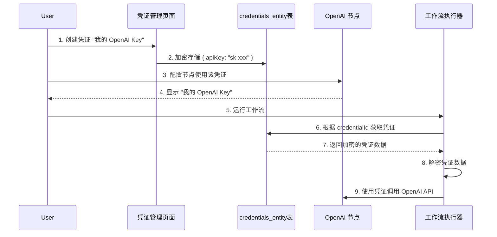
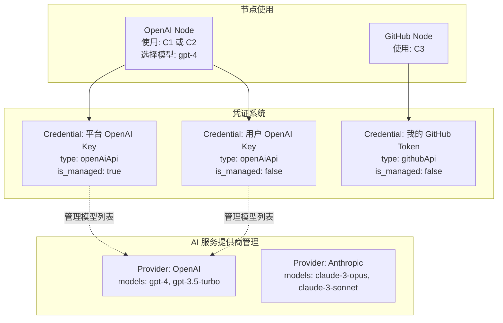

# 凭证概念分析

> **创建日期**: 2025-11-08
> **问题**: 改造后的凭证概念和 n8n 原本的设计有出入

---

## 📊 一、n8n 原本的凭证系统设计

### 1.1 核心概念

在 n8n 中，**凭证（Credentials）** 是一个**跨节点复用的认证配置对象**。

```
┌─────────────────────────────────────────────┐
│         Credentials（凭证对象）              │
├─────────────────────────────────────────────┤
│ • ID: uuid                                  │
│ • Name: "我的 GitHub Token"                 │
│ • Type: "githubApi"                         │
│ • Data: { "accessToken": "ghp_xxx" }        │
│ • ProjectId: workspace-1                    │
│ • isManaged: false                          │
└─────────────────────────────────────────────┘
         ↓ 可以被多个节点使用 ↓
    ┌──────────┬──────────┬──────────┐
    │GitHub节点│GitHub节点│GitHub节点│
    │  (Node1) │  (Node2) │  (Node3) │
    └──────────┴──────────┴──────────┘
```

### 1.2 凭证的特性

| 特性 | 说明 | 示例 |
|------|------|------|
| **复用性** | 一个凭证可以在多个节点中使用 | 同一个 GitHub Token 用于 10 个 GitHub 节点 |
| **类型化** | 每种服务有自己的凭证类型 | githubApi, openAiApi, awsIam 等 400+ 种 |
| **加密存储** | 凭证数据加密存储在数据库 | AES-256-CBC 加密 |
| **归属性** | 凭证归属于某个工作空间（Project） | 工作空间 A 的凭证不能被工作空间 B 使用 |
| **可选管理** | 凭证可以是平台托管的（isManaged=true） | n8n Cloud 提供的免费 OpenAI credits |

### 1.3 凭证类型定义

每个第三方服务都有自己的凭证类型定义文件：

```
packages/nodes-base/credentials/
├── OpenAiApi.credentials.ts          # OpenAI 凭证
├── GithubApi.credentials.ts          # GitHub 凭证
├── Aws.credentials.ts                # AWS IAM 凭证
├── SlackOAuth2Api.credentials.ts     # Slack OAuth 凭证
└── ... (400+ 个凭证类型)
```

**示例：OpenAI 凭证定义**

```typescript
// packages/nodes-base/credentials/OpenAiApi.credentials.ts
export class OpenAiApi implements ICredentialType {
  name = 'openAiApi';
  displayName = 'OpenAI API';
  documentationUrl = 'openai';

  properties: INodeProperties[] = [
    {
      displayName: 'API Key',
      name: 'apiKey',
      type: 'string',
      typeOptions: { password: true },
      default: '',
    },
  ];

  async authenticate(
    credentials: ICredentialDataDecryptedObject,
    requestOptions: IHttpRequestOptions,
  ): Promise<IHttpRequestOptions> {
    requestOptions.headers = {
      'Authorization': `Bearer ${credentials.apiKey}`,
    };
    return requestOptions;
  }
}
```

### 1.4 凭证的使用流程



### 1.5 数据库结构（改造前）

**改造前的设计（已废弃）：**

```sql
-- SharedCredentials 表（已删除）
CREATE TABLE shared_credentials (
  id UUID PRIMARY KEY,
  credentials_id UUID,      -- 凭证 ID
  project_id UUID,          -- 项目 ID
  role VARCHAR(50)          -- 角色：owner, editor, viewer
);

-- Credentials 表
CREATE TABLE credentials_entity (
  id UUID PRIMARY KEY,
  name VARCHAR(128),
  type VARCHAR(128),        -- 凭证类型：openAiApi, githubApi 等
  data TEXT,                -- 加密的凭证数据
  -- 注意：原本没有 projectId 字段
);
```

**改造后的设计（当前）：**

```sql
-- Credentials 表（直接归属工作空间）
CREATE TABLE credentials_entity (
  id UUID PRIMARY KEY,
  name VARCHAR(128),
  type VARCHAR(128),        -- 凭证类型：openAiApi, githubApi 等
  data TEXT,                -- 加密的凭证数据
  project_id UUID,          -- ✅ 新增：直接归属工作空间
  is_managed BOOLEAN,       -- ✅ 新增：是否平台托管
  FOREIGN KEY (project_id) REFERENCES project(id)
);
```

---

## 🔄 二、改造方案中的凭证概念

### 2.1 改造方案引入的新概念

改造方案在原有的 `credentials_entity` 基础上，**新增了一个** `workspace_plugin_credentials` 表：

```sql
CREATE TABLE workspace_plugin_credentials (
  id UUID PRIMARY KEY,
  workspace_id UUID NOT NULL,
  service_key VARCHAR(100) NOT NULL,      -- 引用 platform_service.service_key
  encrypted_config TEXT NOT NULL,
  created_at TIMESTAMP,
  updated_at TIMESTAMP,
  UNIQUE (workspace_id, service_key)      -- 每个工作空间对每个插件只能有一份配置
);
```

### 2.2 改造方案中的"两套凭证系统"

改造后实际上形成了**两套凭证系统**：

| 凭证系统 | 表名 | 用途 | 示例 |
|---------|------|------|------|
| **原有凭证** | `credentials_entity` | 高级用户跨节点复用凭证 | 创建一个 GitHub Token 凭证，在 10 个 GitHub 节点中复用 |
| **插件凭证** | `workspace_plugin_credentials` | 工作空间为"插件"配置 API Key | 工作空间 A 为 "GitHub 插件" 配置一个 API Key |

### 2.3 改造方案中的混淆点

**问题 1：插件 = 节点，但凭证设计没有对齐**

根据之前的分析，我们知道：
- ✅ **插件 = 节点**（这是正确的）
- ❌ 但是凭证系统却把 "插件" 和 "节点" 当作两个不同的概念

**问题 2：WorkspacePluginCredentials 的设计假设**

`workspace_plugin_credentials` 表的设计假设：
- ❌ 每个工作空间对每个"插件"（节点）只需要**一份凭证配置**
- ❌ 凭证配置通过 `service_key` 关联到 `platform_service` 表

但实际情况是：
- ✅ 一个工作空间可能需要**多个相同类型的凭证**
  - 例如：公司有 5 个 GitHub 账号，需要创建 5 个不同的 GitHub 凭证
  - 例如：用户有个人 OpenAI 账号和公司 OpenAI 账号，需要创建 2 个 OpenAI 凭证

**问题 3：与 platform_service 的关联不合理**

```sql
-- workspace_plugin_credentials 表
service_key VARCHAR(100) NOT NULL,   -- 引用 platform_service.service_key
```

这个设计假设：
- ❌ `service_key` 引用的是 `platform_service` 表中的某条记录
- ❌ `platform_service` 表存储的是"插件/节点"的元信息

但实际情况是（根据现有代码）：
- ❌ `platform_service` 表存储的是**AI 模型**（gpt-4-turbo, claude-3-opus 等）
- ❌ 这完全是错误的关联！

### 2.4 改造方案的意图（推测）

我推测改造方案的原始意图是：

```
场景 1：平台托管的 AI 节点
用户：拖拽 OpenAI 节点
系统：自动注入平台的 API Key（存储在 platform_service.api_key_encrypted）
计费：从工作空间余额扣费

场景 2：用户托管的第三方节点
用户：拖拽 GitHub 节点
系统：提示用户配置 API Key
用户：在 workspace_plugin_credentials 中配置 GitHub Token
计费：用户自己负责 GitHub 的费用
```

但这个设计有以下问题：

1. **场景 1 的实现方式错误**
   - ❌ 不应该把 GPT-4、GPT-3.5 当作独立的"服务"存储
   - ✅ 应该是：OpenAI 作为一个服务提供商，models 作为参数

2. **场景 2 的设计冗余**
   - ❌ `workspace_plugin_credentials` 完全可以用现有的 `credentials_entity` 代替
   - ✅ 只需要在 `credentials_entity` 中添加 `is_managed` 字段区分平台托管/用户托管即可

---

## 💡 三、正确的凭证概念应该是什么

### 3.1 统一的凭证系统

**只需要一张表：`credentials_entity`**

```sql
CREATE TABLE credentials_entity (
  id UUID PRIMARY KEY,
  name VARCHAR(128),                    -- 凭证名称：用户自定义
  type VARCHAR(128),                    -- 凭证类型：openAiApi, githubApi 等
  data TEXT,                            -- 加密的凭证数据
  project_id UUID,                      -- 归属工作空间
  is_managed BOOLEAN DEFAULT FALSE,     -- 是否平台托管
  created_at TIMESTAMP,
  updated_at TIMESTAMP,

  FOREIGN KEY (project_id) REFERENCES project(id)
);
```

### 3.2 凭证的两种来源

| 来源 | is_managed | 说明 | 示例 |
|------|------------|------|------|
| **平台托管** | `true` | 平台提供 API Key，用户无需配置，按量计费 | 平台提供的 OpenAI Key |
| **用户自管** | `false` | 用户自己创建和配置凭证，用户自负责费用 | 用户创建的 GitHub Token |

### 3.3 凭证的使用方式

**方式 1：在凭证管理页面创建（高级用户）**

```
1. 用户进入"凭证管理"页面
2. 点击"创建凭证"
3. 选择凭证类型（githubApi）
4. 填写凭证名称（"我的 GitHub Token"）
5. 填写 API Key
6. 保存后，可以在多个 GitHub 节点中复用这个凭证
```

**方式 2：在节点参数中直接创建（快捷方式）**

```
1. 用户拖拽 GitHub 节点
2. 在节点参数面板中，"Credential" 字段选择"创建新凭证"
3. 弹出快捷创建对话框
4. 填写凭证信息后保存
5. 该凭证自动应用到当前节点，同时也可以在其他节点中复用
```

**方式 3：使用平台托管的凭证（对于 AI 节点）**

```
1. 用户拖拽 OpenAI 节点
2. 系统检测到 OpenAI 是平台托管的服务
3. 自动注入平台的 OpenAI 凭证（is_managed=true）
4. 用户无需配置，直接使用
5. 工作流执行时，从工作空间余额扣费
```

### 3.4 凭证与 AI 服务提供商的关系



---

## 🐛 四、改造代码中的具体问题

### 4.1 WorkspacePluginCredentials 表的问题

**问题**：这个表完全没有必要存在

```typescript
// packages/@n8n/db/src/entities/workspace-plugin-credentials.entity.ts
@Entity()
@Index(['workspaceId', 'serviceKey'], { unique: true }) // ❌ 错误约束！
export class WorkspacePluginCredentials extends WithTimestampsAndStringId {
  @Column({ type: 'uuid', name: 'workspace_id' })
  workspaceId: string;

  @Column({ type: 'varchar', length: 100, name: 'service_key' })
  serviceKey: string;   // ❌ 引用的是 platform_service（AI 模型），不是节点！

  @Column({ type: 'text', name: 'encrypted_config' })
  encryptedConfig: string;
}
```

**问题分析**：

1. ❌ `UNIQUE (workspaceId, serviceKey)` - 限制每个工作空间对每个服务只能有一个凭证
   - 现实：一个工作空间可能需要多个 GitHub 凭证（多个账号）

2. ❌ `service_key` 引用 `platform_service` - 关联到错误的表
   - `platform_service` 存储的是 AI 模型（gpt-4, claude-3-opus）
   - 凭证应该关联到凭证类型（githubApi, openAiApi），而不是 AI 模型

3. ❌ 功能重复 - `credentials_entity` 已经提供了所有需要的功能

### 4.2 改造方案文档中的错误描述

**文档中的错误表述**：

```markdown
workspace_plugin_credentials: 插件 API Key | service_id, encrypted_credentials
```

**问题**：
- "插件 API Key" 暗示这是专门为"插件"设计的凭证表
- 但实际上凭证应该是跨节点复用的，不应该和"插件"绑定

### 4.3 迁移文件中的问题

让我检查一下迁移文件：

```bash
packages/@n8n/db/src/migrations/common/
├── 1762511302220-CreatePlatformServiceTables.ts    # 创建 platform_service（AI 模型）
├── 1762511302660-ExtendPlatformServiceForPlugins.ts  # 扩展为"插件"
└── 1762511302880-CreateWorkspacePluginCredentialsTable.ts  # ❌ 应该不存在
```

---

## ✅ 五、修正方案

### 5.1 删除 workspace_plugin_credentials 表

**原因**：
1. 功能完全由 `credentials_entity` 覆盖
2. 设计约束不合理（每个工作空间每个服务只能一个凭证）
3. 与 `platform_service` 的关联是错误的

### 5.2 只使用 credentials_entity

**保留现有的 credentials_entity 表结构**：

```sql
CREATE TABLE credentials_entity (
  id UUID PRIMARY KEY,
  name VARCHAR(128),                    -- 用户自定义名称
  type VARCHAR(128),                    -- 凭证类型（400+ 种）
  data TEXT,                            -- 加密的凭证数据
  project_id UUID,                      -- 归属工作空间
  is_managed BOOLEAN DEFAULT FALSE,     -- 平台托管 vs 用户自管
  created_at TIMESTAMP,
  updated_at TIMESTAMP
);
```

### 5.3 平台托管 AI 凭证的实现

**创建平台托管的 OpenAI 凭证**：

```typescript
// 在工作空间创建时，自动创建平台托管的 AI 凭证
async function createWorkspace(workspaceData) {
  // 1. 创建工作空间
  const workspace = await projectRepository.save(workspaceData);

  // 2. 为该工作空间创建平台托管的 AI 凭证
  const platformOpenAiCred = await credentialsRepository.save({
    name: '平台 OpenAI 凭证（按量计费）',
    type: 'openAiApi',
    data: encryptedPlatformApiKey,  // 平台的 OpenAI API Key
    projectId: workspace.id,
    isManaged: true,  // ✅ 平台托管
  });

  const platformAnthropicCred = await credentialsRepository.save({
    name: '平台 Anthropic 凭证（按量计费）',
    type: 'anthropicApi',
    data: encryptedPlatformApiKey,  // 平台的 Anthropic API Key
    projectId: workspace.id,
    isManaged: true,  // ✅ 平台托管
  });

  return workspace;
}
```

### 5.4 用户使用凭证的流程

**场景 1：使用平台托管的 OpenAI**

```typescript
// 用户拖拽 OpenAI 节点
// 系统自动选择 isManaged=true 的 OpenAI 凭证
const credential = await credentialsRepository.findOne({
  where: {
    projectId: currentWorkspace.id,
    type: 'openAiApi',
    isManaged: true,
  },
});

// 执行时，使用平台 API Key，从工作空间余额扣费
```

**场景 2：用户自己配置 OpenAI**

```typescript
// 用户创建自己的 OpenAI 凭证
const userCred = await credentialsRepository.save({
  name: '我的 OpenAI Key',
  type: 'openAiApi',
  data: encryptedUserApiKey,
  projectId: currentWorkspace.id,
  isManaged: false,  // ✅ 用户自管
});

// 用户在节点中选择使用这个凭证
// 执行时，使用用户自己的 API Key，不扣工作空间余额
```

---

## 📝 六、总结

### 6.1 概念对比表

| 概念 | n8n 原本 | 改造方案（错误） | 正确应该是 |
|------|---------|----------------|-----------|
| **凭证表** | credentials_entity | credentials_entity + workspace_plugin_credentials | 只需要 credentials_entity |
| **凭证归属** | SharedCredentials 表（已删除） | 直接 projectId | ✅ 直接 projectId |
| **凭证复用** | ✅ 可跨节点复用 | ❌ 每个工作空间每个插件一个凭证 | ✅ 可跨节点复用 |
| **平台托管** | isManaged 字段（仅 n8n Cloud） | 混乱的两套系统 | ✅ isManaged 字段 |
| **与服务的关系** | 凭证类型（400+种） | 错误关联到 platform_service | ✅ 凭证类型（400+种） |

### 6.2 需要修正的文件

1. **删除的文件**：
   - `workspace-plugin-credentials.entity.ts`
   - `workspace-plugin-credentials.repository.ts`
   - `1762511302880-CreateWorkspacePluginCredentialsTable.ts`（迁移文件）

2. **修正的文件**：
   - 所有引用 `WorkspacePluginCredentials` 的 Service/Controller
   - 前端的凭证管理相关组件

### 6.3 核心结论

✅ **正确的凭证概念**：
- 凭证是**跨节点复用的认证配置对象**
- 一个工作空间可以有**多个相同类型的凭证**
- 凭证通过 `type` 字段关联到**凭证类型**（不是 AI 模型或节点）
- 凭证通过 `isManaged` 字段区分**平台托管 vs 用户自管**

❌ **改造方案的错误**：
- 创建了冗余的 `workspace_plugin_credentials` 表
- 错误地限制了每个工作空间每个服务只能有一个凭证
- 错误地将凭证关联到 `platform_service`（AI 模型）

---

## 🎯 七、下一步行动

1. ✅ 确认删除 `workspace_plugin_credentials` 相关代码
2. ✅ 只使用 `credentials_entity` 表
3. ✅ 实现基于 `isManaged` 字段的平台托管凭证逻辑
4. ✅ 更新前端凭证管理 UI
5. ✅ 更新概念修正方案文档，加入凭证系统的修正
