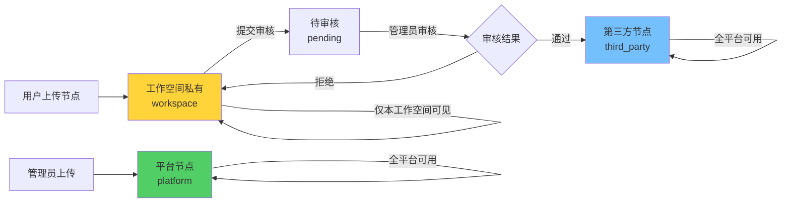

# 节点选择器动态化改造方案（修正版）

> **文档版本：** v2.1（紧急修正版）
> **创建日期：** 2025-11-09
> **最后更新：** 2025-11-09（基于前端崩溃问题的紧急修正）
> **修正说明：**
> - 平台节点和第三方节点无需安装，全平台可用
> - **紧急：** 加入元数据验证和错误处理，解决前端崩溃问题
> **预计工期：** 4-5 天

---

## 🚨 紧急问题说明

### 发现的严重问题

**症状：** 删除节点后，前端崩溃报错：
```javascript
TypeError: Cannot read properties of undefined (reading 'includes')
    at useActionsGeneration.ts:390
    // node.group.includes('trigger')
    // ↑ group 是 undefined
```

**根本原因：**
1. package.json 引用了已删除的节点
2. 后端尝试加载不存在的节点文件
3. 返回不完整的节点元数据（group: undefined）
4. 前端代码假设所有属性都存在 → 崩溃

**临时修复（已完成）：**
- ✅ 更新 package.json，移除已删除节点引用
- ✅ 前端添加空值检查：`node.group && !node.group.includes('trigger')`

**根本解决方案（本方案）：**
- ✅ 后端强制验证元数据完整性
- ✅ 前端从 API 加载节点，信任后端数据
- ✅ 优雅降级，避免单个节点错误影响整体

---

## 📋 核心设计修正

### ❌ 错误理解（v1.0）
- 平台节点需要用户"安装"到工作空间才能使用
- 节点选择器有"市场"Tab，显示未安装节点
- 用户点击"安装"按钮复制节点到工作空间

### ✅ 正确理解（v2.0）
- **平台节点** + **第三方节点** = 全平台共享，所有用户直接可用
- **工作空间私有节点** = 只有本工作空间可见
- 节点选择器**不需要安装流程**

---

## 🎯 节点分类和可见性

### 节点类型定义

```typescript
// custom_node 表的 node_type 字段
type NodeType =
  | 'platform'      // 平台节点：管理员上传，全平台可用
  | 'third_party'   // 第三方节点：开发者提交→审核通过，全平台可用
  | 'workspace';    // 工作空间私有：本工作空间上传，仅本工作空间可见
```

### 节点可见性规则

| 节点类型 | 存储位置 | 可见范围 | 谁可以上传 |
|---------|---------|---------|-----------|
| **内置节点** | 文件系统 | 所有用户 | n8n 官方 |
| **平台节点** | 数据库 `node_type='platform'` | 所有用户 | 管理员 |
| **第三方节点** | 数据库 `node_type='third_party'` | 所有用户 | 开发者→审核 |
| **工作空间私有** | 数据库 `node_type='workspace'` + `workspace_id=xxx` | 仅本工作空间 | 工作空间成员 |

---

## 🔧 后端实现（修正版）

### 4.1 节点加载逻辑（加入元数据验证）

**文件：** `packages/cli/src/services/load-nodes-and-credentials.service.ts`

```typescript
@Service()
export class LoadNodesAndCredentials {
  constructor(
    private readonly customNodeService: CustomNodeService,
    private readonly logger: Logger,
  ) {}

  /**
   * ✅ 获取所有可用节点（根据工作空间）
   * 🔧 新增：元数据验证和错误处理
   */
  async getAllNodeTypes(workspaceId?: string): Promise<INodeTypeNameIndex> {
    // 1. 加载内置节点（142个）
    const builtinNodes = await this.loadBuiltinNodes();

    // 2. 加载全平台共享节点（platform + third_party）
    const sharedNodes = await this.loadSharedNodes();

    // 3. 加载工作空间私有节点
    const workspaceNodes = workspaceId
      ? await this.loadWorkspaceNodes(workspaceId)
      : {};

    // 4. 🔧 新增：验证并合并（优先级：workspace > shared > builtin）
    return this.validateAndMerge(builtinNodes, sharedNodes, workspaceNodes);
  }

  /**
   * 🔧 新增：验证元数据并合并节点
   * 确保所有节点都有完整的元数据，避免前端崩溃
   */
  private validateAndMerge(
    ...nodeSets: INodeTypeNameIndex[]
  ): INodeTypeNameIndex {
    const result: INodeTypeNameIndex = {};
    let validCount = 0;
    let invalidCount = 0;

    for (const nodeSet of nodeSets) {
      for (const [name, node] of Object.entries(nodeSet)) {
        try {
          // ✅ 验证节点元数据
          this.validateNodeMetadata(node.type.description);

          result[name] = node;
          validCount++;
        } catch (error) {
          // ⚠️ 记录错误但不中断加载
          this.logger.warn(`Skipping invalid node ${name}:`, error);
          invalidCount++;
          // ✅ 优雅降级：跳过无效节点，继续加载其他节点
        }
      }
    }

    this.logger.info(
      `Node loading complete: ${validCount} valid, ${invalidCount} invalid (skipped)`
    );

    return result;
  }

  /**
   * 🔧 新增：验证节点元数据完整性
   */
  private validateNodeMetadata(description: INodeTypeDescription): void {
    // 必需字段检查
    const requiredFields = [
      'name',
      'displayName',
      'group',
      'description',
      'version',
    ];

    for (const field of requiredFields) {
      if (!description[field]) {
        throw new Error(`Missing required field: ${field}`);
      }
    }

    // group 必须是非空数组
    if (!Array.isArray(description.group) || description.group.length === 0) {
      throw new Error('group must be a non-empty array');
    }

    // version 必须是数字或数字数组
    if (
      typeof description.version !== 'number' &&
      !Array.isArray(description.version)
    ) {
      throw new Error('version must be a number or array of numbers');
    }

    // ✅ 确保关键属性类型正确
    if (typeof description.name !== 'string') {
      throw new Error('name must be a string');
    }
    if (typeof description.displayName !== 'string') {
      throw new Error('displayName must be a string');
    }
  }

  /**
   * 加载内置节点（142个）
   * 🔧 新增：错误处理，单个节点失败不影响整体
   */
  private async loadBuiltinNodes(): Promise<INodeTypeNameIndex> {
    const nodeTypes: INodeTypeNameIndex = {};

    try {
      // 扫描 packages/nodes-base/nodes 目录
      const nodeFiles = await this.discoverNodeFiles('packages/nodes-base/nodes');

      for (const nodeFile of nodeFiles) {
        try {
          // 动态加载节点
          const NodeClass = require(nodeFile.path);
          const nodeInstance = new NodeClass();

          // ✅ 验证元数据（在添加到结果前）
          this.validateNodeMetadata(nodeInstance.description);

          nodeTypes[nodeInstance.description.name] = {
            type: nodeInstance,
            sourcePath: nodeFile.path,
            source: 'builtin',
          };
        } catch (error) {
          // ⚠️ 单个节点失败不影响其他节点
          this.logger.warn(`Failed to load builtin node ${nodeFile.path}:`, error);
        }
      }
    } catch (error) {
      this.logger.error('Failed to load builtin nodes:', error);
      // ✅ 即使加载失败，也返回空对象而不是抛出异常
    }

    return nodeTypes;
  }

  /**
   * ✅ 加载全平台共享节点（platform + third_party）
   * 🔧 新增：编译错误处理
   */
  private async loadSharedNodes(): Promise<INodeTypeNameIndex> {
    const nodeTypes: INodeTypeNameIndex = {};

    try {
      // 查询：node_type IN ('platform', 'third_party') AND submission_status = 'approved'
      const sharedNodes = await this.customNodeService.getSharedNodes();

      for (const node of sharedNodes) {
        try {
          // 编译节点代码
          const NodeClass = this.compileNodeCode(node.nodeCode);
          const nodeInstance = new NodeClass();

          // ✅ 验证元数据（在添加到结果前）
          this.validateNodeMetadata(nodeInstance.description);

          nodeTypes[node.nodeKey] = {
            type: nodeInstance,
            sourcePath: `custom://${node.id}`,
            source: 'custom',
            nodeType: node.nodeType, // 'platform' | 'third_party'
            nodeId: node.id,
          };
        } catch (error) {
          // ⚠️ 记录错误，标记节点为失败状态（可选）
          this.logger.warn(
            `Failed to load shared node ${node.nodeKey} (${node.id}):`,
            error
          );

          // 🔧 可选：更新数据库标记此节点有问题
          await this.customNodeService.markNodeAsError(node.id, error.message);
        }
      }
    } catch (error) {
      this.logger.error('Failed to load shared nodes:', error);
    }

    return nodeTypes;
  }

  /**
   * ✅ 加载工作空间私有节点
   */
  private async loadWorkspaceNodes(workspaceId: string): Promise<INodeTypeNameIndex> {
    // 查询：workspace_id = xxx AND node_type = 'workspace'
    const workspaceNodes = await this.customNodeService.getWorkspaceNodes(workspaceId);

    const nodeTypes: INodeTypeNameIndex = {};

    for (const node of workspaceNodes) {
      const NodeClass = this.compileNodeCode(node.nodeCode);
      nodeTypes[node.nodeKey] = {
        type: new NodeClass(),
        sourcePath: `custom://${node.id}`,
        source: 'custom',
        nodeType: 'workspace',
        nodeId: node.id,
      };
    }

    return nodeTypes;
  }

  /**
   * 编译节点代码
   * 🔧 新增：更严格的错误处理
   */
  private compileNodeCode(code: string): any {
    try {
      // 使用 vm2 或类似沙箱环境编译
      const { VM } = require('vm2');
      const vm = new VM({
        timeout: 5000,
        sandbox: {
          require: this.createSandboxRequire(),
        },
      });

      const compiledCode = vm.run(code);

      // ✅ 验证返回的是一个类
      if (typeof compiledCode !== 'function') {
        throw new Error('Node code must export a class');
      }

      return compiledCode;
    } catch (error) {
      this.logger.error('Failed to compile node code:', error);
      throw new Error(`Node compilation failed: ${error.message}`);
    }
  }

  /**
   * 🔧 新增：创建沙箱 require 函数
   */
  private createSandboxRequire() {
    // 只允许安全的依赖
    const allowedModules = [
      'n8n-workflow',
      'n8n-core',
      // ... 其他安全的模块
    ];

    return (moduleName: string) => {
      if (!allowedModules.includes(moduleName)) {
        throw new Error(`Module ${moduleName} is not allowed`);
      }
      return require(moduleName);
    };
  }
}
```

### 4.2 CustomNodeService 扩展

**文件：** `packages/cli/src/services/custom-node.service.ts`

```typescript
@Service()
export class CustomNodeService {
  /**
   * ✅ 获取全平台共享节点（platform + third_party）
   */
  async getSharedNodes() {
    return await this.customNodeRepository.find({
      where: {
        nodeType: In(['platform', 'third_party']),
        submissionStatus: 'approved',
        isActive: true,
      },
      order: { createdAt: 'DESC' },
    });
  }

  /**
   * ✅ 获取工作空间私有节点
   */
  async getWorkspaceNodes(workspaceId: string) {
    return await this.customNodeRepository.find({
      where: {
        workspaceId,
        nodeType: 'workspace',
        isActive: true,
      },
      order: { createdAt: 'DESC' },
    });
  }

  /**
   * ✅ 创建工作空间私有节点
   */
  async createWorkspaceNode(
    workspaceId: string,
    userId: string,
    data: {
      nodeKey: string;
      nodeName: string;
      nodeDefinition: any;
      nodeCode: string;
      category?: string;
      description?: string;
    }
  ) {
    const node = this.customNodeRepository.create({
      ...data,
      workspaceId,
      createdBy: userId,
      nodeType: 'workspace',  // ✅ 标记为工作空间私有
      submissionStatus: 'draft', // 私有节点默认草稿状态
      isActive: true,
    });

    return await this.customNodeRepository.save(node);
  }

  /**
   * ✅ 提交工作空间节点到平台审核
   */
  async submitNodeForReview(nodeId: string) {
    const node = await this.customNodeRepository.findOneOrFail({
      where: { id: nodeId },
    });

    // 只有工作空间私有节点可以提交审核
    if (node.nodeType !== 'workspace') {
      throw new Error('只有工作空间私有节点可以提交审核');
    }

    node.submissionStatus = 'pending';
    node.submittedAt = new Date();

    return await this.customNodeRepository.save(node);
  }

  /**
   * ✅ 管理员审核节点（通过后变为第三方节点）
   */
  async reviewNode(
    nodeId: string,
    status: 'approved' | 'rejected',
    reviewerId: string,
    notes?: string
  ) {
    const node = await this.customNodeRepository.findOneOrFail({
      where: { id: nodeId },
    });

    node.submissionStatus = status;
    node.reviewedBy = reviewerId;
    node.reviewedAt = new Date();
    node.reviewNotes = notes;

    if (status === 'approved') {
      // ✅ 审核通过后，从工作空间私有变为第三方节点（全平台可用）
      node.nodeType = 'third_party';
      node.workspaceId = null; // 清空工作空间 ID，表示全平台可用
    }

    return await this.customNodeRepository.save(node);
  }
}
```

### 4.3 API 端点（修正版）

**文件：** `packages/cli/src/controllers/node-types.controller.ts`

```typescript
@RestController('/node-types')
export class NodeTypesController {
  /**
   * ✅ 获取所有可用节点（内置 + 平台 + 第三方 + 工作空间私有）
   */
  @Get('/')
  async getAllNodeTypes(
    @WorkspaceContext() context: { workspaceId: string }
  ) {
    const allNodeTypes = await this.loadNodesAndCredentials.getAllNodeTypes(
      context.workspaceId
    );

    return Object.values(allNodeTypes).map(node => ({
      ...node.type.description,
      source: node.source,
      nodeType: node.nodeType,
      nodeId: node.nodeId,
    }));
  }
}
```

**文件：** `packages/cli/src/controllers/custom-nodes.controller.ts`

```typescript
@RestController('/custom-nodes')
export class CustomNodesController {
  /**
   * ✅ 用户上传工作空间私有节点
   */
  @Post('/workspace')
  async uploadWorkspaceNode(
    @Body() body: {
      nodeKey: string;
      nodeName: string;
      nodeDefinition: any;
      nodeCode: string;
      category?: string;
      description?: string;
    },
    @WorkspaceContext() context: { workspaceId: string; userId: string }
  ) {
    return await this.customNodeService.createWorkspaceNode(
      context.workspaceId,
      context.userId,
      body
    );
  }

  /**
   * ✅ 提交工作空间节点到平台审核
   */
  @Post('/:nodeId/submit')
  async submitForReview(
    @Param('nodeId') nodeId: string
  ) {
    return await this.customNodeService.submitNodeForReview(nodeId);
  }
}
```

---

## 🎨 前端实现（修正版）

### 5.1 Store 改造（加入安全访问）

**文件：** `packages/editor-ui/src/stores/nodeTypes.store.ts`

```typescript
export const useNodeTypesStore = defineStore('nodeTypes', () => {
  const nodeTypes = ref<Record<string, INodeTypeWithSource>>({});
  const loading = ref(false);
  const error = ref<Error | null>(null);

  /**
   * ✅ 加载所有可用节点
   * 包括：内置 + 平台 + 第三方 + 工作空间私有
   * 🔧 新增：错误处理和加载状态
   */
  async function fetchNodeTypes() {
    loading.value = true;
    error.value = null;

    try {
      const nodes = await nodeTypesApi.getAllNodeTypes();

      nodeTypes.value = {};
      for (const node of nodes) {
        // ✅ 后端已验证元数据，前端可以信任数据
        // 但仍然做基本的空值检查
        if (node && node.name) {
          nodeTypes.value[node.name] = node;
        } else {
          console.warn('Received invalid node from API:', node);
        }
      }
    } catch (err) {
      error.value = err as Error;
      console.error('Failed to load node types:', err);
      // ✅ 不抛出异常，允许应用继续运行
    } finally {
      loading.value = false;
    }
  }

  /**
   * 🔧 新增：安全获取节点
   */
  function getNodeType(name: string): INodeTypeWithSource | null {
    return nodeTypes.value[name] || null;
  }

  /**
   * 🔧 新增：安全获取节点属性
   */
  function getNodeProperty<K extends keyof INodeTypeDescription>(
    nodeName: string,
    property: K
  ): INodeTypeDescription[K] | undefined {
    const node = nodeTypes.value[nodeName];
    return node?.[property];
  }

  /**
   * 计算属性：内置节点（142个）
   */
  const builtinNodes = computed(() =>
    Object.values(nodeTypes.value).filter(node => node.source === 'builtin')
  );

  /**
   * ✅ 计算属性：扩展节点（平台 + 第三方，全平台可用）
   */
  const extensionNodes = computed(() =>
    Object.values(nodeTypes.value).filter(
      node => node.nodeType === 'platform' || node.nodeType === 'third_party'
    )
  );

  /**
   * ✅ 计算属性：工作空间私有节点
   */
  const workspaceNodes = computed(() =>
    Object.values(nodeTypes.value).filter(
      node => node.nodeType === 'workspace'
    )
  );

  /**
   * 🔧 新增：按分类安全获取节点
   */
  function getNodesByCategory(category: string): INodeTypeWithSource[] {
    return Object.values(nodeTypes.value).filter(node => {
      // ✅ 安全访问 group 属性
      if (!node.group || !Array.isArray(node.group)) {
        console.warn(`Node ${node.name} has invalid group property`);
        return false;
      }
      return node.group.includes(category);
    });
  }

  /**
   * 🔧 新增：按 tag 安全过滤节点
   */
  function getNodesByTag(tag: string): INodeTypeWithSource[] {
    return Object.values(nodeTypes.value).filter(node => {
      // ✅ 安全访问 codex.categories
      if (!node.codex?.categories) return false;

      return Object.values(node.codex.categories)
        .flat()
        .includes(tag);
    });
  }

  return {
    nodeTypes,
    loading,
    error,
    fetchNodeTypes,
    getNodeType,
    getNodeProperty,
    builtinNodes,
    extensionNodes,
    workspaceNodes,
    getNodesByCategory,
    getNodesByTag,
  };
});
```

### 5.2 节点选择器 UI（修正版）

**文件：** `packages/editor-ui/src/components/Node/NodeCreator/NodeCreator.vue`

```vue
<template>
  <div class="node-creator">
    <!-- 搜索框 -->
    <div class="node-creator-search">
      <n8n-input
        v-model="searchQuery"
        placeholder="搜索节点..."
        prefix-icon="search"
      />
    </div>

    <!-- ✅ Tab 切换（修正版） -->
    <n8n-tabs v-model="activeTab" class="node-creator-tabs">
      <!-- Tab 1: 基础节点（142个内置） -->
      <n8n-tab-pane label="基础节点" name="builtin">
        <div class="tab-description">
          n8n 内置的核心节点，涵盖数据处理、流程控制等基础功能
        </div>
        <NodeCategoryList :nodes="filteredBuiltinNodes" />
      </n8n-tab-pane>

      <!-- ✅ Tab 2: 扩展节点（平台 + 第三方，全平台共享） -->
      <n8n-tab-pane label="扩展节点" name="extension">
        <div class="tab-description">
          平台提供和社区贡献的节点，所有用户可用
        </div>

        <!-- 分类：平台节点 -->
        <div class="node-section">
          <h3 class="section-title">
            <n8n-tag type="success" size="small">平台提供</n8n-tag>
            平台节点
          </h3>
          <NodeGrid :nodes="filteredPlatformNodes" />
        </div>

        <!-- 分类：第三方节点 -->
        <div class="node-section">
          <h3 class="section-title">
            <n8n-tag type="info" size="small">社区贡献</n8n-tag>
            第三方节点
          </h3>
          <NodeGrid :nodes="filteredThirdPartyNodes" />
        </div>

        <n8n-empty
          v-if="extensionNodes.length === 0"
          description="暂无扩展节点"
        />
      </n8n-tab-pane>

      <!-- ✅ Tab 3: 我的节点（工作空间私有） -->
      <n8n-tab-pane label="我的节点" name="workspace">
        <div class="tab-description">
          本工作空间上传的私有节点，仅团队成员可见
        </div>

        <NodeList :nodes="filteredWorkspaceNodes" />

        <n8n-empty
          v-if="workspaceNodes.length === 0"
          description="还没有上传私有节点"
        >
          <n8n-button @click="showUploadDialog = true" type="primary">
            上传节点
          </n8n-button>
        </n8n-empty>

        <div class="workspace-actions">
          <n8n-button @click="showUploadDialog = true" icon="plus">
            上传新节点
          </n8n-button>
        </div>
      </n8n-tab-pane>
    </n8n-tabs>

    <!-- 上传对话框 -->
    <NodeUploadDialog
      v-if="showUploadDialog"
      @close="showUploadDialog = false"
      @uploaded="handleNodeUploaded"
    />
  </div>
</template>

<script setup lang="ts">
import { ref, computed, onMounted } from 'vue';
import { useNodeTypesStore } from '@/stores/nodeTypes.store';

const nodeTypesStore = useNodeTypesStore();

const searchQuery = ref('');
const activeTab = ref('builtin');
const showUploadDialog = ref(false);

// 内置节点
const builtinNodes = computed(() => nodeTypesStore.builtinNodes);
const filteredBuiltinNodes = computed(() =>
  builtinNodes.value.filter(matchesSearch)
);

// ✅ 扩展节点（平台 + 第三方）
const extensionNodes = computed(() => nodeTypesStore.extensionNodes);

const filteredPlatformNodes = computed(() =>
  extensionNodes.value
    .filter(node => node.nodeType === 'platform')
    .filter(matchesSearch)
);

const filteredThirdPartyNodes = computed(() =>
  extensionNodes.value
    .filter(node => node.nodeType === 'third_party')
    .filter(matchesSearch)
);

// ✅ 工作空间私有节点
const workspaceNodes = computed(() => nodeTypesStore.workspaceNodes);
const filteredWorkspaceNodes = computed(() =>
  workspaceNodes.value.filter(matchesSearch)
);

function matchesSearch(node: any) {
  if (!searchQuery.value) return true;
  const query = searchQuery.value.toLowerCase();
  return (
    node.displayName?.toLowerCase().includes(query) ||
    node.description?.toLowerCase().includes(query) ||
    node.name?.toLowerCase().includes(query)
  );
}

async function handleNodeUploaded() {
  // 重新加载节点列表
  await nodeTypesStore.fetchNodeTypes();
  // 切换到"我的节点" Tab
  activeTab.value = 'workspace';
  showUploadDialog.value = false;
}

onMounted(async () => {
  await nodeTypesStore.fetchNodeTypes();
});
</script>

<style scoped lang="scss">
.node-creator {
  height: 100%;
  display: flex;
  flex-direction: column;

  &-search {
    padding: var(--spacing--md);
    border-bottom: var(--border);
  }

  &-tabs {
    flex: 1;
    overflow: hidden;
  }
}

.tab-description {
  padding: var(--spacing--sm) var(--spacing--md);
  font-size: var(--font-size--xs);
  color: var(--color--text--tint-2);
  background: var(--color--background--light-2);
  border-radius: var(--radius);
  margin-bottom: var(--spacing--md);
}

.node-section {
  margin-bottom: var(--spacing--xl);

  .section-title {
    display: flex;
    align-items: center;
    gap: var(--spacing--xs);
    font-size: var(--font-size--md);
    font-weight: var(--font-weight--bold);
    margin-bottom: var(--spacing--sm);
  }
}

.workspace-actions {
  margin-top: var(--spacing--lg);
  text-align: center;
}
</style>
```

---

## 📊 用户体验流程（修正版）

### 场景 1：新用户打开工作流编辑器

1. 打开节点选择器
2. **Tab 1 - 基础节点**：看到 142 个内置节点（Set, If, Code...）
3. **Tab 2 - 扩展节点**：
   - 平台节点（管理员上传的）：如"AI 智能分析"、"OCR 识别"
   - 第三方节点（审核通过的）：如"GitHub 高级版"、"Slack 增强版"
   - ✅ **直接可用，无需安装**
4. **Tab 3 - 我的节点**：空（还没上传私有节点）

### 场景 2：用户使用平台节点

1. 切换到"扩展节点" Tab
2. 看到"AI 智能分析"节点（平台节点）
3. 直接拖拽到画布使用
4. ✅ **无需安装，立即可用**

### 场景 3：用户上传工作空间私有节点

1. 切换到"我的节点" Tab
2. 点击"上传节点"按钮
3. 填写节点信息 + 上传代码
4. 节点立即出现在"我的节点" Tab
5. ✅ **仅本工作空间可见可用**
6. （可选）点击"提交审核"，审核通过后变为第三方节点（全平台可用）

### 场景 4：管理员上传平台节点

1. 管理员进入后台管理系统
2. 上传新节点，设置为"平台节点"
3. 节点自动出现在所有用户的"扩展节点" Tab
4. ✅ **所有用户立即可用**

### 场景 5：开发者提交第三方节点

1. 开发者在自己工作空间上传节点（工作空间私有）
2. 点击"提交审核"
3. 管理员审核通过
4. 节点 `node_type` 从 `workspace` 变为 `third_party`
5. 节点出现在所有用户的"扩展节点" Tab（第三方分类）
6. ✅ **全平台可用**

---

## 🔄 节点生命周期



---

## 🗄️ 数据库设计（无需修改）

**`custom_node` 表已经支持这个设计：**

```sql
CREATE TABLE custom_node (
  id UUID PRIMARY KEY,
  node_key VARCHAR(100) NOT NULL,
  node_name VARCHAR(200) NOT NULL,

  -- ✅ 关键字段：节点类型
  node_type VARCHAR(50) DEFAULT 'workspace',  -- 'platform' | 'third_party' | 'workspace'

  -- ✅ 关键字段：所属工作空间（null = 全平台可用）
  workspace_id UUID,                          -- NULL 表示全平台节点

  node_definition JSONB NOT NULL,
  node_code TEXT NOT NULL,

  -- 审核字段
  submission_status VARCHAR(50),              -- 'draft' | 'pending' | 'approved' | 'rejected'
  submitted_at TIMESTAMP,
  reviewed_by UUID,
  reviewed_at TIMESTAMP,
  review_notes TEXT,

  is_active BOOLEAN NOT NULL DEFAULT true,
  created_by UUID NOT NULL,
  created_at TIMESTAMP DEFAULT CURRENT_TIMESTAMP,
  updated_at TIMESTAMP DEFAULT CURRENT_TIMESTAMP,

  FOREIGN KEY (workspace_id) REFERENCES project(id) ON DELETE CASCADE,
  UNIQUE(workspace_id, node_key)
);
```

**查询示例：**

```sql
-- 获取全平台可用节点（平台 + 第三方）
SELECT * FROM custom_node
WHERE node_type IN ('platform', 'third_party')
  AND submission_status = 'approved'
  AND is_active = true;

-- 获取工作空间私有节点
SELECT * FROM custom_node
WHERE workspace_id = 'xxx'
  AND node_type = 'workspace'
  AND is_active = true;
```

---

## ✅ 验收标准（修正版）

### 后端验收
- [ ] `getAllNodeTypes(workspaceId)` 返回：内置 + 平台 + 第三方 + 工作空间私有
- [ ] 平台节点和第三方节点在所有工作空间可见
- [ ] 工作空间私有节点只在本工作空间可见
- [ ] 审核通过后节点 `node_type` 从 `workspace` 变为 `third_party`
- [ ] 审核通过后节点 `workspace_id` 变为 `null`

### 前端验收
- [ ] 节点选择器有三个 Tab：基础节点、扩展节点、我的节点
- [ ] Tab 1 显示 142 个内置节点
- [ ] Tab 2 分两个分类：平台节点 + 第三方节点
- [ ] Tab 3 显示工作空间私有节点
- [ ] ❌ 没有"安装"按钮和流程
- [ ] 用户可以上传工作空间私有节点
- [ ] 用户可以提交节点审核

### 集成测试
- [ ] 管理员上传平台节点后，所有用户立即可用
- [ ] 用户A上传工作空间节点，用户B（其他工作空间）看不到
- [ ] 用户A提交节点审核，审核通过后所有用户可用
- [ ] 搜索功能在所有 Tab 正常工作

---

## 📊 改造工期（不变）

| 任务 | 工作量 |
|------|--------|
| 后端节点加载改造 | 1 天 |
| 后端 API 端点 | 0.5 天 |
| 前端 Store 改造 | 0.5 天 |
| 节点选择器 UI | 1.5 天 |
| 集成测试 | 0.5 天 |
| **总计** | **4 天** |

---

## 📝 关键修正点总结

| 项目 | v1.0（错误） | v2.0（修正） |
|------|-------------|-------------|
| **平台节点** | 需要安装到工作空间 | ✅ 全平台可用，无需安装 |
| **第三方节点** | 需要安装到工作空间 | ✅ 全平台可用，无需安装 |
| **节点选择器 Tab** | 基础/已安装/市场 | ✅ 基础/扩展/我的节点 |
| **安装流程** | 有安装按钮和 API | ❌ 无需安装流程 |
| **节点可见性** | 按安装状态 | ✅ 按节点类型 + 工作空间 |

---

**文档版本：** v2.0（修正版）
**创建日期：** 2025-11-09
**维护者：** 开发团队
