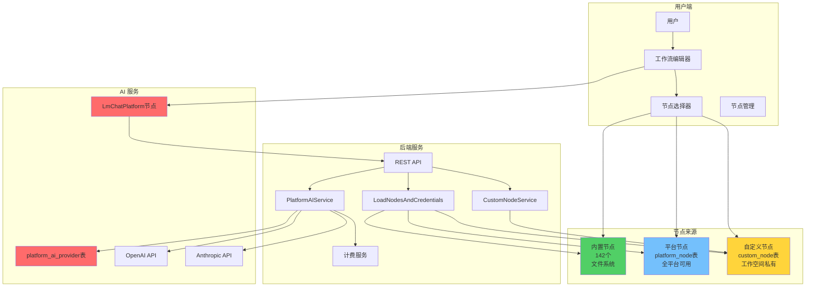

# 架构总览

> **版本：** v1.0
> **状态：** 设计中

[← 返回总览](../00-总览与导航.md)

---

## 🏗️ 架构总览

### 系统架构图



### 数据流程

```
节点加载流程：
┌─────────┐
│ 前端启动 │
└────┬────┘
     ↓
┌──────────────────────────┐
│ 调用 GET /node-types/    │
└────┬─────────────────────┘
     ↓
┌────────────────────────────────┐
│ LoadNodesAndCredentials        │
│ ├─ loadBuiltinNodes()          │  ← 文件系统（142个）
│ ├─ loadPlatformNodes()         │  ← platform_node 表
│ └─ loadWorkspaceNodes(wsId)    │  ← custom_node 表
└────┬───────────────────────────┘
     ↓
┌─────────────────────────┐
│ validateNodeMetadata()  │  ← 验证元数据完整性
└────┬────────────────────┘
     ↓
┌─────────────────────────┐
│ 返回节点列表             │
│ [内置 + 平台 + 自定义]   │
└────┬────────────────────┘
     ↓
┌─────────────────────────┐
│ 前端渲染节点选择器       │
│ ├─ Tab 1: 基础节点      │
│ ├─ Tab 2: 扩展节点      │
│ └─ Tab 3: 我的节点      │
└─────────────────────────┘
```

```
AI 调用流程：
┌──────────────────┐
│ 用户运行工作流     │
└────┬─────────────┘
     ↓
┌─────────────────────────────────┐
│ LmChatPlatform.supplyData()     │
│ providerKey = "openai"          │
│ modelId = "gpt-4-turbo"         │
└────┬────────────────────────────┘
     ↓
┌──────────────────────────────────────────────┐
│ POST /platform-ai-providers/openai/chat/     │
│      completions                             │
│ Body: { model, messages, temperature... }   │
└────┬─────────────────────────────────────────┘
     ↓
┌─────────────────────────────────────┐
│ PlatformAIController                │
│ └─ platformAIService.chat()         │
└────┬────────────────────────────────┘
     ↓
┌──────────────────────────────────────────┐
│ 1. 从 platform_ai_provider 获取 API Key │
│ 2. 调用上游 OpenAI API                  │
│ 3. 记录使用量                           │
│ 4. 计费并扣除余额                       │
│ 5. 返回 AI 响应                         │
└────┬─────────────────────────────────────┘
     ↓
┌────────────────┐
│ 返回给用户      │
└────────────────┘
```

---


[← 上一章：多租户架构](./01-多租户架构.md) | [返回总览](../00-总览与导航.md) | [下一章：数据库设计 →](./03-数据库设计.md)
