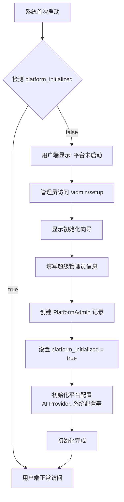
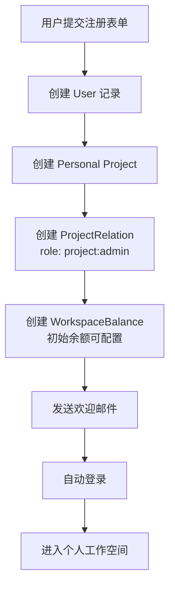
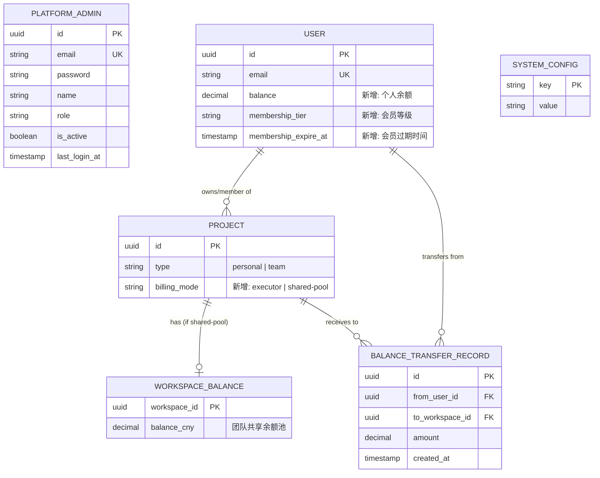
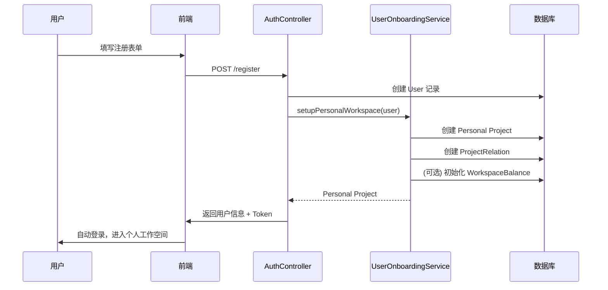
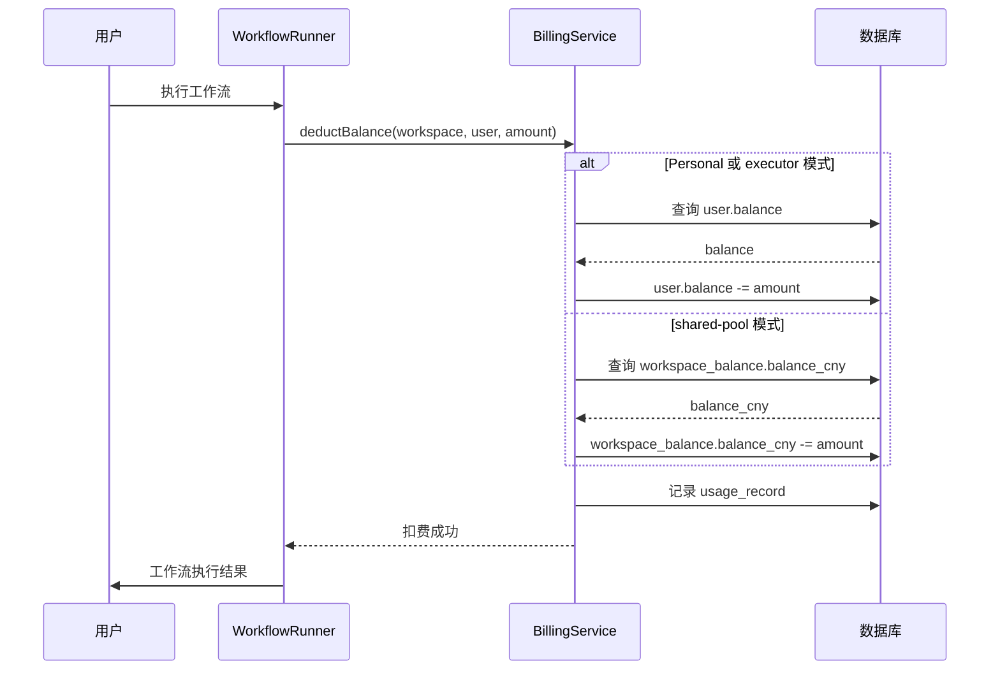

# 用户认证与初始化系统改造方案

> **版本：** v1.0
> **状态：** 待实施
> **优先级：** P0（阻塞上线）
> **基于：** 当前项目 73% 完成度
> **创建日期：** 2025-01-10

[← 返回总览](../00-总览与导航.md)

---

## 📋 背景与问题

### 当前项目状态

**已完成（73%）：**
- ✅ 数据库多租户架构（Project、WorkspaceBalance、UsageRecord 等表）
- ✅ 凭证系统已移除
- ✅ 工作空间隔离机制（@ProjectScope 装饰器）
- ✅ 计费系统基础（WorkspaceBalance 表、扣费逻辑）
- ✅ User、Project、ProjectRelation 关系已建立

**存在的核心问题：**
- ❌ 初始化逻辑仍是单租户模式（`/owner/setup` 只能设置一次全局 Owner）
- ❌ 没有平台管理员和普通用户的区分
- ❌ 用户注册后未自动创建个人工作空间
- ❌ 缺少会员等级体系
- ❌ 团队工作空间的扣费模式未实现

### 改造目标

将单租户初始化逻辑改造为**平台型 SaaS 多租户初始化系统**：

1. **两套账号体系**：平台管理员 vs 平台用户（完全独立）
2. **首次启动流程**：管理员后台初始化 → 用户端开放注册
3. **自动化注册**：用户注册 → 自动创建个人工作空间 + 初始余额
4. **会员体系**：绑定到用户账号，影响团队创建数量和成员上限
5. **灵活计费**：团队工作空间支持两种扣费模式

---

## 🏗️ 架构设计

### 1. 两套账号体系

#### 1.1 平台管理员（PlatformAdmin）

**用途：** 管理整个平台的配置和运营

**特征：**
- 单独的数据表和认证体系
- 单独的登录入口（`/admin/login`）
- 拥有超级权限（管理 AI Provider、平台节点、用户账号等）
- 不能直接访问用户工作空间内容（数据隔离）

**数据库设计：**

```sql
CREATE TABLE platform_admin (
  id UUID PRIMARY KEY DEFAULT gen_random_uuid(),
  email VARCHAR(255) NOT NULL UNIQUE,
  password VARCHAR(255) NOT NULL,
  name VARCHAR(100) NOT NULL,
  role VARCHAR(50) NOT NULL DEFAULT 'admin',  -- 'super_admin' | 'admin'
  is_active BOOLEAN NOT NULL DEFAULT true,
  last_login_at TIMESTAMP,
  created_at TIMESTAMP NOT NULL DEFAULT CURRENT_TIMESTAMP,
  updated_at TIMESTAMP NOT NULL DEFAULT CURRENT_TIMESTAMP
);

CREATE INDEX idx_platform_admin_email ON platform_admin(email);
```

#### 1.2 平台用户（User）

**用途：** 普通用户，使用平台功能

**特征：**
- 使用现有 User 表
- 用户登录入口（`/login`）
- 拥有自己的工作空间和数据
- 会员等级影响使用配额

**数据库扩展：**

```sql
-- 扩展现有 user 表
ALTER TABLE "user"
  ADD COLUMN balance DECIMAL(10, 4) DEFAULT 0.0 COMMENT '个人余额（人民币）',
  ADD COLUMN membership_tier VARCHAR(20) DEFAULT 'free'
    COMMENT '会员等级: free, basic, pro, enterprise',
  ADD COLUMN membership_expire_at TIMESTAMP
    COMMENT '会员过期时间';

-- 索引
CREATE INDEX idx_user_membership ON "user"(membership_tier);
```

### 2. 系统初始化流程

#### 2.1 首次启动检测

**系统状态表：**

```sql
CREATE TABLE system_config (
  key VARCHAR(100) PRIMARY KEY,
  value TEXT NOT NULL,
  updated_at TIMESTAMP NOT NULL DEFAULT CURRENT_TIMESTAMP
);

-- 初始化标记
INSERT INTO system_config (key, value)
VALUES ('platform_initialized', 'false');
```

**检测逻辑：**

```typescript
// packages/cli/src/services/system-init.service.ts
@Service()
export class SystemInitService {
  async isPlatformInitialized(): Promise<boolean> {
    const config = await this.systemConfigRepository.findOne({
      where: { key: 'platform_initialized' }
    });
    return config?.value === 'true';
  }

  async setPlatformInitialized(): Promise<void> {
    await this.systemConfigRepository.upsert({
      key: 'platform_initialized',
      value: 'true',
      updated_at: new Date()
    });
  }
}
```

#### 2.2 初始化流程图



#### 2.3 用户端启动页面

**路由守卫：**

```typescript
// packages/frontend/editor-ui/src/router/index.ts
router.beforeEach(async (to, from, next) => {
  const systemStore = useSystemStore();

  // 检查系统是否初始化
  if (!systemStore.initialized) {
    await systemStore.checkInitialization();
  }

  // 如果系统未初始化，且不是管理员路由
  if (!systemStore.initialized && !to.path.startsWith('/admin')) {
    next('/platform-not-ready');
    return;
  }

  next();
});
```

**未初始化页面：**

```vue
<!-- packages/frontend/editor-ui/src/views/PlatformNotReady.vue -->
<template>
  <div class="platform-not-ready">
    <n8n-icon icon="lock" size="xlarge" />
    <h1>{{ $t('platformNotReady.title') }}</h1>
    <p>{{ $t('platformNotReady.description') }}</p>
    <n8n-text size="small" color="text-light">
      {{ $t('platformNotReady.contactAdmin') }}
    </n8n-text>
  </div>
</template>
```

### 3. 用户注册流程

#### 3.1 注册自动化流程



#### 3.2 注册接口实现

**Controller：**

```typescript
// packages/cli/src/controllers/auth.controller.ts
@RestController()
export class AuthController {
  constructor(
    private readonly authService: AuthService,
    private readonly userOnboardingService: UserOnboardingService,
  ) {}

  @Post('/register', { skipAuth: true })
  async register(
    req: AuthlessRequest,
    res: Response,
    @Body payload: UserRegisterDto,
  ): Promise<PublicUser> {
    const { email, password, firstName, lastName } = payload;

    // 1. 创建用户账号
    const user = await this.authService.createUser({
      email,
      password,
      firstName,
      lastName,
      membershipTier: 'free',  // 默认免费会员
      balance: 100.0,  // 初始余额 100 元（可配置）
    });

    // 2. 自动创建个人工作空间
    await this.userOnboardingService.setupPersonalWorkspace(user);

    // 3. 发放登录 Cookie
    this.authService.issueCookie(res, user, false, req.browserId);

    // 4. 发送欢迎邮件
    await this.mailer.sendWelcomeEmail(user);

    return await this.userService.toPublic(user, { withScopes: true });
  }
}
```

**Service：**

```typescript
// packages/cli/src/services/user-onboarding.service.ts
@Service()
export class UserOnboardingService {
  constructor(
    private readonly projectRepository: ProjectRepository,
    private readonly projectRelationRepository: ProjectRelationRepository,
    private readonly workspaceBalanceRepository: WorkspaceBalanceRepository,
    private readonly logger: Logger,
  ) {}

  async setupPersonalWorkspace(user: User): Promise<Project> {
    return await this.projectRepository.manager.transaction(async (em) => {
      // 1. 创建个人工作空间
      const personalProject = em.create(Project, {
        id: uuidv4(),
        name: `${user.firstName}'s Workspace`,
        type: 'personal',
        icon: { type: 'emoji', value: '🏠' },
        description: 'Personal workspace',
      });
      await em.save(personalProject);

      // 2. 关联用户（Owner 角色）
      const relation = em.create(ProjectRelation, {
        userId: user.id,
        projectId: personalProject.id,
        role: 'project:admin',  // 个人空间的 Owner
      });
      await em.save(relation);

      // 3. 初始化工作空间余额（暂时不用，余额在用户账号上）
      // 未来如果需要工作空间独立余额，可以在这里初始化

      this.logger.info(`Personal workspace created for user ${user.id}`);

      return personalProject;
    });
  }
}
```

### 4. 余额和计费体系

#### 4.1 双层余额架构

**设计原则：**
- 用户余额：存在 `user.balance`，充值到这里
- 工作空间共享余额池：存在 `workspace_balance.balance`，只用于团队共享模式

**数据结构：**

```typescript
// User 表（已扩展）
interface User {
  balance: number;  // 个人余额（CNY）
  membershipTier: 'free' | 'basic' | 'pro' | 'enterprise';
  membershipExpireAt?: Date;
}

// WorkspaceBalance 表（现有）
interface WorkspaceBalance {
  workspaceId: string;
  balanceCny: number;  // 团队共享余额池（CNY）
  lowBalanceThresholdCny: number;
  currency: string;
}

// Project 表（需扩展）
interface Project {
  type: 'personal' | 'team';
  billingMode: 'executor' | 'shared-pool';  // 新增字段
}
```

#### 4.2 扣费模式

**Personal Project：**
- 固定 `billingMode = 'executor'`
- 扣费来源：`user.balance`

**Team Project：**

| 扣费模式 | 说明 | 扣费来源 |
|---------|------|---------|
| `executor` | 谁执行扣谁的余额 | 执行者的 `user.balance` |
| `shared-pool` | 团队共享余额池 | `workspace_balance.balance` |

**创建团队时选择：**

```typescript
@Post('/projects')
async createTeamWorkspace(
  req: AuthenticatedRequest,
  @Body payload: CreateTeamProjectDto,
) {
  const { name, billingMode } = payload;  // billingMode: 'executor' | 'shared-pool'

  const project = await this.projectService.createTeamWorkspace({
    name,
    type: 'team',
    billingMode,
    ownerId: req.user.id,
  });

  // 如果是 shared-pool 模式，初始化 WorkspaceBalance
  if (billingMode === 'shared-pool') {
    await this.workspaceBalanceRepository.save({
      workspaceId: project.id,
      balanceCny: 0.0,
      lowBalanceThresholdCny: 10.0,
      currency: 'CNY',
    });
  }

  return project;
}
```

**扣费逻辑：**

```typescript
// packages/cli/src/services/billing.service.ts
@Service()
export class BillingService {
  async deductBalance(params: {
    workspaceId: string;
    executorUserId: string;
    amount: number;
    serviceKey: string;
    metadata?: Record<string, any>;
  }): Promise<void> {
    const { workspaceId, executorUserId, amount, serviceKey, metadata } = params;

    // 1. 获取工作空间信息
    const project = await this.projectRepository.findOneOrFail({
      where: { id: workspaceId },
    });

    let balanceSource: 'user' | 'workspace';
    let newBalance: number;

    // 2. 根据扣费模式决定扣费来源
    if (project.type === 'personal' || project.billingMode === 'executor') {
      // 扣执行者的余额
      const user = await this.userRepository.findOneOrFail({
        where: { id: executorUserId },
      });

      if (user.balance < amount) {
        throw new OperationalError('余额不足，请充值');
      }

      newBalance = user.balance - amount;
      await this.userRepository.update(
        { id: executorUserId },
        { balance: newBalance }
      );
      balanceSource = 'user';
    } else {
      // 扣工作空间共享余额池
      const wsBalance = await this.workspaceBalanceRepository.findOneOrFail({
        where: { workspaceId },
      });

      if (wsBalance.balanceCny < amount) {
        throw new OperationalError('团队余额不足，请联系管理员充值');
      }

      newBalance = wsBalance.balanceCny - amount;
      await this.workspaceBalanceRepository.update(
        { workspaceId },
        { balanceCny: newBalance }
      );
      balanceSource = 'workspace';
    }

    // 3. 记录使用记录
    await this.usageRecordRepository.save({
      workspaceId,
      userId: executorUserId,
      serviceKey,
      amount,
      balanceAfter: newBalance,
      balanceSource,
      metadata,
      createdAt: new Date(),
    });
  }
}
```

#### 4.3 团队共享余额池充值

**充值接口：**

```typescript
@Post('/workspaces/:id/balance/transfer')
async transferToWorkspace(
  req: AuthenticatedRequest,
  @Param('id') workspaceId: string,
  @Body payload: { amount: number },
): Promise<{ success: boolean }> {
  const { amount } = payload;
  const userId = req.user.id;

  // 1. 验证权限（只有 Owner 和 Admin 可以充值）
  await this.projectService.validateAccess(userId, workspaceId, ['project:admin']);

  // 2. 验证工作空间是 shared-pool 模式
  const project = await this.projectRepository.findOneOrFail({
    where: { id: workspaceId },
  });

  if (project.billingMode !== 'shared-pool') {
    throw new BadRequestError('该工作空间不支持共享余额池');
  }

  // 3. 从用户余额转入工作空间余额池
  await this.projectRepository.manager.transaction(async (em) => {
    // 扣除用户余额
    const user = await em.findOneOrFail(User, { where: { id: userId } });
    if (user.balance < amount) {
      throw new OperationalError('个人余额不足');
    }
    user.balance -= amount;
    await em.save(user);

    // 增加工作空间余额
    const wsBalance = await em.findOneOrFail(WorkspaceBalance, {
      where: { workspaceId },
    });
    wsBalance.balanceCny += amount;
    await em.save(wsBalance);

    // 记录转账
    await em.save(em.create(BalanceTransferRecord, {
      fromUserId: userId,
      toWorkspaceId: workspaceId,
      amount,
      createdAt: new Date(),
    }));
  });

  return { success: true };
}
```

### 5. 会员等级体系

#### 5.1 会员等级定义

**绑定到用户账号：**

| 等级 | 可创建团队数 | 团队成员上限 | 个人空间特权 | 月费 |
|------|------------|-------------|-------------|------|
| Free | 1 个 | 5 人 | 基础功能 | 免费 |
| Basic | 3 个 | 20 人 | + 优先队列 | ¥99/月 |
| Pro | 10 个 | 50 人 | + 无限执行 | ¥299/月 |
| Enterprise | 无限 | 无限 | + 专属支持 | 定制 |

#### 5.2 权益判断逻辑

```typescript
// packages/cli/src/services/membership.service.ts
@Service()
export class MembershipService {
  getMembershipLimits(tier: MembershipTier): MembershipLimits {
    const limits = {
      free: {
        maxTeams: 1,
        maxTeamMembers: 5,
        monthlyExecutions: 1000,
      },
      basic: {
        maxTeams: 3,
        maxTeamMembers: 20,
        monthlyExecutions: 10000,
      },
      pro: {
        maxTeams: 10,
        maxTeamMembers: 50,
        monthlyExecutions: -1,  // 无限
      },
      enterprise: {
        maxTeams: -1,  // 无限
        maxTeamMembers: -1,  // 无限
        monthlyExecutions: -1,  // 无限
      },
    };

    return limits[tier];
  }

  async canCreateTeam(userId: string): Promise<boolean> {
    const user = await this.userRepository.findOneOrFail({
      where: { id: userId },
    });

    const limits = this.getMembershipLimits(user.membershipTier);

    // 无限制
    if (limits.maxTeams === -1) return true;

    // 统计当前团队数量
    const teamCount = await this.projectRepository.count({
      where: {
        type: 'team',
        projectRelations: {
          userId,
          role: 'project:admin',  // 只统计自己创建的
        },
      },
    });

    return teamCount < limits.maxTeams;
  }

  async canAddTeamMember(projectId: string): Promise<boolean> {
    const project = await this.projectRepository.findOneOrFail({
      where: { id: projectId },
      relations: ['projectRelations', 'projectRelations.user'],
    });

    // 找到团队 Owner
    const owner = project.projectRelations.find(
      (rel) => rel.role === 'project:admin'
    )?.user;

    if (!owner) return false;

    const limits = this.getMembershipLimits(owner.membershipTier);

    // 无限制
    if (limits.maxTeamMembers === -1) return true;

    // 统计当前成员数
    const memberCount = project.projectRelations.length;

    return memberCount < limits.maxTeamMembers;
  }
}
```

#### 5.3 会员过期处理

**策略：** 只限制新增，不踢出现有成员

```typescript
@Cron('0 0 * * *')  // 每天凌晨检查
async checkExpiredMemberships() {
  const expiredUsers = await this.userRepository.find({
    where: {
      membershipTier: Not('free'),
      membershipExpireAt: LessThan(new Date()),
    },
  });

  for (const user of expiredUsers) {
    // 降级为 Free
    await this.userRepository.update(
      { id: user.id },
      { membershipTier: 'free', membershipExpireAt: null }
    );

    // 发送通知邮件
    await this.mailer.sendMembershipExpiredEmail(user);

    this.logger.info(`User ${user.id} membership expired, downgraded to free`);
  }
}
```

### 6. 角色体系

#### 6.1 两层角色体系

**平台级角色：**

| 角色 | 权限范围 |
|------|---------|
| `super_admin` | 管理平台配置、AI Provider、用户账号、查看统计 |
| `admin` | 管理平台节点、查看统计（权限略低于 super_admin）|

**工作空间级角色（现有）：**

| 角色 | 权限范围 |
|------|---------|
| `project:admin` | 工作空间 Owner，完全控制（不可转让）|
| `project:editor` | 可创建/编辑工作流、管理成员 |
| `project:viewer` | 只读权限 |

#### 6.2 角色验证装饰器

```typescript
// packages/cli/src/decorators/platform-admin.decorator.ts
export function RequirePlatformAdmin(minRole: 'admin' | 'super_admin' = 'admin') {
  return function (target: any, propertyKey: string, descriptor: PropertyDescriptor) {
    const originalMethod = descriptor.value;

    descriptor.value = async function (...args: any[]) {
      const req = args[0] as AuthenticatedRequest;

      if (!req.platformAdmin) {
        throw new AuthError('需要平台管理员权限');
      }

      if (minRole === 'super_admin' && req.platformAdmin.role !== 'super_admin') {
        throw new ForbiddenError('需要超级管理员权限');
      }

      return originalMethod.apply(this, args);
    };

    return descriptor;
  };
}
```

---

## 🔧 实施清单

### 阶段 1：数据库改造（1 天）

**新增表：**

- [ ] 创建 `platform_admin` 表（平台管理员）
- [ ] 创建 `system_config` 表（系统配置）
- [ ] 创建 `balance_transfer_record` 表（余额转账记录）

**扩展表：**

- [ ] `user` 表添加：`balance`, `membership_tier`, `membership_expire_at`
- [ ] `project` 表添加：`billing_mode`
- [ ] `usage_record` 表添加：`balance_source` 字段

**迁移脚本：**

```sql
-- 1. 创建 platform_admin 表
CREATE TABLE platform_admin (
  id UUID PRIMARY KEY DEFAULT gen_random_uuid(),
  email VARCHAR(255) NOT NULL UNIQUE,
  password VARCHAR(255) NOT NULL,
  name VARCHAR(100) NOT NULL,
  role VARCHAR(50) NOT NULL DEFAULT 'admin',
  is_active BOOLEAN NOT NULL DEFAULT true,
  last_login_at TIMESTAMP,
  created_at TIMESTAMP NOT NULL DEFAULT CURRENT_TIMESTAMP,
  updated_at TIMESTAMP NOT NULL DEFAULT CURRENT_TIMESTAMP
);

-- 2. 创建 system_config 表
CREATE TABLE system_config (
  key VARCHAR(100) PRIMARY KEY,
  value TEXT NOT NULL,
  updated_at TIMESTAMP NOT NULL DEFAULT CURRENT_TIMESTAMP
);

INSERT INTO system_config (key, value) VALUES ('platform_initialized', 'false');

-- 3. 创建余额转账记录表
CREATE TABLE balance_transfer_record (
  id UUID PRIMARY KEY DEFAULT gen_random_uuid(),
  from_user_id UUID NOT NULL REFERENCES "user"(id) ON DELETE CASCADE,
  to_workspace_id UUID NOT NULL REFERENCES project(id) ON DELETE CASCADE,
  amount DECIMAL(10, 4) NOT NULL,
  created_at TIMESTAMP NOT NULL DEFAULT CURRENT_TIMESTAMP
);

-- 4. 扩展 user 表
ALTER TABLE "user"
  ADD COLUMN balance DECIMAL(10, 4) DEFAULT 100.0,
  ADD COLUMN membership_tier VARCHAR(20) DEFAULT 'free',
  ADD COLUMN membership_expire_at TIMESTAMP;

-- 5. 扩展 project 表
ALTER TABLE project
  ADD COLUMN billing_mode VARCHAR(20) DEFAULT 'executor';

-- 个人工作空间固定为 executor 模式
UPDATE project SET billing_mode = 'executor' WHERE type = 'personal';

-- 6. 扩展 usage_record 表
ALTER TABLE usage_record
  ADD COLUMN balance_source VARCHAR(20) DEFAULT 'user';

-- 7. 索引
CREATE INDEX idx_user_balance ON "user"(balance);
CREATE INDEX idx_user_membership ON "user"(membership_tier);
CREATE INDEX idx_project_billing_mode ON project(billing_mode);
CREATE INDEX idx_balance_transfer_user ON balance_transfer_record(from_user_id);
CREATE INDEX idx_balance_transfer_workspace ON balance_transfer_record(to_workspace_id);
```

### 阶段 2：后端实现（3 天）

**Service 层：**

- [ ] 创建 `SystemInitService`（系统初始化检测）
- [ ] 创建 `PlatformAdminService`（管理员认证和管理）
- [ ] 创建 `UserOnboardingService`（用户注册自动化）
- [ ] 创建 `MembershipService`（会员权益判断）
- [ ] 增强 `BillingService`（双层余额扣费逻辑）

**Controller 层：**

- [ ] 创建 `PlatformAdminController`
  - `POST /admin/setup`（首次初始化）
  - `POST /admin/login`（管理员登录）
  - `GET /admin/dashboard`（统计面板）
- [ ] 增强 `AuthController`
  - `POST /register`（用户注册 + 自动创建工作空间）
  - `GET /system/status`（检查系统是否初始化）
- [ ] 增强 `ProjectsController`
  - `POST /projects`（支持 billingMode 参数）
  - `POST /projects/:id/balance/transfer`（充值到工作空间）

**Middleware：**

- [ ] 创建 `PlatformAdminAuthMiddleware`（管理员身份验证）
- [ ] 创建 `SystemInitMiddleware`（检测系统是否初始化）

**Entity：**

- [ ] 创建 `PlatformAdmin` 实体
- [ ] 创建 `SystemConfig` 实体
- [ ] 创建 `BalanceTransferRecord` 实体

### 阶段 3：前端实现（2 天）

**用户端：**

- [ ] 创建 `PlatformNotReady.vue`（系统未初始化提示页）
- [ ] 创建 `Register.vue`（用户注册页面）
- [ ] 增强 `router/index.ts`（添加系统初始化检测）
- [ ] 创建 `SystemStore`（系统状态管理）

**管理员端：**

- [ ] 创建 `AdminSetup.vue`（管理员初始化向导）
- [ ] 创建 `AdminLogin.vue`（管理员登录页）
- [ ] 创建 `AdminDashboard.vue`（管理员后台首页）
- [ ] 创建独立的管理员路由（`/admin/*`）

**工作空间管理：**

- [ ] 增强 `CreateWorkspaceDialog.vue`（添加扣费模式选择）
- [ ] 创建 `WorkspaceBalanceTransfer.vue`（充值到工作空间）
- [ ] 创建 `MembershipUpgrade.vue`（会员升级页面）

### 阶段 4：测试验收（1 天）

**功能测试：**

- [ ] 首次启动流程
  - 用户端显示"平台未启动"
  - 管理员可以完成初始化
  - 初始化后用户端正常访问
- [ ] 用户注册流程
  - 注册自动创建个人工作空间
  - 自动分配初始余额
  - 自动登录进入工作空间
- [ ] 团队工作空间
  - 创建时可选择扣费模式
  - executor 模式扣执行者余额
  - shared-pool 模式扣工作空间余额
  - Owner/Admin 可以充值到工作空间
- [ ] 会员权益
  - 创建团队时检查会员限制
  - 添加成员时检查会员限制
  - 会员过期自动降级

**安全测试：**

- [ ] 管理员后台需要单独认证
- [ ] 普通用户无法访问管理员接口
- [ ] 管理员无法访问用户工作空间数据
- [ ] 余额扣到负数阻止执行

**性能测试：**

- [ ] 系统初始化检测 < 10ms
- [ ] 用户注册流程 < 500ms
- [ ] 余额扣费 < 20ms

---

## 📊 数据库 ER 图



---

## 🎯 业务流程图

### 用户注册自动化流程



### 团队工作空间扣费流程



---

## 🔐 安全考虑

### 1. 管理员后台隔离

**路由隔离：**
- 用户端：`https://app.example.com`
- 管理员：`https://admin.example.com` 或 `/admin/*`

**认证隔离：**
- 不同的 JWT Secret
- 不同的 Session Cookie 名称
- 独立的认证中间件

### 2. 余额并发安全

**使用悲观锁：**

```typescript
async deductBalance(params) {
  await this.dataSource.transaction(async (em) => {
    // 使用 FOR UPDATE 悲观锁
    const user = await em.findOne(User, {
      where: { id: params.userId },
      lock: { mode: 'pessimistic_write' },
    });

    if (user.balance < params.amount) {
      throw new OperationalError('余额不足');
    }

    user.balance -= params.amount;
    await em.save(user);
  });
}
```

### 3. 会员权益防篡改

**服务端验证：**
- 所有会员权益判断必须在后端
- 前端只显示，不决策
- 创建团队、添加成员时实时检查

---

## ⚠️ 注意事项

### 1. 向后兼容

**现有数据处理：**

直接删除现有的n8n数据库

### 2. 初始余额配置

**建议做成可配置：**

```typescript
// packages/cli/src/config/schema.ts
{
  user: {
    initialBalance: {
      doc: '用户注册时的初始余额（人民币）',
      format: Number,
      default: 0,
      env: 'N8N_USER_INITIAL_BALANCE',
    },
  },
}
```

---

## 📈 后续优化（Phase 2）

### 短期优化（1-2 个月）

- [ ] 支付集成（支付宝、微信支付）
- [ ] 充值优惠活动（首充双倍等）
- [ ] 邀请好友奖励机制
- [ ] 会员自动续费


---

## 📞 相关资源

### 代码位置

**后端：**
- Entity: `packages/@n8n/db/src/entities/`
- Service: `packages/cli/src/services/`
- Controller: `packages/cli/src/controllers/`

**前端：**
- Views: `packages/frontend/editor-ui/src/views/`
- Stores: `packages/frontend/editor-ui/src/stores/`
- Router: `packages/frontend/editor-ui/src/router/`

### 参考文档

- [01-多租户架构](./01-多租户架构.md) - 现有多租户基础
- [03-数据库设计](./03-数据库设计.md) - 数据库表结构
- [05-AI服务架构](./05-AI服务架构.md) - 计费系统设计
- [Chat-Hub按量计费改造方案](../Chat-Hub按量计费改造方案.md) - 计费实现参考

---

**文档维护：** 开发团队
**最后更新：** 2025-01-10
**下一次审查：** 实施前
