# 注释代码清理 - 可视化路线图

## 总体清理流程图

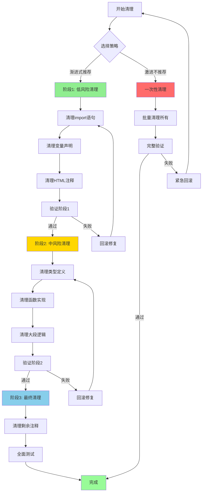

## 注释类型分布

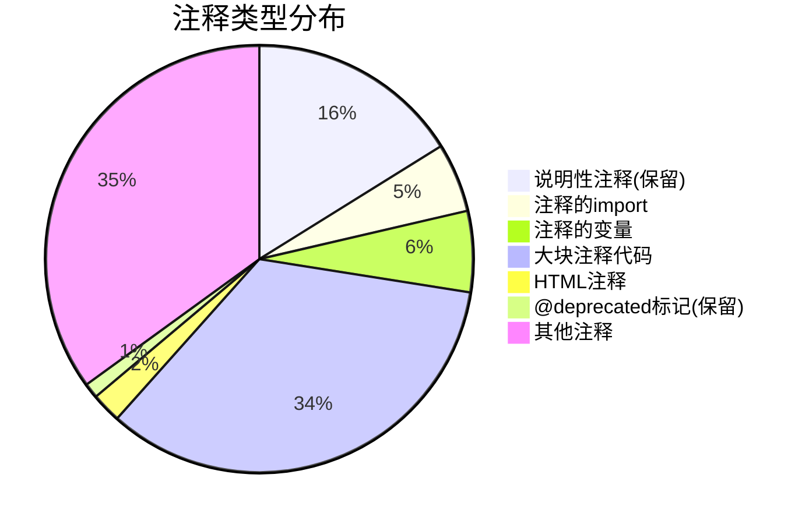

## 风险级别分布

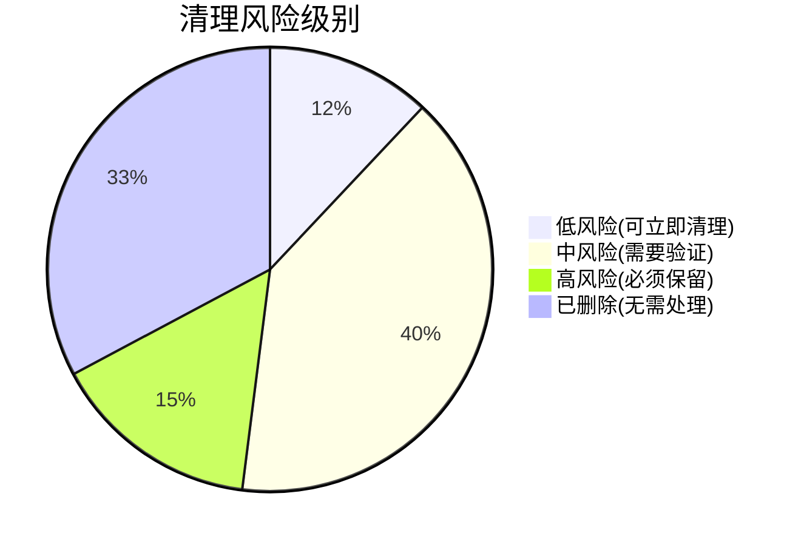

## 清理时间线（渐进式 - 推荐）

```mermaid
gantt
    title 注释代码清理时间线（推荐方案）
    dateFormat  HH:mm
    axisFormat %H:%M

    section 第1天
    创建分支          :done,    d1, 09:00, 10m
    运行分析工具      :done,    d2, after d1, 20m
    清理import语句    :active,  d3, after d2, 30m
    验证类型检查      :         d4, after d3, 10m
    清理变量声明      :         d5, after d4, 30m
    清理HTML注释      :         d6, after d5, 1h
    阶段1验证         :crit,    d7, after d6, 30m
    提交阶段1         :milestone, m1, after d7, 0m

    section 第2天
    清理类型定义      :         d8, 09:00, 2h
    验证构建          :crit,    d9, after d8, 30m
    清理函数实现      :         d10, after d9, 3h
    阶段2验证         :crit,    d11, after d10, 1h
    提交阶段2         :milestone, m2, after d11, 0m

    section 第3天
    清理大段逻辑      :         d12, 09:00, 2h
    清理剩余注释      :         d13, after d12, 1h
    全面构建测试      :crit,    d14, after d13, 2h
    手动UI测试        :crit,    d15, after d14, 1h
    最终验证          :crit,    d16, after d15, 1h
    完成清理          :milestone, m3, after d16, 0m
```

## 文件清理优先级矩阵

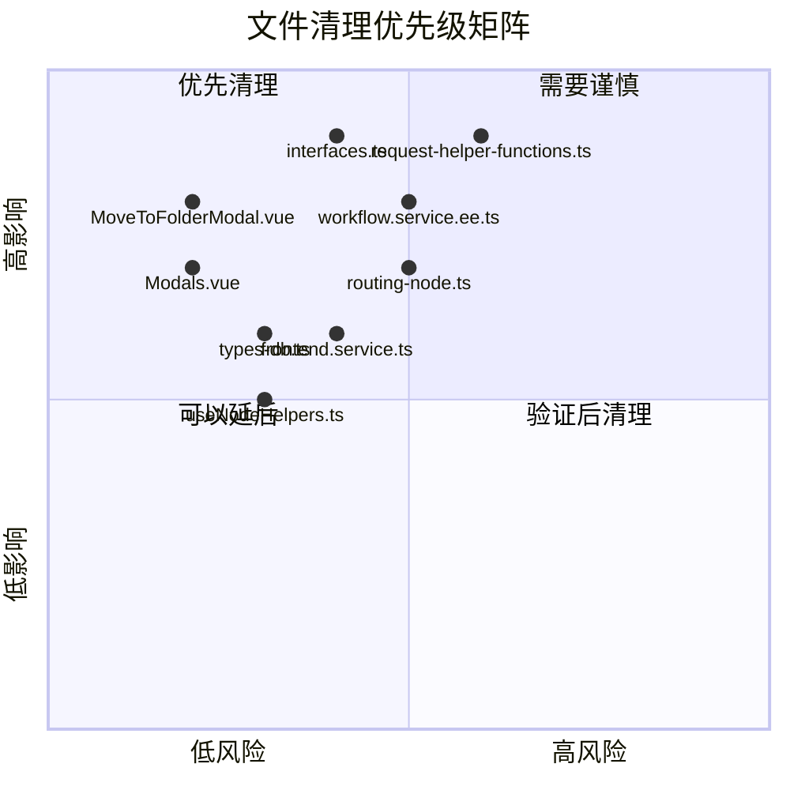

## 清理阶段详细流程

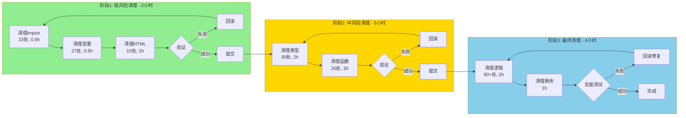

## 验证检查点流程

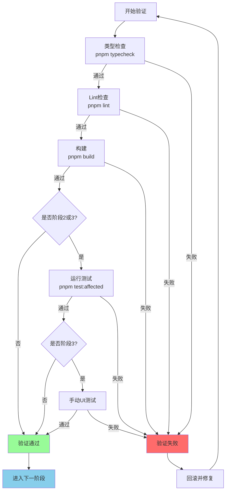

## 注释代码分类决策树

```mermaid
graph TD
    A[发现注释代码] --> B{是否包含<br/>'Credential system'?}

    B -->|是| C{是否为说明性注释?}
    B -->|否| D{是否为@deprecated?}

    C -->|说明删除原因| E[保留]
    C -->|注释掉的代码| F{代码类型?}

    D -->|是| E
    D -->|否| F

    F -->|import语句| G[立即删除<br/>风险:低]
    F -->|变量声明| H[立即删除<br/>风险:低]
    F -->|HTML注释| I[立即删除<br/>风险:低]
    F -->|类型定义| J[验证后删除<br/>风险:中]
    F -->|函数实现| K[验证后删除<br/>风险:中]
    F -->|大段逻辑| L[验证后删除<br/>风险:中]

    G --> M[删除后验证]
    H --> M
    I --> M
    J --> N[详细验证]
    K --> N
    L --> N

    M -->|typecheck<br/>lint| O[提交]
    N -->|typecheck<br/>lint<br/>build<br/>test| O

    E --> P[保留并标记]

    style E fill:#98FB98
    style G fill:#90EE90
    style H fill:#90EE90
    style I fill:#90EE90
    style J fill:#FFD700
    style K fill:#FFD700
    style L fill:#FFD700
```

## 关键文件清理顺序

```mermaid
graph LR
    subgraph 前端优先[前端文件 - 优先]
        F1[MoveToFolderModal.vue<br/>50行, 1h] --> F2[Modals.vue<br/>15行, 0.5h]
        F2 --> F3[useNodeHelpers.ts<br/>20行, 0.5h]
        F3 --> F4[其他前端<br/>30行, 1h]
    end

    subgraph 类型定义[类型定义 - 其次]
        T1[types-db.ts<br/>20行, 0.5h] --> T2[interfaces.ts<br/>40行, 1h]
        T2 --> T3[其他类型<br/>10行, 0.5h]
    end

    subgraph 后端服务[后端服务 - 最后]
        B1[workflow.service.ee.ts<br/>60行, 2h] --> B2[frontend.service.ts<br/>30行, 1h]
        B2 --> B3[request-helper-functions.ts<br/>80行, 2h]
        B3 --> B4[其他后端<br/>40行, 1.5h]
    end

    F4 --> T1
    T3 --> B1

    style 前端优先 fill:#90EE90
    style 类型定义 fill:#FFD700
    style 后端服务 fill:#87CEEB
```

## 风险评估热力图

```mermaid
graph TD
    subgraph 风险评估
        A[注释类型]
        B[import语句]
        C[变量声明]
        D[HTML注释]
        E[类型定义]
        F[函数实现]
        G[大段逻辑]
        H[说明注释]
        I[@deprecated]
    end

    B -.风险:低<br/>影响:低.-> B1[优先级:1]
    C -.风险:低<br/>影响:低.-> C1[优先级:1]
    D -.风险:低<br/>影响:中.-> D1[优先级:1]
    E -.风险:中<br/>影响:中.-> E1[优先级:2]
    F -.风险:中<br/>影响:高.-> F1[优先级:2]
    G -.风险:中<br/>影响:中.-> G1[优先级:2]
    H -.风险:高<br/>影响:高.-> H1[保留]
    I -.风险:高<br/>影响:高.-> I1[保留]

    style B1 fill:#90EE90
    style C1 fill:#90EE90
    style D1 fill:#90EE90
    style E1 fill:#FFD700
    style F1 fill:#FFD700
    style G1 fill:#FFD700
    style H1 fill:#FF6B6B
    style I1 fill:#FF6B6B
```

## 清理进度跟踪看板

```mermaid
graph LR
    subgraph 待清理[待清理 - 250项]
        T1[import: 23]
        T2[变量: 27]
        T3[HTML: 10]
        T4[类型: 30]
        T5[函数: 20]
        T6[逻辑: 140]
    end

    subgraph 清理中[清理中]
        P1[ ]
    end

    subgraph 已完成[已完成]
        D1[ ]
    end

    subgraph 保留[保留 - 76项]
        K1[说明: 71]
        K2[@deprecated: 5]
    end

    T1 --> P1
    T2 --> P1
    T3 --> P1
    T4 --> P1
    T5 --> P1
    T6 --> P1

    P1 --> D1

    style 待清理 fill:#FFE4B5
    style 清理中 fill:#87CEEB
    style 已完成 fill:#98FB98
    style 保留 fill:#FFB6C1
```

## 验证步骤依赖关系

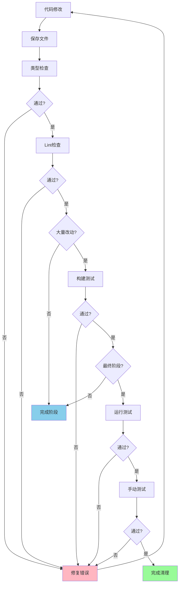

## 回滚策略流程

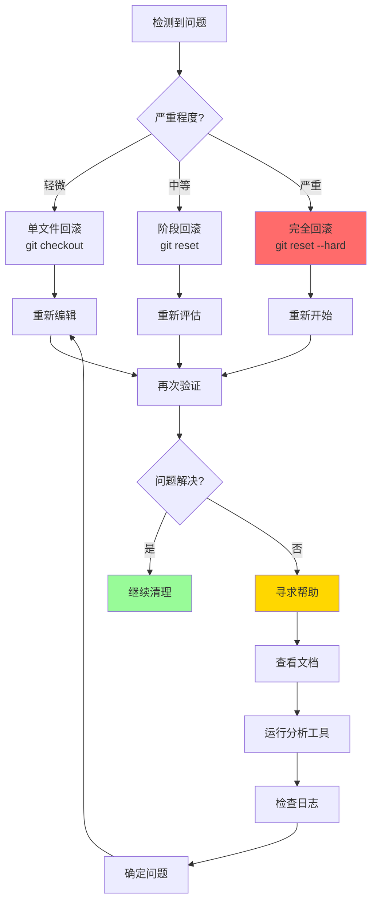

## 最佳实践建议流程

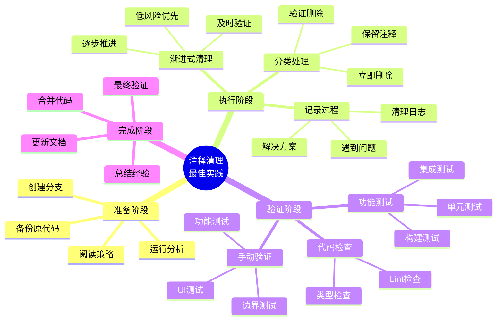

## 工具和命令使用流程

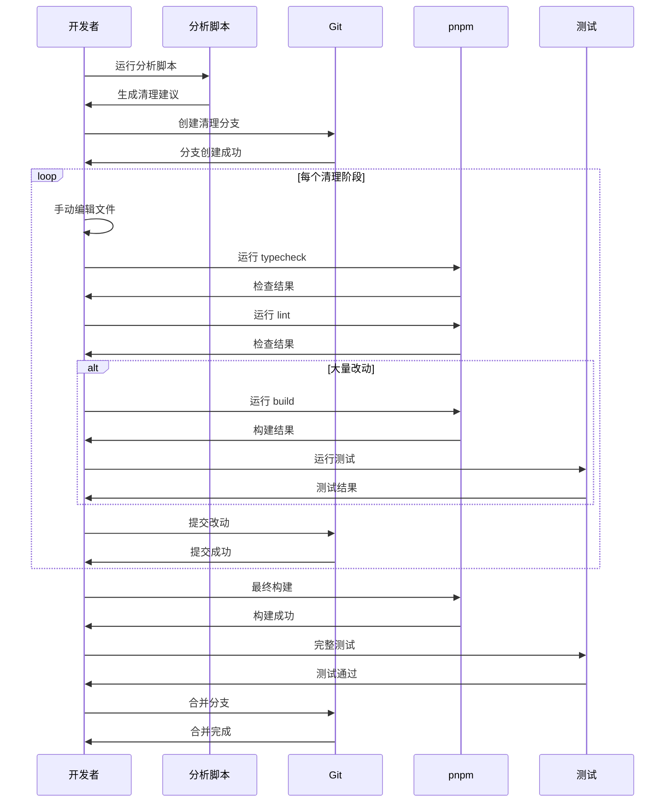

---

## 图例说明

### 颜色含义
- 🟢 **绿色**: 低风险，可以安全执行
- 🟡 **黄色**: 中风险，需要验证
- 🔴 **红色**: 高风险，必须保留或谨慎处理
- 🔵 **蓝色**: 信息性，流程步骤

### 优先级标记
- **优先级 1**: 立即清理（低风险）
- **优先级 2**: 验证后清理（中风险）
- **保留**: 不清理（高风险）

### 时间估算
- 轻量级: < 1 小时
- 中等: 1-3 小时
- 重量级: 3-5 小时

---

**文档版本**: v1.0
**创建日期**: 2025-11-10
**图表工具**: Mermaid
**适用范围**: n8n 凭证系统删除后的注释代码清理可视化
